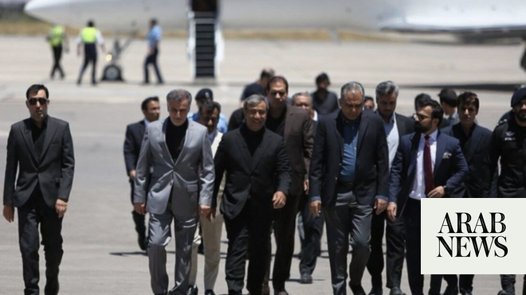

# Pakistan interior minister arrives in Iran

Source: https://www.arabnews.com/node/2647913/middle-east
Captured source: https://www.arabnews.com/node/2647913/middle-east
Published: 2026-06-20T10:59:34+03:00
Modified: 2026-06-20T18:33:35+03:00
Author: AFP

## Summary

TEHRAN: Pakistan’s interior minister arrived in Iran on Saturday after planned talks between Iran and the US in Switzerland were postponed, Iranian media reported. Tehran and Washington were due to hold talks in Switzerland on Friday, after signing a memorandum of understanding ending the war in the Middle East, but the latest negotiations have been postponed until Sunday.

## Image

## Video Or Embed URLs

- https://static.addtoany.com/menu/sm.25.html
- about:blank
- https://www.google.com/recaptcha/api2/aframe
- https://imasdk.googleapis.com/js/core/bridge3.772.0_en.html
- https://cm.g.doubleclick.net/partnerpixels?gdpr=0&us_privacy=1---&gpp_sid=-1&url=https%3A%2F%2Fwww.arabnews.com%2Fnode%2F2647913%2Fmiddle-east

## Text

https://arab.news/n5a87

Naqvi is expected meet his Iranian counterpart Eskandar Momeni, as well as Foreign Minister Abbas Araghchi for talks during the visit

TEHRAN: Pakistan’s interior minister arrived in Iran on Saturday after planned talks between Iran and the US in Switzerland were postponed, Iranian media reported.

Tehran and Washington were due to hold talks in Switzerland on Friday, after signing a memorandum of understanding ending the war in the Middle East, but the latest negotiations have been postponed until Sunday.

Iranian media including Tasnim news agency said Pakistan’s Interior Minister Mohsin Naqvi landed on Saturday in the northeastern city of Mashhad.

Foreign ministry spokesman Esmaeil Baghaei had earlier told ISNA news agency that “Pakistan’s interior minister will arrive in Iran at noon today, Saturday, as part of Pakistan’s efforts regarding the Iran-US negotiations.”

Naqvi is expected meet his Iranian counterpart Eskandar Momeni, as well as Foreign Minister Abbas Araghchi for talks during the visit, according to Baghaei.

Pakistan has been a key mediator between Tehran and Washington, with Qatar also joining the efforts in the run-up to the deal announced this week.

The war began on February 28 with US-Israeli strikes that killed supreme leader Ali Khamenei and several senior military commanders.

Iran retaliated with missile and drone strikes that drew in countries across in the region, before an April truce halted the worst of the fighting.

Iran on Thursday announced it signed a deal with the United States to end the hostilities, with the aim of holding further negotiations on a broader deal that would include Iran’s long contested nuclear program.
