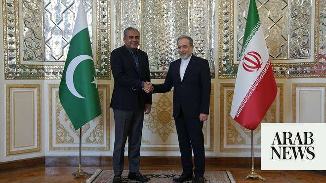

# Pakistan’s interior minister to meet Iran’s Araqchi during Tehran visit, ISNA says

Source: https://www.arabnews.com/node/2647913/middle-east
Captured source: https://www.arabnews.com/node/2647913/middle-east
Published: 2026-06-20T10:59:34+03:00
Modified: 2026-06-20T10:59:34+03:00
Author: Reuters

## Summary

DUBAI: Pakistan Interior ​Minister Mohsin Naqvi is due to hold talks ‌with ‌Iranian ​Foreign ‌Minister ⁠Abbas Araqchi ​during a ⁠visit to Tehran on Saturday, Iranian ⁠Foreign Ministry ‌spokesperson Esmaeil ‌Baghaei ​said, ‌according ‌to ISNA news agency. Baghaei said Naqvi’s ‌visit is part of ⁠Islamabad’s ⁠ongoing efforts related to negotiations between Iran and the United

## Image

## Video Or Embed URLs

- https://static.addtoany.com/menu/sm.25.html
- about:blank
- https://www.google.com/recaptcha/api2/aframe
- https://imasdk.googleapis.com/js/core/bridge3.772.0_en.html
- https://sync.teads.tv/wigo-no-slot
- https://cm.g.doubleclick.net/partnerpixels?gdpr=0&us_privacy=1---&gpp_sid=-1&url=https%3A%2F%2Fwww.arabnews.com%2Fnode%2F2647913%2Fmiddle-east

## Text

https://arab.news/n5a87

DUBAI: Pakistan Interior ​Minister Mohsin Naqvi is due to hold talks ‌with ‌Iranian ​Foreign ‌Minister ⁠Abbas Araqchi ​during a ⁠visit to Tehran on Saturday, Iranian ⁠Foreign Ministry ‌spokesperson Esmaeil ‌Baghaei ​said, ‌according ‌to ISNA news agency. Baghaei said Naqvi’s ‌visit is part of ⁠Islamabad’s ⁠ongoing efforts related to negotiations between Iran and the United States.
