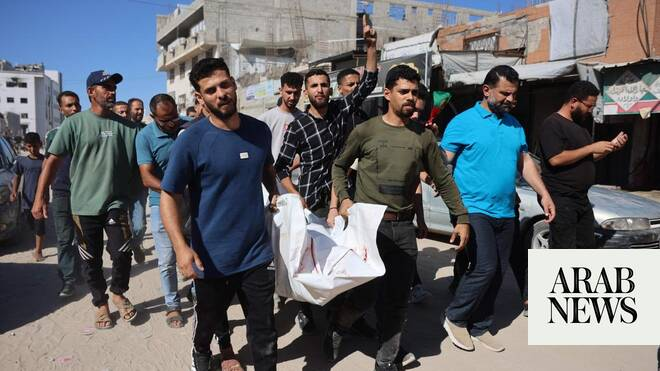

# Gaza health officials say Israeli strikes kill five

Source: https://www.arabnews.com/node/2647916/middle-east
Captured source: https://www.arabnews.com/node/2647916/middle-east
Published: 2026-06-20T13:09:50+03:00
Modified: 2026-06-20T15:45:31+03:00
Author: AFP

## Summary

GAZA CITY: Gaza health officials said Israeli strikes on Saturday killed five people, including four members of the same family, in the latest violence to rock the Palestinian territory despite a ceasefire. Israel and Hamas trade near-daily accusations of truce violations and the Gaza Strip remains gripped by bloodshed as progress on permanently ending the war remains stalled.

## Image

## Video Or Embed URLs

- https://static.addtoany.com/menu/sm.25.html
- about:blank
- https://imasdk.googleapis.com/js/core/bridge3.772.0_en.html
- https://www.google.com/recaptcha/api2/aframe
- https://sync.teads.tv/wigo-no-slot
- https://cm.g.doubleclick.net/partnerpixels?gdpr=0&us_privacy=1---&gpp_sid=-1&url=https%3A%2F%2Fwww.arabnews.com%2Fnode%2F2647916%2Fmiddle-east

## Text

https://arab.news/rt85v

Israel and Hamas trade near-daily accusations of truce violations

Gaza City’s Al-Shifa hospital confirmed receiving the bodies of four members of the Al-Safadi family

GAZA CITY: Gaza health officials said Israeli strikes on Saturday killed five people, including four members of the same family, in the latest violence to rock the Palestinian territory despite a ceasefire. Israel and Hamas trade near-daily accusations of truce violations and the Gaza Strip remains gripped by bloodshed as progress on permanently ending the war remains stalled. An overnight Israeli airstrike on an apartment building in the Sabra neighborhood of Gaza City killed four members of the Al-Safadi family, including the husband, wife and their two daughters, according to the civil defense agency, a rescue service that operates under Hamas authority. It said the strike also injured 12 others. Gaza City’s Al-Shifa hospital confirmed receiving the bodies of four members of the Al-Safadi family, including two children. “Around 2 o’clock, my cousins were asleep when a missile struck them. They have no connection to Hamas, nor are they involved in anything. They’re just innocent children,” said Nael Al-Safadi, a relative. AFP footage from the scene showed an exterior wall of the apartment blown off, exposing rubble, clothes, mattresses and other household belongings strewn across the shattered interior. “By God, I still feel as though I’m in a dream — I never expected this to happen to us,” Mohammad Al-Safadi, who survived the strike, told AFP. “I’m a civilian. I swear to God I’ve never carried a weapon or fired one. What do you want from me? Go after whoever you’re after, what’s my fault in this?“ Al-Shifa hospital, meanwhile, said it had received one body following a separate Israeli drone strike near an intersection in the north of Gaza City. The Israeli military did not immediately respond to a request for comment on two incidents. At least 1,012 Palestinians have been killed in Gaza since the ceasefire took effect on October 10 last year, according to the territory’s health ministry, which operates under Hamas authority and whose figures are considered reliable by the United Nations. The Israeli army has reported five deaths in its ranks during the same period. Restrictions imposed on media outlets and limited access in Gaza prevent AFP from independently verifying tolls or freely covering the violence there.
