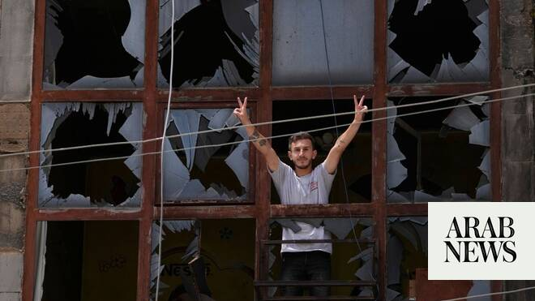

# Lebanon backs deconfliction cell proposal, but ties support to Israeli withdrawal

Source: https://www.arabnews.com/node/2648158/middle-east
Captured source: https://www.arabnews.com/node/2648158/middle-east
Published: 2026-06-22T18:34:16+03:00
Modified: 2026-06-22T18:43:14+03:00
Author: NAJIA HOUSSARI

## Summary

BEIRUT: Lebanon has welcomed a proposal to establish a deconfliction cell aimed at halting military operations in the country, but officials say any such mechanism must lead to a lasting ceasefire and the withdrawal of Israeli forces from occupied Lebanese territory. The proposal emerged from US-Iran talks held in Switzerland and was announced in a joint statement by mediators

## Image

## Video Or Embed URLs

- https://static.addtoany.com/menu/sm.25.html
- about:blank
- https://www.google.com/recaptcha/api2/aframe
- https://imasdk.googleapis.com/js/core/bridge3.773.0_en.html
- https://cm.g.doubleclick.net/partnerpixels?gdpr=0&us_privacy=1---&gpp_sid=-1&url=https%3A%2F%2Fwww.arabnews.com%2Fnode%2F2648158%2Fmiddle-east

## Text

https://arab.news/bffsu

Proposal emerged from US-Iran talks held in Switzerland and was announced in a joint statement by mediators Qatar and Pakistan

President Joseph Aoun discussed the scheme during a phone call with US Vice President JD Vance

BEIRUT: Lebanon has welcomed a proposal to establish a deconfliction cell aimed at halting military operations in the country, but officials say any such mechanism must lead to a lasting ceasefire and the withdrawal of Israeli forces from occupied Lebanese territory.

The proposal emerged from US-Iran talks held in Switzerland and was announced in a joint statement by mediators Qatar and Pakistan.

President Joseph Aoun discussed the scheme on Monday during a phone call with US Vice President JD Vance, senior presidential adviser Jared Kushner and Qatari Prime Minister Sheikh Mohammed bin Abdulrahman Al-Thani.

According to the Lebanese Presidency, the talks focused on efforts to consolidate the ceasefire in Lebanon, halt Israeli military escalation and explore practical steps to achieve those goals, including the possible establishment of a dedicated deconfliction mechanism.

A Lebanese official familiar with the discussions told Arab News that Aoun had expressed preliminary support for the proposal.

“The president agreed to the idea in principle, provided it leads to a sustainable ceasefire and the withdrawal of Israeli forces from Lebanese territory,” the source said.

The official declined to provide details about the structure or mandate of the proposed mechanism, but stressed that discussions held in Switzerland do not conflict with Lebanese-Israeli negotiations scheduled to begin in Washington on Tuesday.

Those talks, the source said, are expected to focus on post-ceasefire arrangements, particularly Israeli withdrawal from southern Lebanon.

The fifth round of direct Lebanese-Israeli negotiations is due to begin on Tuesday and continue for three days at the US State Department, with military and diplomatic tracks running in parallel.

President Aoun later briefed Parliament Speaker Nabih Berri and Prime Minister Nawaf Salam on the contents of the tripartite call. The source also confirmed to Arab News that communication channels remain open between the presidency and Hezbollah through intermediaries.

The announcement came as tensions remained high across southern Lebanon for a second consecutive day amid mixed signals from Israeli officials regarding a potential withdrawal and continued insistence on maintaining operational freedom inside Lebanese territory.

In their joint statement, Qatar and Pakistan said Washington and Tehran had agreed to establish communication channels aimed at helping end the fighting in Lebanon, describing the talks as positive and constructive.

The Lebanese official also pointed to Saudi-Qatari coordination regarding Lebanon.

A diplomatic source following the negotiations said Lebanese officials were carefully assessing the implications of the recent US-Iran memorandum of understanding ahead of the Washington talks.

“The Lebanese delegation is not concerned by what emerged from the Swiss discussions regarding a ceasefire in southern Lebanon,” the source told Arab News. “However, Lebanon must negotiate from its own position and remain the sole decision-maker regarding its national interests.”

The source said the proposed deconfliction cell is expected to feature in discussions in Washington, particularly given the likelihood of some form of Israeli participation, similar to existing monitoring mechanisms.

Meanwhile, Lebanese Army Commander Gen. Rodolphe Haykal toured military units deployed in Nabatieh, Kfar Roummane, Choukine, Zrarieh and the outskirts of Kfar Tebnit, areas that were previously targeted by Israeli strikes.

Haykal highlighted the army’s commitment to national stability, saying the military institution would remain “the source of trust for the Lebanese people.”

Berri, meanwhile, rejected proposals for pilot zones in southern Lebanon, warning that such arrangements could delay a full Israeli withdrawal for years.

Instead, he advocated a district-based approach under which the Lebanese Army would deploy throughout the south, allowing displaced residents to return to their villages.

A Lebanese military source following developments on the ground suggested that any Israeli withdrawal could begin in the western sector, particularly around Tyre, where Israel has largely completed its military objectives.

The source cited the discovery of a Hezbollah tunnel in Majdal Zoun allegedly containing drones and anti-tank missiles, adding that the area is not considered strategically sensitive because it is located away from the border.

The source also dismissed the feasibility of implementing pilot zones at the district level, arguing that such a plan would require logistical capabilities unavailable to the Lebanese Army.

“The most dangerous scenario would be for Israel to withdraw from areas it has surrounded but not occupied, leaving responsibility for securing them to the Lebanese Army,” the source said. “That would effectively place the army in an ambush.”

Elsewhere, Lebanese Forces MP Fadi Karam described the outcome of the Switzerland talks as part of a broader US effort to reduce tensions across multiple regional fronts and create conditions for a wider political settlement.

Speaking to Arab News, Karam said the strategy aims to replace confrontation with dialogue and encourage a more constructive Iranian role in the region.

“That does not mean all outstanding issues have been resolved,” he said. “Many challenges remain.”

Karam argued that the Lebanese-Israeli negotiations remain central to achieving a security arrangement that could address Israel's stated security concerns while also tackling the long-standing debate over Hezbollah's weapons.

Meanwhile, Israeli public broadcaster Kan reported that the Israeli military is expected to reduce its presence in southern Lebanon in the coming days after completing most of its offensive operations.

Israeli Foreign Minister Gideon Sa’ar said Israel would respect the ceasefire as long as Hezbollah did the same, adding that it was in the interests of both countries to dismantle what he described as Hezbollah’s “terrorist state.”
