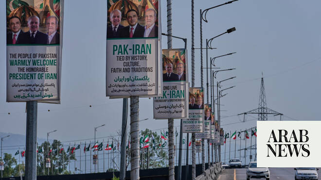

# Iran’s president, FM in Pakistan as US-Iran teams work to finalize a war-ending deal

Source: https://www.arabnews.com/node/2648232/middle-east
Captured source: https://www.arabnews.com/node/2648232/middle-east
Published: 2026-06-23T13:50:15+03:00
Modified: 2026-06-23T17:10:00+03:00
Author: AP

## Summary

DUBAI: ISLAMABAD: Iran’s president arrived in Pakistan for talks Tuesday with officials who have been mediating negotiations between Tehran and Washington on a permanent end to the war in the Middle East, even as discrepancies emerged on what had been agreed so far and violence broke out again in Lebanon. President Masoud Pezeshkian’s visit to Islamabad comes as technical

## Image

## Video Or Embed URLs

- blob:https://www.arabnews.com/5756fdd9-9964-4876-8c2f-6f0b3f927b55
- https://imasdk.googleapis.com/js/core/bridge3.773.0_en.html
- about:blank
- https://static.addtoany.com/menu/sm.25.html
- https://www.google.com/recaptcha/api2/aframe
- https://cm.g.doubleclick.net/partnerpixels?gdpr=0&us_privacy=1---&gpp_sid=-1&url=https%3A%2F%2Fwww.arabnews.com%2Fnode%2F2648232%2Fmiddle-east

## Text

https://arab.news/psyzq

DUBAI: ISLAMABAD: Iran’s president arrived in Pakistan for talks Tuesday with officials who have been mediating negotiations between Tehran and Washington on a permanent end to the war in the Middle East, even as discrepancies emerged on what had been agreed so far and violence broke out again in Lebanon.

President Masoud Pezeshkian’s visit to Islamabad comes as technical teams are working on details of the deal, following high-level negotiations in Switzerland on Monday led by US Vice President JD Vance and Iran’s parliamentary speaker, Mohammad Bagher Qalibaf.

Vance had said that the negotiations in Switzerland won an agreement for International Atomic Energy Agency inspectors to visit Iranian nuclear sites, but Iranian Foreign Ministry spokesperson Esmail Baghaei told reporters in Tehran on Tuesday no visits have been scheduled to the facilities earlier bombed by the United States.

The IAEA, the UN’s nuclear watchdog, has been in and out of Iran since Israel’s 12-day war against Iran in 2025, but has not been granted access to the bombed enrichment sites targeted by the US in that war.

Security was tight in the area of Islamabad where the Iranian president was to meet with President Asif Ali Zardari and Prime Minister Shehbaz Sharif. It’s his first visit since the conflict started with the American and Israeli attack on Iran on Feb. 28.

Pezeshkian and Sharif were to hold joint news conference after their discussions.

Iranian Foreign Minister Abbas Araghchi also arrived in Islamabad on Tuesday, joining Pezeshkian in meeting with Sharif.

The Iranian envoy had previously been in Oman alongside Iran’s chief negotiator, Mohammad Bagher Qalibaf, as part of diplomatic efforts.

In the initial talks, marking the start of a 60-day diplomatic process that seeks to reach a permanent deal to end the Iran war, Iran and the US agreed to create a “de-confliction cell” to address the fighting in Lebanon between Israel and the Iranian-backed Hezbollah militia group. The US said negotiators also discussed “mechanisms” to ensure the Strait of Hormuz, a key waterway for the transit of oil that Iran had effectively blocked during the war, remains open.

Ahead of his meetings in Pakistan, Pezeshkian cautioned that “the effectiveness of the talks depends on full commitment to the agreed obligations and their precise implementation.”

“Progress on this path will be measured by practical adherence to accepted responsibilities,” he wrote on X. “Statements outside the agreed text do not help advance the negotiations.”

Iran suggested the ongoing technical talks in Switzerland have led to the creation of specific negotiation groups, which include those focused on sanctions relief, nuclear issues, reconstruction and monitoring, according to a report by the state-run IRNA news agency.

It quoted Kazem Gharibabadi, a deputy foreign minister leading the technical talks, saying that the countries involved also formed a contact mechanism over ships moving through the Strait of Hormuz and over the fighting in Lebanon between Israel and Hezbollah.

It remains unclear whether the de-confliction cell being created will be enough to stop fighting between Hezbollah and Israel, which occupies part of Lebanon and insists it must maintain a free hand to attack militants who are launching attacks into northern Israel.

Mediators Pakistan and Qatar said the cell would include the Lebanese government and would “ensure the adherence of the termination of military operations in Lebanon,” but Israeli Prime Minister Benjamin Netanyahu raised new questions late Monday, saying his military still has “full freedom of action to thwart any direct or emerging threat to them or to the residents of the north.”

Neither Israel nor Hezbollah are signatories to the US-Iran deal, and Netanyahu has vowed to keep his forces in southern Lebanon until any threat to Israel is eliminated. Hezbollah has refused to halt attacks unless Israel commits to withdrawing.

US President Donald Trump later said “we’re going to take a look at it,” when asked about Netanyahu’s comments, adding that he wouldn’t say what action he would take but that the situation would “get solved.”

“I’m a problem solver, I get problems solved real fast, including with Bibi,” he said, using a nickname for Netanyahu.

At the moment, the renewed ceasefire in Lebanon, brokered on Saturday, appears to be holding with no new Israeli or Hezbollah strikes reported overnight.

Lebanon and Israel planned another round of direct talks in Washington on Tuesday, which are expected to focus on developing a plan for an Israeli withdrawal.
