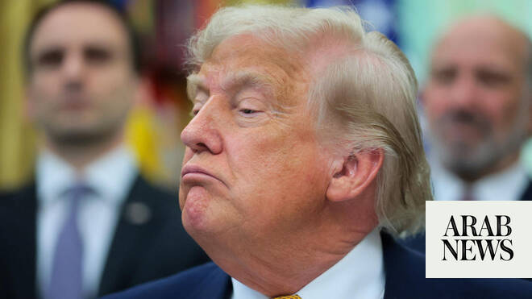

# Trump insists Iran has agreed to nuclear inspections

Source: https://www.arabnews.com/node/2648266/world
Captured source: https://www.arabnews.com/node/2648266/world
Published: 2026-06-23T14:44:35+03:00
Modified: 2026-06-23T16:44:13+03:00
Author: Reuters

## Summary

WASHINGTON: US President Donald Trump insisted on Tuesday that Iran has agreed to allow nuclear inspections ​long into the future, despite statements from Iran that it has not done so. “Iran has fully and completely agreed to highest level Nuclear inspections long into the future (Infinity!!!),” he wrote in a social media post. “This will insure ‘Nuclear Honesty.’ If they ‌did

## Image

## Video Or Embed URLs

- https://truthsocial.com/@realDonaldTrump/116799154100072125/embed
- https://static.addtoany.com/menu/sm.25.html
- about:blank
- https://imasdk.googleapis.com/js/core/bridge3.773.0_en.html
- https://www.google.com/recaptcha/api2/aframe
- https://cm.g.doubleclick.net/partnerpixels?gdpr=0&us_privacy=1---&gpp_sid=-1&url=https%3A%2F%2Fwww.arabnews.com%2Fnode%2F2648266%2Fworld

## Text

https://arab.news/p6xmw

Trump ⁠also said ‌in ‌an ​early ‌morning social ‌media post that the United States would ‌leave ships in the Strait ⁠of ⁠Hormuz

WASHINGTON: US President Donald Trump insisted on Tuesday that Iran has agreed to allow nuclear inspections ​long into the future, despite statements from Iran that it has not done so.

“Iran has fully and completely agreed to highest level Nuclear inspections long into the future (Infinity!!!),” he wrote in a social media post. “This will insure ‘Nuclear Honesty.’ If they ‌did not ‌agree to this, there ​would ‌be ⁠no further ​negotiations!“

Iran has ⁠denied it had begun discussions on its nuclear program or agreed to invite International Atomic Energy Agency inspectors back to the country.

Trump also said that the United States would leave ships in the Strait ⁠of Hormuz in case it ‌becomes necessary to ‌reimpose its blockade of Iranian ports, ​something he said ‌was “at this point, highly unlikely.”

He added ‌that 19 million barrels of oil flowed out of the Hormuz Strait on Monday.

The United States waived sanctions on Iran for 60 ‌days from Monday after the first talks under a nascent peace deal. Trump ⁠on ⁠Tuesday said the funds that the US Treasury is releasing will go into escrow under US control and will be used to buy food and medical supplies exclusively from the United States, including corn, wheat, and soybeans.

“These are things that are desperately needed by Iran. This is a humanitarian crisis, and I feel ​it is necessary ​to help, NOW, before it is too late,” Trump wrote.
