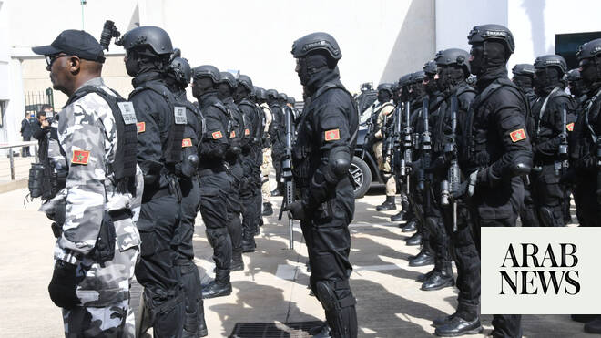

# Moroccan contingent arrives in Israel to join international Gaza force

Source: https://www.arabnews.com/node/2648344/middle-east
Captured source: https://www.arabnews.com/node/2648344/middle-east
Published: 2026-06-24T00:21:36+03:00
Modified: 2026-06-24T00:21:36+03:00
Author: AFP

## Summary

JERUSALEM: Officers from the Moroccan military, whose deployment was announced in February, have arrived in Israel to join a nascent international force for Gaza, US President Donald Trump’s Board of Peace said Tuesday. An official from the board separately told AFP on condition of anonymity that the contingent arrived on June 18 at the headquarters of the International

## Image

## Video Or Embed URLs

- https://static.addtoany.com/menu/sm.25.html
- about:blank
- https://www.google.com/recaptcha/api2/aframe
- https://imasdk.googleapis.com/js/core/bridge3.773.0_en.html
- https://sync.teads.tv/wigo-no-slot
- https://cm.g.doubleclick.net/partnerpixels?gdpr=0&us_privacy=1---&gpp_sid=-1&url=https%3A%2F%2Fwww.arabnews.com%2Fnode%2F2648344%2Fmiddle-east

## Text

https://arab.news/vwyt6

At least 1,027 Palestinians have been killed since the ceasefire began, according to the Hamas?run health ministry in Gaza, whose figures are considered reliable by the UN

Israel now says it controls at least 70 percent of the Gaza Strip, compared with just over half following its pullback on the first day of the truce

JERUSALEM: Officers from the Moroccan military, whose deployment was announced in February, have arrived in Israel to join a nascent international force for Gaza, US President Donald Trump’s Board of Peace said Tuesday. An official from the board separately told AFP on condition of anonymity that the contingent arrived on June 18 at the headquarters of the International Stabilization Force (ISF) in southern Israel. The contingent is expected to contribute to the development of the force’s overall structure and provide expertise in several areas, including policing, the official said. He confirmed the presence of four Moroccan officers but did not specify whether the contingent included additional personnel. “Their arrival strengthens the international effort to support the people of Gaza,” the Board of Peace said on X. In February, Morocco committed to deploying police officers and military personnel to the Gaza Strip, becoming the first Arab country to do so publicly. In mid-January, Washington announced the launch of the second phase of Trump’s plan for Gaza aimed at bringing a definitive end to the war triggered by Hamas’s October 7, 2023 attack on Israel. In practice, however, little tangible progress has been achieved. The Trump plan, endorsed by the United Nations Security Council, led to the establishment of a ceasefire that took effect in October. Its second phase provides for a gradual Israeli withdrawal from Gaza, the disarmament of Hamas, and the deployment of the ISF, a project that has been the subject of repeated announcements and discussions but has yet to materialize. In late February, Hamas said it was open to the presence of such a force in the Gaza Strip, provided it did not interfere in the territory’s internal affairs. Hamas seized control of Gaza in 2007. Israel now says it controls at least 70 percent of the Gaza Strip, compared with just over half following its pullback on the first day of the truce. Israel and Hamas accuse each other almost daily of violating the ceasefire amid stalled efforts toward a lasting end to the war. At least 1,027 Palestinians have been killed since the ceasefire began, according to the Hamas?run health ministry in Gaza, whose figures are considered reliable by the UN. The Israeli military says it has lost five of its soldiers during the same period.
