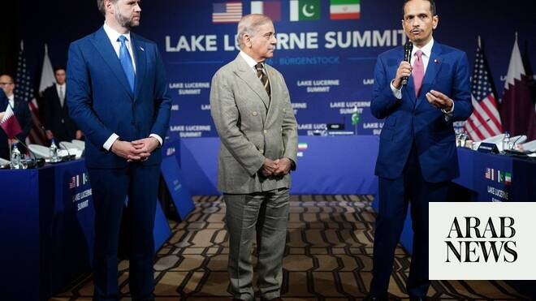

# Qatar says US-Iran hotline crucial for Hormuz reopening

Source: https://www.arabnews.com/node/2648396/middle-east
Captured source: https://www.arabnews.com/node/2648396/middle-east
Published: 2026-06-24T11:57:48+03:00
Modified: 2026-06-24T12:00:24+03:00
Author: Arab News

## Summary

DUBAI: Qatar’s Prime Minister Sheikh Mohammed bin Abdulrahman Al-Thani said his country would ‌resume normal liquefied ‌natural ⁠gas production “within a ⁠few weeks”, the Financial Times reported on Wednesday. But establishing a hotline between ⁠the US and ‌Iran ‌is essential to ‌reopen the Strait ‌of Hormuz, he told the FT in an interview.

## Image

## Video Or Embed URLs

- https://static.addtoany.com/menu/sm.25.html
- about:blank
- https://imasdk.googleapis.com/js/core/bridge3.773.0_en.html
- https://www.google.com/recaptcha/api2/aframe
- https://sync.teads.tv/wigo-no-slot
- https://cm.g.doubleclick.net/partnerpixels?gdpr=0&us_privacy=1---&gpp_sid=-1&url=https%3A%2F%2Fwww.arabnews.com%2Fnode%2F2648396%2Fmiddle-east

## Text

https://arab.news/9r9wr

DUBAI: Qatar’s Prime Minister Sheikh Mohammed bin Abdulrahman Al-Thani said his country would ‌resume normal liquefied ‌natural ⁠gas production “within a ⁠few weeks”, the Financial Times reported on Wednesday. But establishing a hotline between ⁠the US and ‌Iran ‌is essential to ‌reopen the Strait ‌of Hormuz, he told the FT in an interview. Al-Thani noted that the so-called “hotline” agreed by the warring parties at their talks in Switzerland was needed “to counter ‘disinformation’ and ensure co-ordination while mines were cleared from the crucial waterway.” He noted that the communication was essential to get information needed to guarantee the safety of vessels. “So the hotline’s purpose is to make sure that any ship that gets any type of threat is to be verified by Iran … and to let the ship pass safely.” Sheikh Mohammed said Qatar, the world’s second-largest LNG exporter whose facilities were hit by Iran in the early weeks of the war, had already started to prepare its tankers after the warring parties signed a memorandum of understanding last week. “Within a few weeks, production will come back to normal, except the damaged facility,” Sheikh Mohammed said. “Our teams have been mobilized already for a few weeks. QatarEnergy is preparing for operations to come back to normal as soon as the situation in the strait normalizes.” QatarEnergy ‌suspended LNG production after the US ⁠and Israel ⁠launched their war on Iran on February 28 following a drone attack on its huge Ras Laffan plant.
