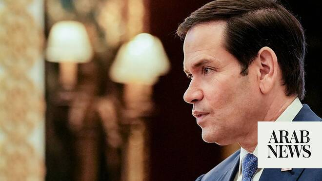

# Rubio warns Hormuz tolls would ‘spread like contagion’ to other waterways

Source: https://www.arabnews.com/node/2648526/middle-east
Captured source: https://www.arabnews.com/node/2648526/middle-east
Published: 2026-06-25T11:35:38+03:00
Modified: 2026-06-25T13:39:04+03:00
Author: AFP

## Summary

MANAMA: US Secretary of State Marco Rubio on Thursday warned that Iranian tolls on ships passing the Strait of Hormuz would spread to other waterways, risking “total chaos.” “International waterways do not belong to any nation state. This is a foundational principle in the world today, without which the world would be in total chaos,” he told a Gulf Cooperation Council meeting

## Image

## Video Or Embed URLs

- https://386ea777257decd0ffba1e12e4ca60c1.safeframe.googlesyndication.com/safeframe/1-0-45/html/container.html
- blob:https://www.arabnews.com/d04096f1-bce7-4373-97f1-0d0252cb776a
- https://imasdk.googleapis.com/js/core/bridge3.773.0_en.html
- https://static.addtoany.com/menu/sm.25.html
- about:blank
- https://sync.teads.tv/wigo-no-slot
- https://ep2.adtrafficquality.google/sodar/sodar2/255/runner.html
- https://www.google.com/recaptcha/api2/aframe
- https://cm.g.doubleclick.net/partnerpixels?gdpr=0&us_privacy=1---&gpp_sid=-1&url=https%3A%2F%2Fwww.arabnews.com%2Fnode%2F2648526%2Fmiddle-east

## Text

https://arab.news/232w7

The top US diplomat also gave assurances that the interests of Gulf countries would be taken into account

MANAMA: US Secretary of State Marco Rubio on Thursday warned that Iranian tolls on ships passing the Strait of Hormuz would spread to other waterways, risking “total chaos.” “International waterways do not belong to any nation state. This is a foundational principle in the world today, without which the world would be in total chaos,” he told a Gulf Cooperation Council meeting in Bahrain. “If in fact we accepted that you can charge money to use an international waterway because it happens to be near your territorial space, well then this will spread throughout the world like a contagion.” Rubio, on his first regional tour since the US and Iran signed a memorandum of understanding to end the Middle East war, said the US wants a peace deal but not “at any price.” “While we want a deal, we don’t want a deal at any price,” he said. “We want a deal that’s good, we want a deal that’s real, we want a deal that’s verifiable, and we want a deal that’s adhered to.” The top US diplomat, who has visited the heavily attacked UAE, Kuwait and Bahrain on his tour, also gave assurances that the interests of Gulf countries would be taken into account. “We want to ensure... that there is no part of this deal that’s undertaken that in any way undermines the security, the stability, or the prosperity of any of our partners in the Gulf region,” he said.
