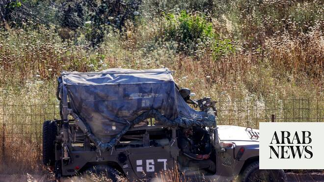

# Israel, Lebanon deny that Israel has withdrawn from part of southern Lebanon

Source: https://www.arabnews.com/node/2648532/middle-east
Captured source: https://www.arabnews.com/node/2648532/middle-east
Published: 2026-06-25T12:26:50+03:00
Modified: 2026-06-25T12:29:40+03:00
Author: Reuters

## Summary

BEIRUT: Senior Israeli and Lebanese officials denied on Thursday that there had been any ​Israeli withdrawal from occupied southern Lebanon, after a US official said Israel had pulled some of its troops back in a good faith gesture toward Lebanon’s government. Israel and Lebanon have been discussing a US-backed proposal for Israeli forces to transfer some of the Lebanese

## Image

## Video Or Embed URLs

- https://b1ad7c6695442d4a59fd05cb051cdff6.safeframe.googlesyndication.com/safeframe/1-0-45/html/container.html
- https://static.addtoany.com/menu/sm.25.html
- about:blank
- https://www.google.com/recaptcha/api2/aframe
- https://imasdk.googleapis.com/js/core/bridge3.773.0_en.html
- https://sync.teads.tv/wigo-no-slot
- https://cm.g.doubleclick.net/partnerpixels?gdpr=0&us_privacy=1---&gpp_sid=-1&url=https%3A%2F%2Fwww.arabnews.com%2Fnode%2F2648532%2Fmiddle-east

## Text

Israel and Lebanon have been discussing a US-backed proposal for Israeli forces to transfer some of the Lebanese territory invaded in their war with Hezbollah to Lebanon’s military

BEIRUT: Senior Israeli and Lebanese officials denied on Thursday that there had been any ​Israeli withdrawal from occupied southern Lebanon, after a US official said Israel had pulled some of its troops back in a good faith gesture toward Lebanon’s government. Israel and Lebanon have been discussing a US-backed proposal for Israeli forces to transfer some of the Lebanese territory invaded in their war with Hezbollah to Lebanon’s military, in ‌a possible step ‌toward restoring Lebanese control of occupied ​territory. The “pilot ‌zone” ⁠proposal ​has been ⁠part of the latest round of Israeli-Lebanese talks in Washington, which have gone on even as they appear to be eclipsed by Iran’s move to make Lebanon central to its own talks with the United States. A US State Department official said the pilot zone process was aimed ⁠at ensuring the complete and verifiable ‌destruction of Hezbollah’s weapons and infrastructure ‌and the dismantlement of non-state armed ​groups. “Israel has already taken ‌a concrete step by pulling back from a part ‌of its buffer zone. This is a significant demonstration of good faith toward Lebanon’s legitimate government,” the State Department official said. “The (Lebanese Armed Forces) should now move in and verifiably clear out terrorist ‌weapons and infrastructure. This model will be repeated across South Lebanon, enabling the safe return ⁠of displaced ⁠families, reconstruction of the south, and the restoration of full Lebanese sovereignty,” the official added. A senior Israeli defense official told Reuters that Israel’s policy was clear and that the military would not be withdrawing from its so-called “buffer zone” in southern Lebanon. Asked about the State Department official’s comments, a senior Lebanese military official said developments on the ground in recent days “show the opposite of a pullback.” The official said Israeli forces had been enforcing ​their buffer zone against anyone ​approaching it, including Lebanese army troops.
