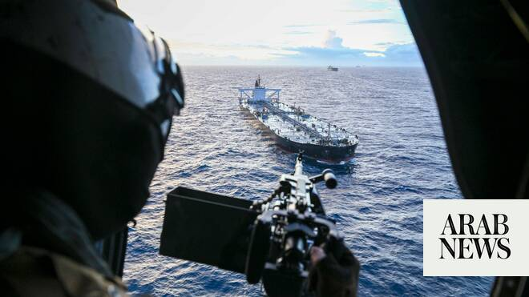

# Iranian sailors seized by US handed over in Pakistan

Source: https://www.arabnews.com/node/2648699/middle-east
Captured source: https://www.arabnews.com/node/2648699/middle-east
Published: 2026-06-26T20:02:24+03:00
Modified: 2026-06-26T20:02:24+03:00
Author: Arab News

## Summary

LONDON: Twenty-two Iranian crew members whose oil tanker was seized by the United States during the recent conflict were transferred to Iran's consulate in Pakistan on Friday. Pakistan’s Foreign Minister Ishaq Dar said the sailors were from the ship named Davina, which US forces boarded in the Indian Ocean earlier this month. Iran’s state news agency IRNA reported that the

## Image

## Video Or Embed URLs

- https://2fd3180901a8c59dc0fd8011c56acebb.safeframe.googlesyndication.com/safeframe/1-0-45/html/container.html
- https://static.addtoany.com/menu/sm.25.html
- about:blank
- https://www.google.com/recaptcha/api2/aframe
- https://imasdk.googleapis.com/js/core/bridge3.773.0_en.html
- https://cm.g.doubleclick.net/partnerpixels?gdpr=0&us_privacy=1---&gpp_sid=-1&url=https%3A%2F%2Fwww.arabnews.com%2Fnode%2F2648699%2Fmiddle-east

## Text

https://arab.news/n584y

Twenty-two Iranian crew members seized by US earlier this month arrive at Iran's consulate in Karachi

Pakistan's foreign minister says the sailors were on board the supertanker Davina, which the US boarded in the Indian Ocean

LONDON: Twenty-two Iranian crew members whose oil tanker was seized by the United States during the recent conflict were transferred to Iran's consulate in Pakistan on Friday.

Pakistan’s Foreign Minister Ishaq Dar said the sailors were from the ship named Davina, which US forces boarded in the Indian Ocean earlier this month.

Iran’s state news agency IRNA reported that the crew were handed over to Iranian diplomats and are expected to return to Iran in the coming days.

Pakistan has mediated talks between the US and Iran to end the conflict, which led to an initial agreement signed last week.

Dar said Pakistan had remained in close contact with the US and Iranian authorities throughout the process.

“Arrangements are now being finalized in close collaboration with the Iranian Missions in Pakistan to facilitate their earliest and safe return to their homeland,” Dar said on X.

The group is the fourth set of Iranian crew in the past two months that Pakistan has helped repatriate.

The US military said it had interdicted and boarded the sanctioned stateless vessel Davina on June 4 as part of a blockade of Iranian ports.

The supertanker, capable of carrying up to two million barrels of crude oil, was placed under ‌US sanctions in October 2024 for Iranian oil trading, Reuters reported.

The vessel, also known as the Lenore, was seen on June 5 off Sri Lanka’s southern coast.

*With AFP and Reuters
