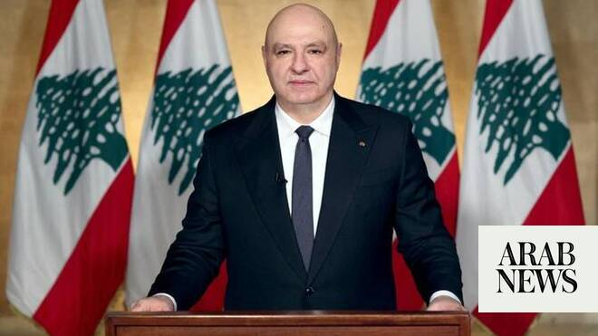

# Lebanon president: Israel deal first step to restoring sovereignty

Source: https://www.arabnews.com/node/2648720/middle-east
Captured source: https://www.arabnews.com/node/2648720/middle-east
Published: 2026-06-26T23:29:22+03:00
Modified: 2026-06-26T23:33:55+03:00
Author: AFP

## Summary

BEIRUT: Lebanese President Joseph Aoun said a deal signed with Israel on Friday was a first step toward fully restoring his country’s sovereignty after the latest war between Israel and the Iran-backed Hezbollah. “The framework agreement signed today is a first step” that will enable Lebanese “to return to their fully liberated lands, and to their certainly rebuilt homes...

## Image

## Video Or Embed URLs

- https://07479620a405b6d6480d8226852c962b.safeframe.googlesyndication.com/safeframe/1-0-45/html/container.html
- https://static.addtoany.com/menu/sm.25.html
- about:blank
- https://www.google.com/recaptcha/api2/aframe
- https://imasdk.googleapis.com/js/core/bridge3.773.0_en.html
- https://sync.teads.tv/wigo-no-slot
- https://cm.g.doubleclick.net/partnerpixels?gdpr=0&us_privacy=1---&gpp_sid=-1&url=https%3A%2F%2Fwww.arabnews.com%2Fnode%2F2648720%2Fmiddle-east

## Text

https://arab.news/c6vqh

Joseph Aoun says agreement will enable Lebanese “to return to their fully liberated lands"

Prime Minister Nawaf Salam says the accord “aims to achieve Israel’s withdrawal from all Lebanese territory"

BEIRUT: Lebanese President Joseph Aoun said a deal signed with Israel on Friday was a first step toward fully restoring his country’s sovereignty after the latest war between Israel and the Iran-backed Hezbollah. “The framework agreement signed today is a first step” that will enable Lebanese “to return to their fully liberated lands, and to their certainly rebuilt homes... under the sovereignty of the Lebanese state that has no partner in its sovereignty over its land and people,” Aoun said according to a statement released by his office. “We swear to continue to work until this is fully achieved. There will be no more occupation, prisoners, subordination or tutelage,” he added. Lebanese Prime Minister Nawaf Salam said the agreement “aims to achieve Israel’s withdrawal from all Lebanese territory, restore state sovereignty over it” and see the return of displaced Lebanese. “I look forward to the blessed moment when Israel begins to withdraw — so that our dear people can return to their homes with safety and dignity — and to the launch” of reconstruction efforts, Salam added, according to a statement.
