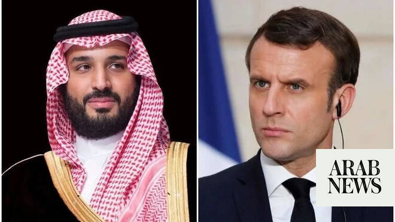

# Saudi crown prince, Macron emphasize importance of freedom of navigation during call

Source: https://www.arabnews.com/node/2648894/saudi-arabia
Captured source: https://www.arabnews.com/node/2648894/saudi-arabia
Published: 2026-06-28T18:52:40+03:00
Modified: 2026-06-28T18:52:40+03:00
Author: Arab News

## Summary

RIYADH: Saudi Crown Prince and French President Emmanuel Macron emphasised the importance of ensuring freedom of navigation during a phone call on Sunday. They also discussed supporting diplomatic efforts to de-escalate tension in the region and the latest updates regarding the memorandum of understanding signed between the US and Iran, the Saudi Press Agency reported. A

## Image

## Video Or Embed URLs

- https://96fdf4f51d0b1e7cffdce860326b185a.safeframe.googlesyndication.com/safeframe/1-0-45/html/container.html
- https://static.addtoany.com/menu/sm.25.html
- about:blank
- https://www.google.com/recaptcha/api2/aframe
- https://imasdk.googleapis.com/js/core/bridge3.773.0_en.html
- https://sync.teads.tv/wigo-no-slot
- https://cm.g.doubleclick.net/partnerpixels?gdpr=0&us_privacy=1---&gpp_sid=-1&url=https%3A%2F%2Fwww.arabnews.com%2Fnode%2F2648894%2Fsaudi-arabia

## Text

https://arab.news/83gb5

RIYADH: Saudi Crown Prince and French President Emmanuel Macron emphasised the importance of ensuring freedom of navigation during a phone call on Sunday.

They also discussed supporting diplomatic efforts to de-escalate tension in the region and the latest updates regarding the memorandum of understanding signed between the US and Iran, the Saudi Press Agency reported.

A memorandum of understanding was reached this month to put a lasting end to the US-Israeli war on Iran.

Efforts to reach comprehensive solutions that ensure regional security and stability were also discussed and regional and international developments were reviewed.

The two leaders also addressed areas of joint cooperation between their countries.
