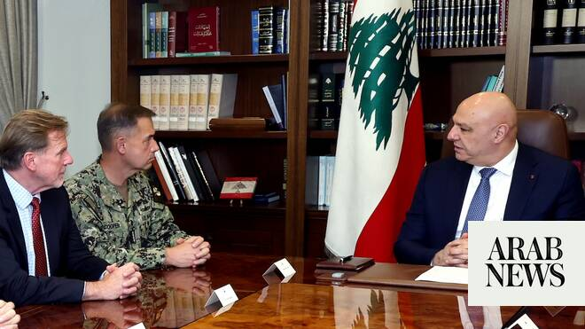

# Lebanon president tells US commander will exert sovereignty over all country’s territory

Source: https://www.arabnews.com/node/2648994/middle-east
Captured source: https://www.arabnews.com/node/2648994/middle-east
Published: 2026-06-29T17:47:39+03:00
Modified: 2026-06-29T19:52:18+03:00
Author: AFP

## Summary

BEIRUT: Lebanon’s President Joseph Aoun on Monday told the head of US forces in the Middle East that Beirut intended to assert its sovereignty over the entire country, with the army deployed right up to the Israeli border. Aoun met Admiral Brad Cooper, the head of US Central Command, to discuss the Washington-brokered agreement signed last week by Israel and Lebanon aimed at a

## Image

## Video Or Embed URLs

- https://4b1f150f8642172cf1345129e56f1c84.safeframe.googlesyndication.com/safeframe/1-0-45/html/container.html
- https://static.addtoany.com/menu/sm.25.html
- about:blank
- https://imasdk.googleapis.com/js/core/bridge3.774.0_en.html
- https://ep2.adtrafficquality.google/sodar/sodar2/255/runner.html
- https://www.google.com/recaptcha/api2/aframe
- https://cm.g.doubleclick.net/partnerpixels?gdpr=0&us_privacy=1---&gpp_sid=-1&url=https%3A%2F%2Fwww.arabnews.com%2Fnode%2F2648994%2Fmiddle-east

## Text

https://arab.news/9xu2s

Cooper also met Lebanon’s army chief Rodolphe Haykal, with the discussions addressing “the latest developments in Lebanon and the region”

BEIRUT: Lebanon’s President Joseph Aoun on Monday told the head of US forces in the Middle East that Beirut intended to assert its sovereignty over the entire country, with the army deployed right up to the Israeli border. Aoun met Admiral Brad Cooper, the head of US Central Command, to discuss the Washington-brokered agreement signed last week by Israel and Lebanon aimed at a peace deal. Cooper also met Lebanon’s army chief Rodolphe Haykal, with the discussions addressing “the latest developments in Lebanon and the region,” the army said in a statement.

As part of the Washington deal, Hezbollah is to be disarmed, with the onus for doing so on the Lebanese army. Israeli leaders have said their troops will continue to occupy the south until then. The Iran-backed militant group has fiercely opposed the agreement and leading figures have warned of conflict within Lebanon if the deal is forced on them. Hezbollah drew Lebanon into the Middle East war in March with rocket fire at Israel, triggering Israeli airstrikes and a ground invasion. According to the statement, Haykal and Cooper discussed “the importance of successfully implementing the security annex of the framework agreement,” as well as ways of strengthening future cooperation. In a post on X, Central Command said Cooper, Aoun and Haykal “discussed the path forward in implementing” the Washington agreement. Cooper also visited Israel, it said.

“Verified disarmament”

The deal commits Lebanon to restoring sovereignty over its territory through the “verified disarmament of non-state armed groups and dismantlement of associated infrastructure,” enabling a progressive Israeli withdrawal, according to the text released by the State Department. “The components of this process will be detailed in a Security Annex, developed with the full support of the United States,” the text said, without immediately publishing the annex. US Secretary of State Marco Rubio said on Friday that Washington would reimburse Lebanon’s army for $30 million as it seeks to “improve the capability and capacity” of the Lebanese military. The US has long been a key supporter of the Lebanese army. Hezbollah chief Naim Qassem has called the agreement “null and void” and instead called for the implementation of a US-Iran memorandum of understanding to halt the regional war that included Lebanon. The Israel-Lebanon talks in Washington have sought to separate Lebanon from the Iran deal. However, Friday’s agreement came after a lull in fighting that followed the US-Iran memorandum, which Tehran insisted should include Lebanon. Hezbollah on Monday said it reserved the right to self-defense after several Israeli attacks on southern Lebanon the day before, accusing Israel of a “blatant violation of the ceasefire.” Israeli troops are operating in a self-declared “security zone” stretching around 10 kilometers (six miles) deep inside Lebanese territory along the border. Lebanese authorities say Israeli attacks since the war began on March 2 have killed more than 4,200 people.
