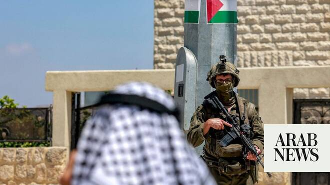

# West Bank suffering its largest displacement crisis since 1967, UN Security Council told

Source: https://www.arabnews.com/node/2649024/middle-east
Captured source: https://www.arabnews.com/node/2649024/middle-east
Published: 2026-06-29T23:10:10+03:00
Modified: 2026-06-29T23:17:04+03:00
Author: Ephrem Kossaify

## Summary

NEW YORK CITY: The West Bank is experiencing its largest displacement crisis since 1967, the UN Security Council heard on Monday. It came as officials and humanitarian agencies warned of an entrenched and unlawful Israeli occupation, while the US accused the world body of ignoring atrocities committed by Hamas against Palestinians in Gaza.

## Image

## Video Or Embed URLs

- https://67edfe543d482799d497741a693574df.safeframe.googlesyndication.com/safeframe/1-0-45/html/container.html
- https://static.addtoany.com/menu/sm.25.html
- about:blank
- https://www.google.com/recaptcha/api2/aframe
- https://imasdk.googleapis.com/js/core/bridge3.774.0_en.html
- https://cm.g.doubleclick.net/partnerpixels?gdpr=0&us_privacy=1---&gpp_sid=-1&url=https%3A%2F%2Fwww.arabnews.com%2Fnode%2F2649024%2Fmiddle-east

## Text

https://arab.news/n8q2w

Crisis caused by settler violence, access restrictions, demolitions and prolonged security operations within an entrenched, unlawful Israeli occupation, officials say

Question no longer whether Israeli settlements violate international law but whether the council is prepared to act, says Norwegian Refugee Council representative

NEW YORK CITY: The West Bank is experiencing its largest displacement crisis since 1967, the UN Security Council heard on Monday.

It came as officials and humanitarian agencies warned of an entrenched and unlawful Israeli occupation, while the US accused the world body of ignoring atrocities committed by Hamas against Palestinians in Gaza.

Ramiz Alakbarov, the deputy special coordinator for the Middle East peace process, told the council that settler violence, access restrictions, demolitions and prolonged security operations had combined to produce the worst wave of Palestinian displacement in the West Bank for nearly six decades.

He cited continuing Israeli military activity in Jenin and Tulkarm, including the establishment of an army post in the former, as especially troubling given that these areas fall under the civil and security control of the Palestinian Authority.

Alakbarov reiterated condemnation by the UN secretary-general, Antonio Guterres, of settlement expansions, formal land registrations in Area C (which constitutes about 61 percent of West Bank territory and is under full Israeli security and administrative control), and decision to establish military facilities at the former UN Relief and Works Agency compound in Sheikh Jarrah, East Jerusalem, which he urged Israeli authorities to rescind.

Regarding the situation in Gaza, Alakbarov said Israeli airstrikes and military operations have continued in the territory despite the ceasefire agreement, pushing the death toll since the truce to more than 1,000, according to Gaza’s Health Ministry. He said Israel now controlled about 70 percent of the Gaza Strip, squeezing civilians into increasingly limited areas.

While conditions have eased somewhat since the adoption of Security Council Resolution 2803 in November (which endorsed the US-backed “Comprehensive Plan to End the Gaza Conflict”), including a reduction in the share of households going to bed hungry from 92 percent to 36 percent, Alakbarov said 70 percent of the population still lacked dignified shelter.

He voiced concern over reports of intimidation in relation to anti-Hamas protests in Gaza on June 26, and called for the full implementation of Resolution 2803, including the disarmament of Hamas and other armed groups, the withdrawal of Israeli forces, the deployment of the International Stabilization Force, and the transfer of governance to a “National Committee for the Administration of Gaza.”

Itay Epshtain, representing the Norwegian Refugee Council, delivered a legal argument in which he told council members that the question was no longer whether Israeli settlements violated international laws but “whether the council is prepared to give them effect.”

He said more than 33,000 Palestinians had been displaced from Jenin, Tulkarm and Far’a refugee camps, and that more than 70 percent of displaced households cited threats against women and children, including sexualized threats, as decisive in their decisions to flee.

Citing a 2024 advisory opinion by the International Court of Justice, Epshtain said it had found Israel’s continued presence in the occupied territory unlawful “as such,” elevating what was once a political call within the text of Resolution 2334 to “a judicially endorsed legal obligation.”

He rejected any framing of settler violence as mere “extremism,” arguing that when armed settlers operate as part of military structures, the issue becomes one of state responsibility.

He called for restitution of Palestinian land and property, expansion of the UN Register of Damage to cover compensation claims since 1967, and protective measures for communities at risk of displacement before any harm occurs, as he accused Israel of continuing to obstruct the work of humanitarian organizations, including the Norwegian Refugee Council.

The US permanent representative to the UN, Mike Waltz, told the story of a young Gazan girl, Masa, who recently received a bag of school supplies, describing this as a sign that “life is starting again in Gaza.”

He said disarmament of Hamas remained “the heart” of the peace plan endorsed by Resolution 2803. He credited mediators Turkey, Egypt and Qatar for their efforts, and noted that the former US secretary of state, Hillary Clinton, had recently endorsed the plan as the “only game in town.”

Waltz cited a UN Independent International Commission of Inquiry report this month that documented executions, torture and beatings of Palestinians carried out by Hamas-affiliated forces in Gaza between 2024 and 2026, including public killings at the Nasser Medical Complex, which he said amounted to war crimes.

He criticized what he described as the near-total absence of coverage of the report, and said Hamas had mounted an “industrial-scale campaign of terror” on June 26 against Gazans protesting against its rule, including house arrests and threats against families.

Regarding the implementation of Resolution 2803, Waltz said troops from Morocco, Kosovo and Albania were being deployed as part of the International Stabilization Force, while Egypt and Jordan were training a new Palestinian police force, with the UAE pledging $100 million toward the effort.

“Hamas does not get to negotiate its way into keeping a terrorist army,” he added.
