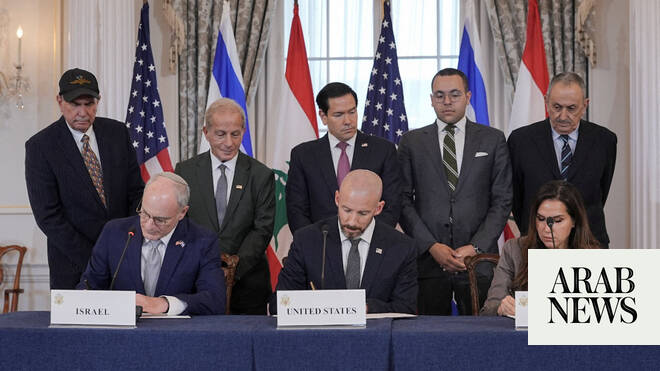

# UN hails US-brokered Israel-Lebanon ‘Framework’ agreement as a ‘milestone’

Source: https://www.arabnews.com/node/2649026/middle-east
Captured source: https://www.arabnews.com/node/2649026/middle-east
Published: 2026-06-29T23:38:06+03:00
Modified: 2026-06-29T23:39:15+03:00
Author: Ephrem Kossaify

## Summary

NEW YORK CITY: The UN on Monday described a newly announced “Trilateral Framework” established by the US, Israel and Lebanon as a “milestone” development. Stephane Dujarric, spokesperson for UN Secretary-General Antonio Guterres, told reporters the arrangement “constitutes a milestone in efforts to end decades of conflict and advance lasting stability” between Israel and

## Image

## Video Or Embed URLs

- https://ae9432cb77abc0e5700b9b865d7a9d41.safeframe.googlesyndication.com/safeframe/1-0-45/html/container.html
- https://static.addtoany.com/menu/sm.25.html
- about:blank
- https://www.google.com/recaptcha/api2/aframe
- https://imasdk.googleapis.com/js/core/bridge3.774.0_en.html
- https://sync.teads.tv/wigo-no-slot
- https://cm.g.doubleclick.net/partnerpixels?gdpr=0&us_privacy=1---&gpp_sid=-1&url=https%3A%2F%2Fwww.arabnews.com%2Fnode%2F2649026%2Fmiddle-east

## Text

https://arab.news/j7py5

It brings together the 3 nations in what officials describe as a renewed political track to resolve longstanding tensions along Israeli-Lebanese border

Arrangement is ‘a milestone in efforts to end decades of conflict and advance lasting stability,’ says secretary-general’s spokesperson

NEW YORK CITY: The UN on Monday described a newly announced “Trilateral Framework” established by the US, Israel and Lebanon as a “milestone” development.

Stephane Dujarric, spokesperson for UN Secretary-General Antonio Guterres, told reporters the arrangement “constitutes a milestone in efforts to end decades of conflict and advance lasting stability” between Israel and Lebanon.

The framework, which was announced on June 26, brings together the three nations in what officials described as a renewed political track that aims to resolve longstanding tensions along the Israeli-Lebanese border.

Dujarric said the UN continues to stress the importance of working to resolve outstanding issues through dialogue “to achieve sustainable stability on both sides of the Blue Line,” referring to the de facto border that separates the countries, and to safeguard the sovereignty and security of both states.

He added that the UN remains committed to providing support for Lebanon and Israel in their efforts to fulfill their obligations in pursuit of a long-term resolution to the conflict, in line with the terms of Security Council Resolution 1701, which has governed the ceasefire arrangements along the border since 2006.
