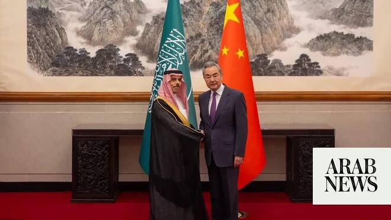

# China calls for maintaining Iran talks momentum

Source: https://www.arabnews.com/node/2649151/saudi-arabia
Captured source: https://www.arabnews.com/node/2649151/saudi-arabia
Published: 2026-06-30T20:01:25+03:00
Modified: 2026-06-30T20:21:04+03:00
Author: Arab News

## Summary

BEIJING: China’s Foreign Minister Wang Yi on Tuesday called for maintaining the momentum in the negotiations between the ‌US and ‌Iran in ‌a meeting in Beijing with his Saudi counterpart Prince Faisal bin Farhan. "The current ceasefire remains fragile, ‌but ‌talking is better ‌than fighting, ‌and dialogue is better than confrontation," Wang said, according to Xinhua news

## Image

## Video Or Embed URLs

- https://e59352ae14c7a71c0b76c25a14ad10ad.safeframe.googlesyndication.com/safeframe/1-0-45/html/container.html
- https://static.addtoany.com/menu/sm.25.html
- about:blank
- https://imasdk.googleapis.com/js/core/bridge3.774.0_en.html
- https://www.google.com/recaptcha/api2/aframe
- https://cm.g.doubleclick.net/partnerpixels?gdpr=0&us_privacy=1---&gpp_sid=-1&url=https%3A%2F%2Fwww.arabnews.com%2Fnode%2F2649151%2Fsaudi-arabia

## Text

https://arab.news/wm4j9

In meeting with his Saudi counterpart, Foreign Minister Wang Yi said Beijing is willing to work with Riyadh to ease tensions in the region

Prince Faisal bin Farhan and Wang discuss freedom of navigation through the Strait of Hormuz

BEIJING: China’s Foreign Minister Wang Yi on Tuesday called for maintaining the momentum in the negotiations between the ‌US and ‌Iran in ‌a meeting in Beijing with his Saudi counterpart Prince Faisal bin Farhan.

"The current ceasefire remains fragile, ‌but ‌talking is better ‌than fighting, ‌and dialogue is better than confrontation," Wang said, according to Xinhua news agency.

He added that Beijing is willing to work with Saudi Arabia to ease tensions in the region and promote lasting peace.

During their meeting, Wang and Prince Faisal discussed the importance of maintaining freedom of navigation in the Strait of Hormuz, saying that the waterway “contributes to supporting energy security and the stability of the global economy,” Saudi Press Agency reported.

Iran shut down the Strait after the conflict with Israel and the US started four months ago.

Fully reopening the waterway, through which a fifth of the world’s oil and liquified natural gas used to pass, has become a key aspect of ongoing negotiations between Tehran and Washington.

China, which relies on energy exports from the Gulf, has repeatedly called for an end to the Iran conflict, with the foreign ministry saying last month that a solution would be beneficial to both the United States, Iran, and the rest of the world.

Wang and Prince Faisal also discussed the latest regional and international developments and “efforts to de-escalate tensions and promote security and stability.”

The talks covered ways for the two countries “to enhance economic, trade, and investment cooperation” and strengthen ties in energy, industry, supply chains, and advanced technologies.

Earlier, Prince Faisal met Chinese Vice President Han Zheng.
