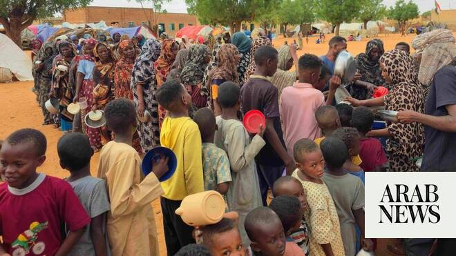

# UN aid chief warns El-Obeid risks becoming ‘another El-Fasher’ as drone strikes escalate in Sudan

Source: https://www.arabnews.com/node/2649179/middle-east
Captured source: https://www.arabnews.com/node/2649179/middle-east
Published: 2026-06-30T23:03:28+03:00
Modified: 2026-06-30T23:08:58+03:00
Author: Ephrem Kossaify

## Summary

NEW YORK CITY: The UN’s top humanitarian official warned on Tuesday that there was a risk El-Obeid, the besieged capital of Sudan’s North Kordofan region, would become “another El-Fasher,” as escalating drone strikes and a deteriorating humanitarian situation threaten hundreds of thousands of civilians sheltering in the city. “I am again sounding the alarm on the escalating

## Image

## Video Or Embed URLs

- https://5b086ca1caa2bacce4acd37fd0d2ea9c.safeframe.googlesyndication.com/safeframe/1-0-45/html/container.html
- https://static.addtoany.com/menu/sm.25.html
- about:blank
- https://www.google.com/recaptcha/api2/aframe
- https://imasdk.googleapis.com/js/core/bridge3.774.0_en.html
- https://cm.g.doubleclick.net/partnerpixels?gdpr=0&us_privacy=1---&gpp_sid=-1&url=https%3A%2F%2Fwww.arabnews.com%2Fnode%2F2649179%2Fmiddle-east

## Text

https://arab.news/nsg6v

Civilians wanting to leave city must be safe to do so, says Tom Fletcher, and ‘whether they leave or remain they must be protected and have access to the essentials for survival’

‘Too often in this brutal war, clear warnings have been ignored. Civilians have paid the price. The international community must make itself heard,’ he adds

NEW YORK CITY: The UN’s top humanitarian official warned on Tuesday that there was a risk El-Obeid, the besieged capital of Sudan’s North Kordofan region, would become “another El-Fasher,” as escalating drone strikes and a deteriorating humanitarian situation threaten hundreds of thousands of civilians sheltering in the city.

“I am again sounding the alarm on the escalating violence and rapidly deteriorating humanitarian situation in Sudan’s North Kordofan region,” said Tom Fletcher, under-secretary-general for humanitarian affairs and emergency relief coordinator. “We cannot allow El-Obeid to become another El-Fasher.”

There are hundreds of thousands of civilians in El-Obeid, he said, including many displaced by fighting elsewhere in Sudan who had sought refuge in the city. Intensifying drone attacks are killing civilians across the region, raising the risk of deeper human suffering, he added.

The strikes are also disrupting access to lifesaving supplies of drinking water and electricity, Fletcher warned, a particularly dangerous development at this time of year.

“With the rainy season approaching, safe water is critical to reduce the risk of cholera and other deadly waterborne diseases,” he said.

Despite the dangers, humanitarian organizations continue to operate in the city, which serves as a critical staging point for wider aid efforts.

“The humanitarian community is working around the clock to help people in El-Obeid, a vital hub for relief operations across the region,” he said.

Sudan has been locked in a civil war between the Sudanese Armed Forces and the paramilitary Rapid Support Forces since April 2023. El-Fasher, the capital of North Darfur State, fell to the RSF in October 2025 after a grueling, 18-month siege, triggering attacks and massacres targeting certain ethnic groups that an independent UN fact-finding mission concluded amounted to genocide.

Fletcher called for an immediate halt to attacks, including drone strikes, on populated areas and civilian infrastructure in El-Obeid, and demanded that civilians be allowed to leave the city without fear of harm.

“Civilians who wish to leave El-Obeid must be able to do so safely,” he said. “Whether they leave or remain, they must be protected and have access to the essentials for survival.”

He stressed the need for aid agencies to be granted unimpeded access, saying: “Humanitarian workers must be able to move safely and without impediment to reach people in need.”

Fletcher also called on everyone involved in the war to abide by the principles of international law.

“All parties to the conflict have clear obligations under international humanitarian law to protect civilians, including humanitarians, and to facilitate rapid, unhindered humanitarian relief,” he said.

In a stark warning to the international community about the danger of inaction, he invoked the earlier devastation in El-Fasher and said: “Too often in this brutal war, clear warnings have been ignored. Civilians have paid the price. The international community must make itself heard. We cannot say we were not warned.”
