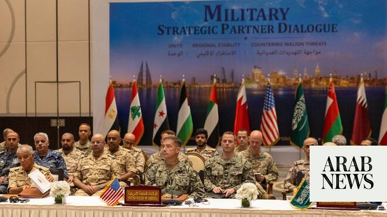

# Lebanon and Syria join US-led Middle East military talks

Source: https://www.arabnews.com/node/2649321/middle-east
Captured source: https://www.arabnews.com/node/2649321/middle-east
Published: 2026-07-01T22:14:30+03:00
Modified: 2026-07-01T22:47:05+03:00
Author: Arab News

## Summary

LONDON: Military leaders from Syria and Lebanon for the first time joined other commanders from across the Middle East at a US defense conference on Wednesday. The regional security dialogue took place in the Bahraini capital, Manama, and was led by US Central Command, which coordinates military operations and cooperation across the Middle East and parts of Asia. The other

## Image

## Video Or Embed URLs

- https://58c3ec1ecabb12e8aec21aa64bfbba22.safeframe.googlesyndication.com/safeframe/1-0-45/html/container.html
- https://static.addtoany.com/menu/sm.25.html
- about:blank
- https://imasdk.googleapis.com/js/core/bridge3.774.0_en.html
- https://ep2.adtrafficquality.google/sodar/sodar2/255/runner.html
- https://www.google.com/recaptcha/api2/aframe
- https://cm.g.doubleclick.net/partnerpixels?gdpr=0&us_privacy=1---&gpp_sid=-1&url=https%3A%2F%2Fwww.arabnews.com%2Fnode%2F2649321%2Fmiddle-east

## Text

https://arab.news/jx3xh

Defense officials from the 2 countries take part for first time in a security meeting with US Central Command and other nations from the region

Military leaders from Gulf and elsewhere say they are committed to free flow of commerce through Strait of Hormuz

LONDON: Military leaders from Syria and Lebanon for the first time joined other commanders from across the Middle East at a US defense conference on Wednesday.

The regional security dialogue took place in the Bahraini capital, Manama, and was led by US Central Command, which coordinates military operations and cooperation across the Middle East and parts of Asia. The other participants from the region included Saudi Arabia, Bahrain, Egypt, Jordan, Kuwait, Oman, Qatar, the UAE and Yemen.

The meeting took place as negotiations continue between Washington and Tehran for a peace agreement, after the two sides last month signed a deal to end their conflict. A key aspect of the talks has been the full reopening to international shipping of the Strait of Hormuz, which Iran blocked when the war began four months ago.

Central Command said the military chiefs at the meeting discussed the regional security situation and “opportunities for enhancing defense collaboration across the region.”

It added: “Leaders underscored their shared commitment to the free flow of commerce through the Strait of Hormuz.”

Adm. Brad Cooper, the head of Central Command, said: “We continue to stand shoulder to shoulder with our regional partners. The discussions underscored our shared commitment to regional security and stability.”

The US has increased its cooperation with Syria as the new authorities in Damascus move to improve relations with Washington after the fall of President Bashar Assad and his regime in December 2024, after a 14-year civil war.

The role of the Lebanese Armed Forces, which have long received financial support from the US, was recognized in an agreement reached last week between Lebanon and Israel.
