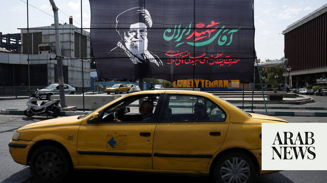

# Iran says to use frozen funds in Qatar to buy ‘required goods’

Source: https://www.arabnews.com/node/2649341/middle-east
Captured source: https://www.arabnews.com/node/2649341/middle-east
Published: 2026-07-01T23:52:22+03:00
Modified: 2026-07-01T23:54:13+03:00
Author: AFP

## Summary

TEHRAN: Iranian Deputy Foreign Minister Kazem Gharibabadi said Wednesday that Tehran would use some of its frozen assets in Qatar to purchase goods needed by the country following talks in Doha. Under the memorandum of understanding that halted the war between Iran and the United States, Washington agreed to make available Iran’s frozen or restricted assets as part of the

## Image

## Video Or Embed URLs

- https://9740a2d82d7b1422357617d9fcafee0f.safeframe.googlesyndication.com/safeframe/1-0-45/html/container.html
- https://static.addtoany.com/menu/sm.25.html
- about:blank
- https://imasdk.googleapis.com/js/core/bridge3.774.0_en.html
- https://www.google.com/recaptcha/api2/aframe
- https://sync.teads.tv/wigo-no-slot
- https://cm.g.doubleclick.net/partnerpixels?gdpr=0&us_privacy=1---&gpp_sid=-1&url=https%3A%2F%2Fwww.arabnews.com%2Fnode%2F2649341%2Fmiddle-east

## Text

https://arab.news/nt22e

Deputy foreign minister says after talks in Doha, Tehran would use some of its frozen assets in Qatar to purchase goods needed by the country

Washington agreed to make available Iran’s frozen assets as part of MoU signed between the two sides to end the conflict

TEHRAN: Iranian Deputy Foreign Minister Kazem Gharibabadi said Wednesday that Tehran would use some of its frozen assets in Qatar to purchase goods needed by the country following talks in Doha. Under the memorandum of understanding that halted the war between Iran and the United States, Washington agreed to make available Iran’s frozen or restricted assets as part of the agreement’s implementation. It remains unclear how the mechanism for releasing and using the funds would work, or when it would take effect. “During the meetings with Qatari officials, including the Central Bank, a number of issues related to the expenditure of part of the initial six billion dollars were reviewed,” Gharibabadi said, according to the IRNA state news agency. “It was agreed that, based on the needs communicated by our country, the required goods would be purchased and made available to Iran.” The amount Gharibabadi mentioned refers to part of Iranian oil revenues transferred from South Korea to restricted accounts in Qatar since 2023. Last month, Iranian foreign ministry spokesman Esmaeil Baqaei said Tehran alone would decide how to use the released assets, “in whatever way is most beneficial and favorable to the country.” He also said the funds would “be available for Iran to freely use as it sees fit to supply the goods that the country needs.” US Vice President JD Vance had said in June that the assets had not yet been unfrozen under the agreement, but if they were, the US and Qatar “have approval over that process.” He also suggested the money would be used to purchase US goods, including agricultural products such as soybeans. Iran’s chief negotiator Mohammad Bagher Ghalibaf rejected that characterization on Tuesday, saying $12 billion of the country’s $24 billion in frozen assets “are to be given” to Iran’s Central Bank “so that it can purchase any goods it needs, at any price and in any currency worldwide.”
