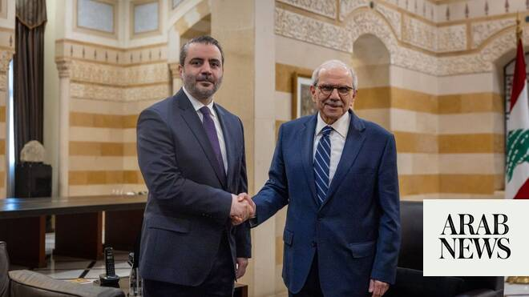

# Syria, Lebanon form joint ministerial committee on security, economy

Source: https://www.arabnews.com/node/2649424/middle-east
Captured source: https://www.arabnews.com/node/2649424/middle-east
Published: 2026-07-02T17:00:01+03:00
Modified: 2026-07-02T17:00:01+03:00
Author: Arab News

## Summary

LONDON: Syria and Lebanon agreed on Thursday to establish a joint ministerial committee aimed at strengthening security coordination, expanding economic cooperation and advancing bilateral ties. The agreement was signed in the Lebanese capital Beirut by Syrian Foreign Minister Asaad Al-Shaibani and Lebanese Prime Minister Nawaf Salam, according to the Syrian state news agency

## Image

## Video Or Embed URLs

- https://2b392465d72fd4f4ea1d65b6035fc83f.safeframe.googlesyndication.com/safeframe/1-0-45/html/container.html
- https://static.addtoany.com/menu/sm.25.html
- about:blank
- https://www.google.com/recaptcha/api2/aframe
- https://imasdk.googleapis.com/js/core/bridge3.774.0_en.html
- https://cm.g.doubleclick.net/partnerpixels?gdpr=0&us_privacy=1---&gpp_sid=-1&url=https%3A%2F%2Fwww.arabnews.com%2Fnode%2F2649424%2Fmiddle-east

## Text

https://arab.news/gaxjh

Agreement signed in Beirut by the Syrian foreign minister and Lebanon’s prime minister

Both sides emphasized respect for sovereignty and backed each other’s stability

LONDON: Syria and Lebanon agreed on Thursday to establish a joint ministerial committee aimed at strengthening security coordination, expanding economic cooperation and advancing bilateral ties.

The agreement was signed in the Lebanese capital Beirut by Syrian Foreign Minister Asaad Al-Shaibani and Lebanese Prime Minister Nawaf Salam, according to the Syrian state news agency SANA.

“Today, we finalized an agreement to establish a joint Syrian-Lebanese Higher Committee comprising ministers from both countries. The committee will meet regularly to strengthen bilateral cooperation,” Salam said at a joint press conference with Al-Shaibani.

Al-Shaibani said the body would provide a framework for expanding economic cooperation and strengthening security coordination.

“Our partnership with Lebanon will provide a platform for expanding economic cooperation and strengthening security coordination between our two countries,” he said.

Talks at Baabda Palace also focused on electricity interconnection, the transport and exchange of goods, and easing the movement of people between Syria and Lebanon, Salam told reporters.

Both sides also stressed the importance of respecting each other’s sovereignty.

Al-Shaibani described his visit to Beirut as a sign of Syria’s “support for Lebanon and our commitment to building a healthy and constructive relationship between our two countries.”

He also voiced support for Lebanon’s stability and condemned Israeli attacks on Lebanese territory.

“Syria rejects all Israeli aggressions against Lebanon, including shelling and forced displacement, and supports the Lebanese state in its efforts to achieve stability,” he said.

Similarly, Lebanese President Joseph Aoun expressed support for Syria’s stability and welcomed what he called “a new chapter” in ties between the neighboring countries, SANA reported.

Aoun’s remarks came after meeting Al-Shaibani at Baabda Palace. He also said Syria’s interim president, Ahmad Al-Sharaa, had assured him repeatedly that Damascus’s approach toward Lebanon had changed.

“President Ahmad Al-Sharaa has assured me in more than one meeting and phone call that Syria’s role will not be what it was in the past and that a new chapter has opened between our two countries,” Aoun said.

“Syria will not side with one Lebanese party against another but will stand alongside all Lebanese.”

Aoun also welcomed the creation of the joint committee.

Earlier on Thursday, Al-Shaibani met with Aoun and Lebanese Parliament Speaker Nabih Berri to discuss bilateral ties and economic cooperation.

On Syrians detained in Lebanon, Al-Shaibani said legal proceedings were underway and expressed hope they would result in their transfer to Syria.

“Regarding Syrian prisoners and detainees in Lebanon, a judicial process is underway, and we hope it will lead to the transfer of all of them to Syria,” he said.

Before the fall of Syria’s longterm ruler Bashar Assad, Syrian-Lebanese relations were shaped by decades of Syrian dominance, Lebanese resentment and periodic attempts to normalize ties.

Syria intervened in Lebanon’s civil war in 1976, kept troops and deep political influence there until 2005, and even after withdrawing remained deeply entangled in Lebanese politics and security affairs.

When the Syrian civil war started in 2011, Lebanon was pulled back into its neighbor’s orbit in a different way, especially through Hezbollah’s intervention on Assad’s side.

After Assad’s fall on Dec. 8, 2024, in a rebel offensive that swept through large parts of the war-torn country, Syria and Lebanon moved into a cautious reset, with both sides talking more openly about sovereignty, normal state-to-state ties and practical cooperation on borders, detainees, refugees and trade, even though mistrust remained high.
