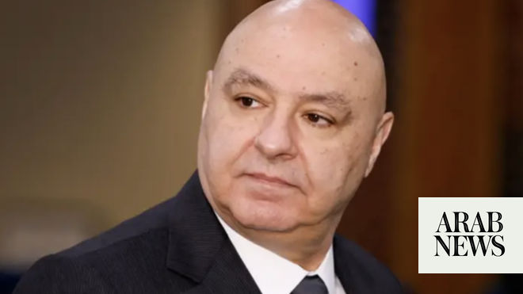

# Lebanese president says will not yield ‘a single inch’ of territory to Israel

Source: https://www.arabnews.com/node/2649443/middle-east
Captured source: https://www.arabnews.com/node/2649443/middle-east
Published: 2026-07-02T19:04:50+03:00
Modified: 2026-07-02T19:08:43+03:00
Author: AFP

## Summary

BEIRUT: Lebanese President Joseph Aoun defended on Thursday negotiations with Israel, saying they were not a betrayal and he would not surrender “a single inch of Lebanon’s territory,” according to the presidency. Israeli Defense Minister Israel Katz said on Wednesday that the Israeli army would remain “until further notice” in what it describes as “security zones” in Lebanon,

## Image

## Video Or Embed URLs

- https://2cd1c4eb3588bacc13491803791cb156.safeframe.googlesyndication.com/safeframe/1-0-45/html/container.html
- https://static.addtoany.com/menu/sm.25.html
- about:blank
- https://www.google.com/recaptcha/api2/aframe
- https://imasdk.googleapis.com/js/core/bridge3.774.0_en.html
- https://cm.g.doubleclick.net/partnerpixels?gdpr=0&us_privacy=1---&gpp_sid=-1&url=https%3A%2F%2Fwww.arabnews.com%2Fnode%2F2649443%2Fmiddle-east

## Text

https://arab.news/c9hg2

Lebanon signed last week a US-backed framework agreement with Israel with the aim of securing peace between the two countries

The latest war erupted on March 2 when Hezbollah launched missiles at Israel in retaliation for US-Israeli strikes on Iran

BEIRUT: Lebanese President Joseph Aoun defended on Thursday negotiations with Israel, saying they were not a betrayal and he would not surrender “a single inch of Lebanon’s territory,” according to the presidency.

Israeli Defense Minister Israel Katz said on Wednesday that the Israeli army would remain “until further notice” in what it describes as “security zones” in Lebanon, Syria and the Gaza Strip.

Lebanon signed last week a US-backed framework agreement with Israel with the aim of securing peace between the two countries — a move that has been met with major protest from Iran-backed Hezbollah.

Negotiations with Israel are not “treason but a diplomatic war without unnecessary bloodshed,” Aoun said on Thursday.

The latest war erupted on March 2 when Hezbollah launched missiles at Israel in retaliation for US-Israeli strikes that killed Iran’s supreme leader.

Israel responded with airstrikes and a ground invasion that have killed more than 4,200 people in Lebanon, according to the authorities.

The Lebanese president said that Beirut has decided to engage in talks “to guarantee Israel’s withdrawal from its territory.”

“We will not yield a single inch of Lebanese territory,” Aoun declared.

The framework agreement envisions the Lebanese army gradually establishing its authority over south Lebanon as Hezbollah disarms and Israel withdraws, but does not set a timeline for this.

The process will be detailed in a security annex, the contents of which have not been made public.

Israeli Prime Minister Benjamin Netanyahu, on a visit to the so-called “security zone” in south Lebanon on Tuesday, reaffirmed that forces would remain there so long as Hezbollah remained a threat.
