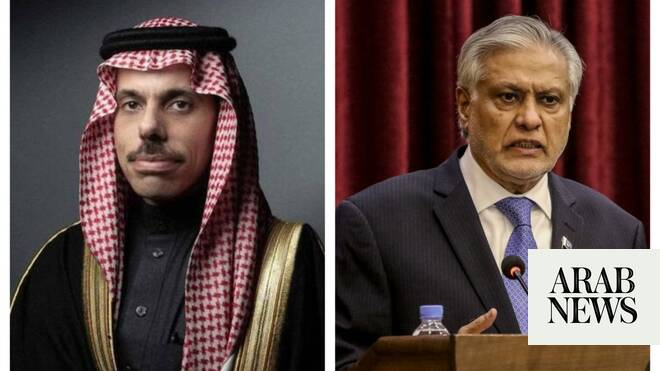

# Saudi, Pakistani foreign ministers discuss US-Iran talks

Source: https://www.arabnews.com/node/2649477/saudi-arabia
Captured source: https://www.arabnews.com/node/2649477/saudi-arabia
Published: 2026-07-02T23:00:49+03:00
Modified: 2026-07-02T23:04:57+03:00
Author: Arab News

## Summary

RIYADH: Saudi Foreign Minister Prince Faisal bin Farhan and his Pakistani counterpart Ishaq Dar discussed the latest round of negotiations between the US and Iran in Doha on Thursday. Mediator Qatar said on Thursday that Iran and the US have made progress in talks over ending the four-month US-Israeli war on Iran. The talks made “positive progress” on matters related to the

## Image

## Video Or Embed URLs

- https://a803d8079bc742ebeebb595526905d6b.safeframe.googlesyndication.com/safeframe/1-0-45/html/container.html
- https://static.addtoany.com/menu/sm.25.html
- about:blank
- https://www.google.com/recaptcha/api2/aframe
- https://imasdk.googleapis.com/js/core/bridge3.774.0_en.html
- https://sync.teads.tv/wigo-no-slot
- https://cm.g.doubleclick.net/partnerpixels?gdpr=0&us_privacy=1---&gpp_sid=-1&url=https%3A%2F%2Fwww.arabnews.com%2Fnode%2F2649477%2Fsaudi-arabia

## Text

https://arab.news/8nh4p

RIYADH: Saudi Foreign Minister Prince Faisal bin Farhan and his Pakistani counterpart Ishaq Dar discussed the latest round of negotiations between the US and Iran in Doha on Thursday.

Mediator Qatar said on Thursday that Iran and the US have made progress in talks over ending the four-month US-Israeli war on Iran.

The talks made “positive progress” on matters related to the memorandum that halted the war in June, a Qatar Foreign Ministry spokesperson ‌said in a ‌post on X.

During a phone call, the two ministers expressed satisfaction with the positive progress achieved and their hope that the talks would lead to a peaceful and comprehensive resolution to the conflict in the region, the Saudi Press Agency reported.

The memorandum of understanding that halted the war in June was brokered by Qatar and Pakistan and included a 60-day ceasefire.
