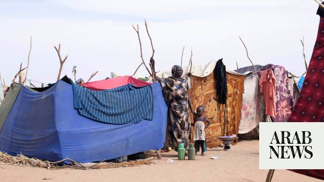

# Human rights catastrophe unfolding in Al-Obeid, Sudan, says UN’s Turk

Source: https://www.arabnews.com/node/2649528/middle-east
Captured source: https://www.arabnews.com/node/2649528/middle-east
Published: 2026-07-03T11:27:50+03:00
Modified: 2026-07-03T11:44:25+03:00
Author: Reuters

## Summary

GENEVA: The United Nations human rights chief on Friday said another human rights ​catastrophe was unfolding in Sudan, in the city of Al-Obeid in North Kordofan, and urged the world to act. “The signs from Al-Obeid are clear and unmistakable: Another human rights catastrophe is unfolding in Sudan, this ‌time in ‌the capital of the ​strategic ‌state ⁠of ​North Kordofan,” ⁠the

## Image

## Video Or Embed URLs

- https://2fce1c64fb1d208acd80f7f5ed3dec2c.safeframe.googlesyndication.com/safeframe/1-0-45/html/container.html
- https://static.addtoany.com/menu/sm.25.html
- about:blank
- https://www.google.com/recaptcha/api2/aframe
- https://imasdk.googleapis.com/js/core/bridge3.774.0_en.html
- https://sync.teads.tv/wigo-no-slot
- https://cm.g.doubleclick.net/partnerpixels?gdpr=0&us_privacy=1---&gpp_sid=-1&url=https%3A%2F%2Fwww.arabnews.com%2Fnode%2F2649528%2Fmiddle-east

## Text

https://arab.news/7nwmn

The urgent debate ⁠was called by Britain, whose ‌envoy previously warned ‌of the risk of ​large-scale atrocities following reports ‌that Sudan’s paramilitary RSF are massing forces around the city of Al-Obeid

GENEVA: The United Nations human rights chief on Friday said another human rights ​catastrophe was unfolding in Sudan, in the city of Al-Obeid in North Kordofan, and urged the world to act. “The signs from Al-Obeid are clear and unmistakable: Another human rights catastrophe is unfolding in Sudan, this ‌time in ‌the capital of the ​strategic ‌state ⁠of ​North Kordofan,” ⁠the UN high commissioner for human rights Volker Turk told delegates in Geneva during an urgent debate at the UN human rights council on the situation in the region. The urgent debate ⁠was called by Britain, whose ‌envoy previously warned ‌of the risk of ​large-scale atrocities following reports ‌that Sudan’s paramilitary Rapid Support ‌Forces and allies are massing forces around the city of Al-Obeid, which could result in an escalation of the conflict. Turk told delegates ‌that civilians have been subjected to siege-like conditions for 18 ⁠months, ⁠with shortages of clean water reaching a critical point in Al-Obeid amid relentless drone strikes as the Sudanese Armed Forces and the RSF battle for control over areas surrounding the city. At least 45 civilians were killed and 41 injured in 15 drone strikes in Al-Obeid and surrounding areas ​between June ​6-28 recorded by the UN human rights office.
