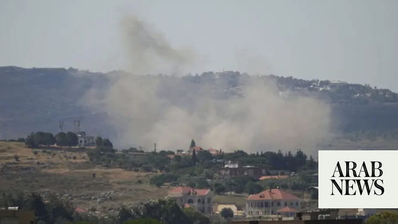

# Israel military says struck Hezbollah positions in south Lebanon

Source: https://www.arabnews.com/node/2649556/middle-east
Captured source: https://www.arabnews.com/node/2649556/middle-east
Published: 2026-07-03T18:04:54+03:00
Modified: 2026-07-03T18:04:54+03:00
Author: AFP

## Summary

JERUSALEM: Israel’s military said Friday it had struck several Hezbollah sites in southern Lebanon a day earlier in response to attacks on its troops in the area. Israel and Lebanon signed a US-sponsored framework agreement last week to pave the way for peace between the two countries and disarm Iran-backed militant group Hezbollah. Israeli officials have repeatedly ruled out

## Image

## Video Or Embed URLs

- https://a7730a53d0d6badcd8df1ad526bf33c4.safeframe.googlesyndication.com/safeframe/1-0-45/html/container.html
- https://static.addtoany.com/menu/sm.25.html
- about:blank
- https://imasdk.googleapis.com/js/core/bridge3.774.0_en.html
- https://www.google.com/recaptcha/api2/aframe
- https://cm.g.doubleclick.net/partnerpixels?gdpr=0&us_privacy=1---&gpp_sid=-1&url=https%3A%2F%2Fwww.arabnews.com%2Fnode%2F2649556%2Fmiddle-east

## Text

https://arab.news/vcsx6

Israel and Lebanon signed a US-sponsored framework agreement last week to pave the way for peace between the two countries

Disarming Iran-backed militant group Hezbollah a key sticking point

JERUSALEM: Israel’s military said Friday it had struck several Hezbollah sites in southern Lebanon a day earlier in response to attacks on its troops in the area.

Israel and Lebanon signed a US-sponsored framework agreement last week to pave the way for peace between the two countries and disarm Iran-backed militant group Hezbollah.

Israeli officials have repeatedly ruled out withdrawing troops from southern Lebanon, maintaining that any withdrawal would happen only after Hezbollah has been disarmed across Lebanon.

“The IDF struck approximately 10 Hezbollah infrastructure sites and a truck used to transfer weapons in southern Lebanon,” the military said in a statement.

The sites were in the areas of the south Lebanon towns of Bint Jbeil, Beit Yahoun, Kounine, and Baraachit, and “were used by Hezbollah to advance attacks against IDF soldiers operating in the Security Zone,” the army said.

The military said the strikes on the infrastructure sites were carried out following attacks on its soldiers inside the Israeli-declared “security zone,” which stretches about 10 kilometers (six miles) deep inside Lebanese territory along the border.

The military said the strike on the truck carrying weapons near the area was carried out to remove a threat to the soldiers.

The Lebanese state-run news agency reported three Israeli strikes Thursday night, near the town of Baraachit in the Bint Jbeil area, and in Nabatiyeh Al-Fawqa.

The agency also reported two injuries in a strike on the town of Seddiqine near Tyre.

Netanyahu visited troops in southern Lebanon on Tuesday, vowing that his country’s forces would stay in the area as long as Iran-backed Hezbollah remained a threat.

The deal between Israel and Lebanon makes any Israeli withdrawal from occupied Lebanese land conditional on Beirut disarming Hezbollah, starting with “pilot zones” that the Lebanese military will take over.

Hezbollah drew Lebanon into the Middle East war on March 2 with rocket fire at Israel, triggering Israeli airstrikes and a ground invasion.

Israeli attacks since the start of the war have killed about 4,300 people, according to Lebanese official figures.

In the same period, the Israeli military has reported 38 soldiers and one civilian contractor killed.
