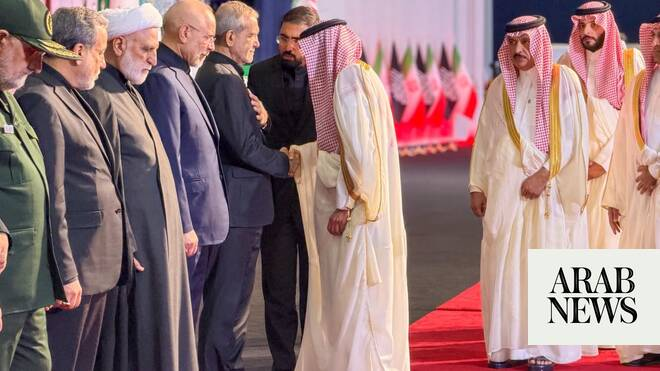

# Saudi leaders send condolences as Iran holds funeral for slain supreme leader

Source: https://www.arabnews.com/node/2649603/saudi-arabia
Captured source: https://www.arabnews.com/node/2649603/saudi-arabia
Published: 2026-07-04T01:37:32+03:00
Modified: 2026-07-04T02:20:28+03:00
Author: Arab News

## Summary

RIYADH: Saudi Arabia’s King Salman and Crown Prince Mohammed bin Salman sent condolences to Iran’s president as Tehran held a state funeral for the late Supreme Leader Ayatollah Ali Khamenei. The message of condolence was conveyed to Iranian President Masoud Pezeshkian by Saudi Arabia’s Deputy Foreign Minister Waleed Elkhereiji, who attended the ceremony, the Saudi Foreign

## Image

## Video Or Embed URLs

- https://faf477bff7bb545ff282abee10ef2c88.safeframe.googlesyndication.com/safeframe/1-0-45/html/container.html
- https://static.addtoany.com/menu/sm.25.html
- about:blank
- https://imasdk.googleapis.com/js/core/bridge3.774.0_en.html
- https://sync.teads.tv/wigo-no-slot
- https://www.google.com/recaptcha/api2/aframe
- https://cm.g.doubleclick.net/partnerpixels?gdpr=0&us_privacy=1---&gpp_sid=-1&url=https%3A%2F%2Fwww.arabnews.com%2Fnode%2F2649603%2Fsaudi-arabia

## Text

https://arab.news/8veu6

Saudi deputy FM conveys King Salman’s condolences at Tehran funeral

Millions expected in Tehran streets for Khamenei’s state funeral

RIYADH: Saudi Arabia’s King Salman and Crown Prince Mohammed bin Salman sent condolences to Iran’s president as Tehran held a state funeral for the late Supreme Leader Ayatollah Ali Khamenei. The message of condolence was conveyed to Iranian President Masoud Pezeshkian by Saudi Arabia’s Deputy Foreign Minister Waleed Elkhereiji, who attended the ceremony, the Saudi Foreign Ministry said early Saturday. The funeral of Khamenei, who was assassinated by Israel on Feb. 28, is expected to last several days. Khamenei’s flag-draped coffin lay at Tehran’s Grand Mosalla alongside those of family members also killed in the attack. State television showed people rallying at night in various Iranian cities, chanting slogans in support of the country’s theocracy and against America and Israel. The government expects to see millions flood the streets of the capital beginning Saturday in scenes reminiscent of the burial of the late Supreme Leader Ayatollah Ruhollah Khomeini in 1989.

• With input from AP
