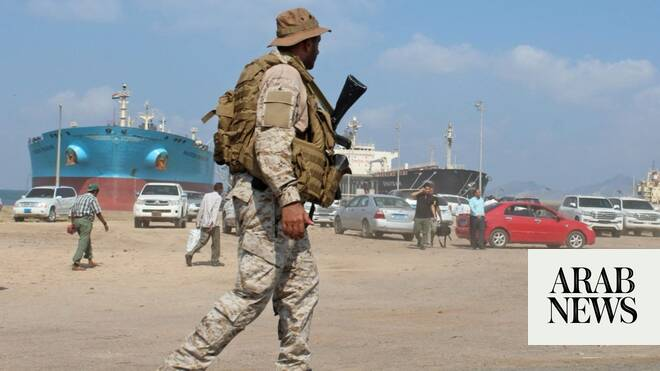

# Houthi militia’s attempts to target Kingdom will be met by unprecedented force: Coalition

Source: https://www.arabnews.com/node/2649604/middle-east
Captured source: https://www.arabnews.com/node/2649604/middle-east
Published: 2026-07-04T02:05:09+03:00
Modified: 2026-07-04T12:15:46+03:00
Author: Arab News

## Summary

RIYADH: Any attempts by Yemen’s Iran-backed Houthi militia to target the Kingdom will be met by “unprecedented determination and force,” the Saudi-led coalition said early on Saturday in a statement posted to social media and carried by the Saudi Press Agency. “Houthi statements against the Kingdom yesterday are merely an attempt to divert attention away from their grave

## Image

## Video Or Embed URLs

- https://3b2381001325dba931e6cf294bc467cb.safeframe.googlesyndication.com/safeframe/1-0-45/html/container.html
- https://static.addtoany.com/menu/sm.25.html
- about:blank
- https://www.google.com/recaptcha/api2/aframe
- https://imasdk.googleapis.com/js/core/bridge3.774.0_en.html
- https://cm.g.doubleclick.net/partnerpixels?gdpr=0&us_privacy=1---&gpp_sid=-1&url=https%3A%2F%2Fwww.arabnews.com%2Fnode%2F2649604%2Fmiddle-east

## Text

https://arab.news/gxzp4

Militia had threatened to target ‘Saudi airports and vital ‌interests on ‌land and sea’

RIYADH: Any attempts by Yemen’s Iran-backed Houthi militia to target the Kingdom will be met by “unprecedented determination and force,” the Saudi-led coalition said early on Saturday in a statement posted to social media and carried by the Saudi Press Agency.

“Houthi statements against the Kingdom yesterday are merely an attempt to divert attention away from their grave violations against the brotherly people of Yemen,” said Maj. Gen. Turki Al-Maliki, the coalition’s spokesperson.

He categorized the militia’s latest threats as an attempt to undermine regional and international security.

“The coalition will respond with unprecedented determination and force to any and all attempts to target the Kingdom, its citizens and residents and national assets, or any attempt to violate the sovereignty of the brotherly Republic of Yemen,” he said.

The militia on Friday threatened to target “Saudi airports and vital ‌interests on ‌land and sea,” according to the group’s military spokesperson.

Al-Maliki accused the Houthis of causing suffering to Yemenis through its actions.

He said: “They try to export the economic disasters and Yemeni suffering they have caused — in addition to covering the rejections they face from tribal and social components of Yemen — to their regional periphery and neighboring countries.”

Known formally as the Coalition to Restore Legitimacy in Yemen, the Saudi-led coalition has been fighting to restore legitimacy to Yemen’s internationally recognized government following the seizure of the capital Sanaa by Houthis in 2014.

The militia, which has received weapons from Tehran, has been in control of the capital since then, as well as many parts of the country.

Al-Maliki said: “The Kingdom, along with the coalition and international partners, have endeavored to undertake initiatives and efforts to alleviate the suffering of the Yemeni people caused by the coup carried out by the Houthi militia, in addition to resolving the Yemeni crisis through a road map, which the legitimate Yemeni government approved, while the Houthis rejected (it), as they went beyond by rejecting efforts for lasting peace and attacked Sea Lines of Communication and international trade in the Southern Red Sea and Bab Al-Mandab Strait.”
