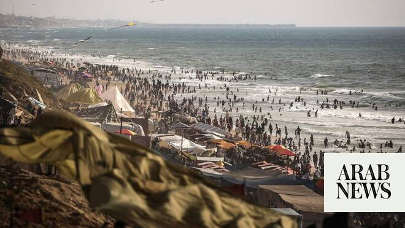

# Fate of Gaza Strip ‘eclipsed and forgotten’ amid Middle East war

Source: https://www.arabnews.com/node/2649638/middle-east
Captured source: https://www.arabnews.com/node/2649638/middle-east
Published: 2026-07-04T15:27:05+03:00
Modified: 2026-07-04T18:28:02+03:00
Author: AFP

## Summary

GAZA CITY, Palestinian Territories: The Gaza war was the spark that touched off years of Middle East conflict culminating in the US-Israeli war with Iran, but as Washington and Tehran wrangle over terms for peace, the devastated territory’s fate seems largely out of mind. “Ever since the United States went to war with Iran, the whole world has forgotten Gaza and its tragedy.

## Image

## Video Or Embed URLs

- https://2f731d9b871e45a6b78ea41244af5789.safeframe.googlesyndication.com/safeframe/1-0-45/html/container.html
- https://static.addtoany.com/menu/sm.25.html
- about:blank
- https://www.google.com/recaptcha/api2/aframe
- https://imasdk.googleapis.com/js/core/bridge3.774.0_en.html
- https://cm.g.doubleclick.net/partnerpixels?gdpr=0&us_privacy=1---&gpp_sid=-1&url=https%3A%2F%2Fwww.arabnews.com%2Fnode%2F2649638%2Fmiddle-east

## Text

https://arab.news/n5q5n

“Ever since the United States went to war with Iran, the whole world has forgotten Gaza and its tragedy,” Jamali told AFP

The apparent inattention paid to the Palestinian territory is all the more striking because it sits at the heart of the chain of events

GAZA CITY, Palestinian Territories: The Gaza war was the spark that touched off years of Middle East conflict culminating in the US-Israeli war with Iran, but as Washington and Tehran wrangle over terms for peace, the devastated territory’s fate seems largely out of mind. “Ever since the United States went to war with Iran, the whole world has forgotten Gaza and its tragedy. We no longer have anyone standing by us,” Palestinian Ahmed Jamali, 53, told AFP from the displacement camp in Gaza where he lives. “We are weak and oppressed, and Israel is doing whatever it wants: killing, destroying and occupying Gaza, while no one in the world lifts a finger.” The apparent inattention paid to the Palestinian territory is all the more striking because it sits at the heart of the chain of events that plunged the region into its most dangerous confrontation in decades. Hamas’s unprecedented October 7, 2023 attack on Israel triggered a devastating military response in Gaza, drawing in Tehran-backed allies like Hezbollah in Lebanon and Yemen’s Houthi rebels — and eventually Iran itself. What began as a local war between Israel and Hamas evolved into a regional conflict and, in turn, a direct confrontation between arch-foes Tehran and Washington. More than two-and-a-half years later, Gaza remains mired in a severe humanitarian crisis, and despite a fragile ceasefire reached between Israel and Hamas in October 2025, efforts to bring the war to a definitive end have stalled for months. Although Iranian officials initially spoke of an agreement to end the Middle East war that would encompass the entire region, the preliminary text endorsed by Tehran and Washington last month contains no mention of Gaza. For analysts, that shows a shift in regional priorities. “It reflects Hamas’s declining strategic value in Iran’s eyes,” Hugh Lovatt of the European Council on Foreign Relations, told AFP. Iran has long armed and financed Hamas as part of its “axis of resistance” — an array of regional forces opposed to Israel and the US — but the October 2023 attack appears to have fundamentally altered that relationship. “Iranians do not really care about Gaza. Hamas was an ally, not an Iranian tool,” said Israeli military expert Eado Hecht. “It betrayed them. They did not want war in autumn 2023, it was too early for them.”

- ‘Gradually fading’ -

Michael Milshtein, another Israeli military analyst, argued that Tehran’s calculations have shifted elsewhere. “It places greater value on preserving Hezbollah as a pillar of the regional balance,” he said. The diplomatic focus has also shifted, with a growing sense of international fatigue over Gaza. “Gaza is gradually fading from international attention,” said Lovatt. One diplomat involved in negotiations described a widespread belief among governments that “most actors see the issue as insoluble in the short to medium term.” Another veteran diplomat based in Jerusalem told AFP that Gaza’s absence from the discussions reflected political paralysis rather than progress. “Gaza is absent from the agreement not because the war is over, but because no credible political framework exists for the day after,” he said. Israel insists that Hamas must fully disarm before any political transition can begin, while Hamas refuses to surrender its weapons without guarantees that an alternative Palestinian governing authority will replace it. Neither an international stabilization force nor a credible transitional mechanism has emerged in the months since the ceasefire took effect, both of which were called for in the US-brokered framework that halted the fighting.

Behind the scenes, negotiations over Gaza’s future continue in Cairo. The talks bring together Palestinian factions, including Hamas, alongside the Board of Peace set up by US President Donald Trump and regional players including Qatar and Turkiye. “Trump may want to give this process a chance,” said a source close to the negotiations. “Whether it succeeds remains to be seen.” Although few details have emerged publicly, diplomatic and security sources told AFP that negotiators are working on a roadmap combining the gradual disarmament of Hamas with the creation of transitional governing authorities for Gaza. Israeli media has reported that the government would reject such a framework. “For now, this diplomatic process exists only around the negotiating table,” Lovatt said. “There has been progress, but reconstruction remains a distant prospect, and nothing is changing for the people on the ground.”

- Return to combat? -

With diplomacy stalled, concerns are mounting that the fighting could yet resume. Israeli media have reported military preparations for a possible summer 2026 offensive against Hamas should political negotiations fail. But military expert Hecht cautioned against assuming that contingency planning meant another war was inevitable. “Having the military opportunities is not the same as having the political opportunity,” he said. “Preparations are not the same as implementation.” Analyst Milshtein argued that Israel had little leverage left. In his view, Washington could ultimately pressure Israel to accept a phased disarmament of Hamas alongside a transitional political framework — or even to withdraw from Gaza. “Alternatively, Israel could embark on another military adventure. Given this government’s record... (it) cannot be ruled out,” Milshtein said, adding that Israeli leaders still lacked a coherent long-term strategy.
