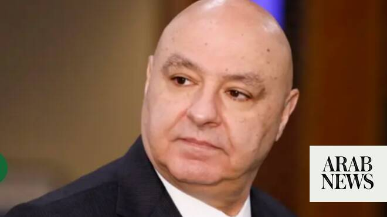

# Lebanese president urges US to ‘keep standing’ by country

Source: https://www.arabnews.com/node/2649641/middle-east
Captured source: https://www.arabnews.com/node/2649641/middle-east
Published: 2026-07-04T15:45:09+03:00
Modified: 2026-07-04T15:47:59+03:00
Author: AFP

## Summary

BEIRUT: Lebanese President Joseph Aoun on Saturday urged the United States to stand by his country after a recent US-backed framework deal with Israel aiming to permanently end hostilities after the latest Israel-Hezbollah war. The deal reached in Washington calls for the disarmament of Iran-backed militant group Hezbollah, a gradual Israeli withdrawal from southern Lebanon

## Image

## Video Or Embed URLs

- https://f6f7606f6b828b3cefd86e2e2f26a4e4.safeframe.googlesyndication.com/safeframe/1-0-45/html/container.html
- https://static.addtoany.com/menu/sm.25.html
- about:blank
- https://www.google.com/recaptcha/api2/aframe
- https://imasdk.googleapis.com/js/core/bridge3.774.0_en.html
- https://sync.teads.tv/wigo-no-slot
- https://cm.g.doubleclick.net/partnerpixels?gdpr=0&us_privacy=1---&gpp_sid=-1&url=https%3A%2F%2Fwww.arabnews.com%2Fnode%2F2649641%2Fmiddle-east

## Text

https://arab.news/mqpf5

Aoun expressed hope that Lebanon could “turn the page on wars... and open a new page of hope, peace and stability“

Aoun urged Washington to “keep always standing beside Lebanon’s right and just causes, its institutions, army and people“

BEIRUT: Lebanese President Joseph Aoun on Saturday urged the United States to stand by his country after a recent US-backed framework deal with Israel aiming to permanently end hostilities after the latest Israel-Hezbollah war. The deal reached in Washington calls for the disarmament of Iran-backed militant group Hezbollah, a gradual Israeli withdrawal from southern Lebanon and the deployment of the Lebanese army there, starting with two “pilot” areas. Hezbollah has rejected the deal, which does not set a timetable for an Israeli withdrawal. In a congratulatory message to President Donald Trump marking the United States’ 250th anniversary of independence, Aoun urged Washington to “keep always standing beside Lebanon’s right and just causes, its institutions, army and people.” Aoun expressed hope that Lebanon could “turn the page on wars... and open a new page of hope, peace and stability.” In a message also marking the independence anniversary, the US embassy in Lebanon said on X that “it is with great pride that we stand with the people of Lebanon as they forge a brighter future — one of peace, prosperity, and promise long overdue.” Hezbollah drew Lebanon into the Middle East war on March 2 with rocket fire at Israel to avenge the killing of Iran’s supreme leader in US-Israeli strikes days earlier. Israel responded with heavy airstrikes and a ground invasion of southern Lebanon, where its troops still occupy swathes of territory near the border. An agreement signed by Tehran and Washington on ending the regional war last month also established a ceasefire in Lebanon, which took effect on June 21. Days later, Lebanon and Israel agreed to the US-backed framework aiming to pave the way for a permanent end to hostilities. The United Nations International Organization for Migration (IOM) said this week that more than 640,000 displaced people have returned home since June 22. Lebanese authorities have said the war has killed some 4,300 people and displaced more than one million others. But many residents are unable to return to towns and villages near the southern border where Israeli troops are still present and many of which have suffered massive destruction. On a visit to the south on Saturday including the heavily damaged city of Nabatieh, Social Affairs Minister Haneen Sayed said authorities were working on a plan including for “prefabricated houses and rent assistance payments” to help people return home, or to areas nearby. Israeli has kept up intermittent strikes on south Lebanon despite the ceasefire. Lebanon’s state-run National News Agency (NNA) said an Israeli strike on the village of Mansouri on Saturday wounded one person, also reporting Israeli artillery shelling elsewhere.
