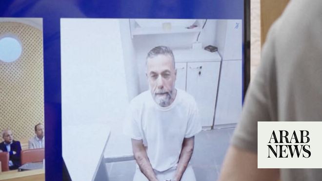

# What Hussam Abu Safiya’s case shows about the limits of international pressure

Source: https://www.arabnews.com/node/2649781/middle-east
Captured source: https://www.arabnews.com/node/2649781/middle-east
Published: 2026-07-05T22:58:28+03:00
Modified: 2026-07-05T23:28:44+03:00
Author: ANAN TELLO

## Summary

LONDON: The image of Dr. Hussam Abu Safiya walking toward Israeli forces before his arrest on Dec. 27, 2024, became one of the defining images of the Gaza war. New allegations about the Palestinian doctor’s treatment in Israeli custody have renewed calls for his release and raised fresh questions about the limits of international pressure on Israel. Those concerns deepened

## Image

## Video Or Embed URLs

- https://platform.twitter.com/embed/Tweet.html?creatorScreenName=Arab_News&creatorUserId=69172612&dnt=false&embedId=twitter-widget-0&features=eyJ0ZndfdGltZWxpbmVfbGlzdCI6eyJidWNrZXQiOltdLCJ2ZXJzaW9uIjpudWxsfSwidGZ3X2ZvbGxvd2VyX2NvdW50X3N1bnNldCI6eyJidWNrZXQiOnRydWUsInZlcnNpb24iOm51bGx9LCJ0ZndfdHdlZXRfZWRpdF9iYWNrZW5kIjp7ImJ1Y2tldCI6Im9uIiwidmVyc2lvbiI6bnVsbH0sInRmd19yZWZzcmNfc2Vzc2lvbiI6eyJidWNrZXQiOiJvbiIsInZlcnNpb24iOm51bGx9LCJ0ZndfZm9zbnJfc29mdF9pbnRlcnZlbnRpb25zX2VuYWJsZWQiOnsiYnVja2V0Ijoib24iLCJ2ZXJzaW9uIjpudWxsfSwidGZ3X21peGVkX21lZGlhXzE1ODk3Ijp7ImJ1Y2tldCI6InRyZWF0bWVudCIsInZlcnNpb24iOm51bGx9LCJ0ZndfZXhwZXJpbWVudHNfY29va2llX2V4cGlyYXRpb24iOnsiYnVja2V0IjoxMjA5NjAwLCJ2ZXJzaW9uIjpudWxsfSwidGZ3X3Nob3dfYmlyZHdhdGNoX3Bpdm90c19lbmFibGVkIjp7ImJ1Y2tldCI6Im9uIiwidmVyc2lvbiI6bnVsbH0sInRmd19kdXBsaWNhdGVfc2NyaWJlc190b19zZXR0aW5ncyI6eyJidWNrZXQiOiJvbiIsInZlcnNpb24iOm51bGx9LCJ0ZndfdXNlX3Byb2ZpbGVfaW1hZ2Vfc2hhcGVfZW5hYmxlZCI6eyJidWNrZXQiOiJvbiIsInZlcnNpb24iOm51bGx9LCJ0ZndfdmlkZW9faGxzX2R5bmFtaWNfbWFuaWZlc3RzXzE1MDgyIjp7ImJ1Y2tldCI6InRydWVfYml0cmF0ZSIsInZlcnNpb24iOm51bGx9LCJ0ZndfbGVnYWN5X3RpbWVsaW5lX3N1bnNldCI6eyJidWNrZXQiOnRydWUsInZlcnNpb24iOm51bGx9LCJ0ZndfdHdlZXRfZWRpdF9mcm9udGVuZCI6eyJidWNrZXQiOiJvbiIsInZlcnNpb24iOm51bGx9fQ%3D%3D&frame=false&hideCard=false&hideThread=false&id=2073532542204948520&lang=en&origin=https%3A%2F%2Fwww.arabnews.com%2Fnode%2F2649781%2Fmiddle-east&sessionId=5908d729221a80ba8521c7b88e1069095e49e435&siteScreenName=Arab_News&siteUserId=69172612&theme=light&widgetsVersion=6a3ad42b224df%3A1778106238597&width=550px
- https://platform.twitter.com/embed/Tweet.html?creatorScreenName=Arab_News&creatorUserId=69172612&dnt=false&embedId=twitter-widget-1&features=eyJ0ZndfdGltZWxpbmVfbGlzdCI6eyJidWNrZXQiOltdLCJ2ZXJzaW9uIjpudWxsfSwidGZ3X2ZvbGxvd2VyX2NvdW50X3N1bnNldCI6eyJidWNrZXQiOnRydWUsInZlcnNpb24iOm51bGx9LCJ0ZndfdHdlZXRfZWRpdF9iYWNrZW5kIjp7ImJ1Y2tldCI6Im9uIiwidmVyc2lvbiI6bnVsbH0sInRmd19yZWZzcmNfc2Vzc2lvbiI6eyJidWNrZXQiOiJvbiIsInZlcnNpb24iOm51bGx9LCJ0ZndfZm9zbnJfc29mdF9pbnRlcnZlbnRpb25zX2VuYWJsZWQiOnsiYnVja2V0Ijoib24iLCJ2ZXJzaW9uIjpudWxsfSwidGZ3X21peGVkX21lZGlhXzE1ODk3Ijp7ImJ1Y2tldCI6InRyZWF0bWVudCIsInZlcnNpb24iOm51bGx9LCJ0ZndfZXhwZXJpbWVudHNfY29va2llX2V4cGlyYXRpb24iOnsiYnVja2V0IjoxMjA5NjAwLCJ2ZXJzaW9uIjpudWxsfSwidGZ3X3Nob3dfYmlyZHdhdGNoX3Bpdm90c19lbmFibGVkIjp7ImJ1Y2tldCI6Im9uIiwidmVyc2lvbiI6bnVsbH0sInRmd19kdXBsaWNhdGVfc2NyaWJlc190b19zZXR0aW5ncyI6eyJidWNrZXQiOiJvbiIsInZlcnNpb24iOm51bGx9LCJ0ZndfdXNlX3Byb2ZpbGVfaW1hZ2Vfc2hhcGVfZW5hYmxlZCI6eyJidWNrZXQiOiJvbiIsInZlcnNpb24iOm51bGx9LCJ0ZndfdmlkZW9faGxzX2R5bmFtaWNfbWFuaWZlc3RzXzE1MDgyIjp7ImJ1Y2tldCI6InRydWVfYml0cmF0ZSIsInZlcnNpb24iOm51bGx9LCJ0ZndfbGVnYWN5X3RpbWVsaW5lX3N1bnNldCI6eyJidWNrZXQiOnRydWUsInZlcnNpb24iOm51bGx9LCJ0ZndfdHdlZXRfZWRpdF9mcm9udGVuZCI6eyJidWNrZXQiOiJvbiIsInZlcnNpb24iOm51bGx9fQ%3D%3D&frame=false&hideCard=false&hideThread=false&id=2073512266675191902&lang=en&origin=https%3A%2F%2Fwww.arabnews.com%2Fnode%2F2649781%2Fmiddle-east&sessionId=5908d729221a80ba8521c7b88e1069095e49e435&siteScreenName=Arab_News&siteUserId=69172612&theme=light&widgetsVersion=6a3ad42b224df%3A1778106238597&width=550px
- https://163fa1ad20aadbb3f1d9a0cece965ace.safeframe.googlesyndication.com/safeframe/1-0-45/html/container.html
- https://static.addtoany.com/menu/sm.25.html
- https://platform.twitter.com/widgets/widget_iframe.1227a5674072e080ffb1ba14ac0c1079.html?origin=https%3A%2F%2Fwww.arabnews.com
- about:blank
- https://www.google.com/recaptcha/api2/aframe
- https://imasdk.googleapis.com/js/core/bridge3.774.0_en.html
- https://cm.g.doubleclick.net/partnerpixels?gdpr=0&us_privacy=1---&gpp_sid=-1&url=https%3A%2F%2Fwww.arabnews.com%2Fnode%2F2649781%2Fmiddle-east

## Text

https://arab.news/8v98x

New allegations about the Palestinian doctor’s treatment in Israeli custody have renewed calls for his release

Analysts say his case reflects how little leverage international actors may have over Israel

LONDON: The image of Dr. Hussam Abu Safiya walking toward Israeli forces before his arrest on Dec. 27, 2024, became one of the defining images of the Gaza war. New allegations about the Palestinian doctor’s treatment in Israeli custody have renewed calls for his release and raised fresh questions about the limits of international pressure on Israel.

Those concerns deepened after a July 2 prison visit by his lawyer, Nasser Odeh.

“This is the last time you will see me,” Abu Safiya told him, according to Odeh. “They brought me here to kill me. I don’t see myself surviving. This is the end.”

Following the visit to the underground Rakefet facility at Nitzan Prison, Odeh and Physicians for Human Rights Israel (PHRI) said Abu Safiya’s life was in “immediate danger.”

According to an affidavit cited by PHRI, Abu Safiya was brought to the meeting in hand and foot shackles, escorted by masked prison guards and suffering from fresh injuries to his head, eyes, ears and neck. Odeh said the doctor's physical and psychological condition had deteriorated dramatically since previous visits.

“His physical and psychological state, the severe injuries visible on his body, and his personal testimony leave no room for doubt: his life is in immediate danger,” Odeh said.

He called for Abu Safiya to be transferred immediately from the Rakefet facility for an independent medical examination.

PHRI has urged the international community to press for independent medical care, outside monitoring of Abu Safiya’s detention conditions, an international inspection of the prison facility and the release of Palestinian healthcare workers it says are being held without due process.

Other organizations, including Health Workers 4 Palestine, Doctors Against Genocide and the Hind Rajab Foundation, have issued similar appeals.

On Sunday, Israel’s Supreme Court ruled that the state must submit by July 7 its response to a petition filed by PHRI seeking the release of 14 Palestinian doctors from Gaza held without charge, and specifically address the serious allegations concerning Abu Safiya’s condition.

PHRI said in a statement that it filed the petition on April 30, but the court repeatedly granted state requests to delay the response.

Legal experts say international law provides protections for detained medical personnel, but enforcement remains limited.

Harout Ekmanian, a New York-based public international law attorney, said detainees are protected under both international humanitarian law and international human rights law, while mechanisms including the International Committee of the Red Cross and UN special rapporteurs can investigate allegations of abuse and seek access to detention facilities.

“Although these mechanisms generally rely on state cooperation rather than coercive enforcement, they remain important legal and humanitarian tools for promoting compliance with international obligations and documenting alleged violations,” Ekmanian told Arab News.

That gap between legal protections and enforcement has become central to Abu Safiya’s case.

Euro-Med Human Rights Monitor has urged the Red Cross to seek immediate access to Abu Safiya and fellow detained physician Dr. Marwan Al-Hams.

According to Odeh, Abu Safiya struggled to breathe and speak during the July 2 meeting, appeared extremely weak, had difficulty sitting upright and at times seemed close to losing consciousness. He also appeared deeply distressed and reluctant to speak openly out of fear of reprisals.

The case has also drawn political attention in Britain.

Labour MP John McDonnell said he had contacted a government minister seeking urgent intervention after raising Abu Safiya’s case in Parliament. Jeremy Corbyn and fellow Labour MP Richard Burgon have also called for Israel to release the doctor and provide him with urgent medical treatment.

Pressure over Abu Safiya’s detention has continued since late 2024, when he was reportedly arrested without charge. UN experts, PHRI, Amnesty International and other rights organizations have cited allegations including torture, repeated beatings, prolonged solitary confinement and denial of adequate medical care.

Amnesty has described his detention as part of what it says is Israel’s systematic targeting of Palestinian healthcare workers and the destruction of Gaza’s healthcare system.

His case has unfolded against the backdrop of the wider Gaza war. Rights groups and UN experts have accused Israel of targeting Gaza’s healthcare system, allegations Israel rejects, saying Hamas uses medical facilities for military purposes and that its operations target militants.

Despite sustained advocacy from rights groups, aid organizations and politicians, there has been no breakthrough.

Dr. Zaher Sahloul, president of the US-based medical charity MedGlobal, said international advocacy had so far failed to secure Abu Safiya’s release and warned his treatment appeared to be worsening rather than improving.

“But we have no choice but to advocate publicly for him and his innocent colleagues ... because naming him, keeping his face and his story in the international spotlight, is the only protection against forced disappearance,” Sahloul told Arab News.

“Dr. Husam Abu Safiya is not a criminal — he is a doctor. He is our colleague. And we will not stop speaking his name until he is free and back to his patients and family,” he added.

Abu Safiya appeared publicly for the first time in more than a year in June when he was shown by video before the Israeli Supreme Court during a hearing challenging his continued detention. The petition was rejected and his detention was reportedly extended.

Following the hearing, PHRI said Abu Safiya told his lawyer he had been assaulted by prison guards while in solitary confinement at Ganot Prison before being transferred to the Rakefet facility on June 24. He also alleged he had been subjected to daily beatings that caused him to lose consciousness without receiving appropriate medical treatment.

For some observers, the allegations underscore a broader reality that public pressure alone may not be enough.

Chris Doyle, director of the London-based Council for Arab-British Understanding, said Israel has largely ignored calls from allies and rights organizations, leaving the United States as the only country with sufficient leverage to influence the case.

“The only country that can make a difference will be the United States, and there is no sign as yet that the Trump administration is prepared to push this particular issue,” Doyle told Arab News.

Still, he argued that Abu Safiya’s story has become emblematic of the wider conflict.

“What is also remarkable ... is how the fate of one individual can sometimes strike a chord with the global public more than the deaths of thousands, how one person can encapsulate and symbolize the suffering of an entire people.

“We saw that with Muhammad Al-Durra in Gaza, with Khaled Said in Egypt, and with Mohamed Bouazizi in Tunisia. One story can shift public opinion.”

Abu Safiya became one of Gaza’s best-known medical voices during the early months of the war, regularly documenting conditions at Kamal Adwan Hospital and providing journalists with updates from inside the facility.

He has been held under Israel’s Unlawful Enemy Combatants Law, which allows authorities to detain people without charge for renewable six-month periods subject to judicial review. Israel has accused Abu Safiya of links to Hamas and alleged Kamal Adwan Hospital was used by Hamas fighters, allegations denied by his lawyer and family.

Naji Abbas, director of the Prisoners and Detainees Department at PHRI, described Odeh’s latest testimony as among the most disturbing the organization has received since the start of the war.

“If the authorities do not intervene immediately, there is a real risk that Dr. Abu Safiya will not leave detention alive,” he said.

For now, the fate of Abu Safiya and other Palestinian doctors in Israeli detention remains unclear.
