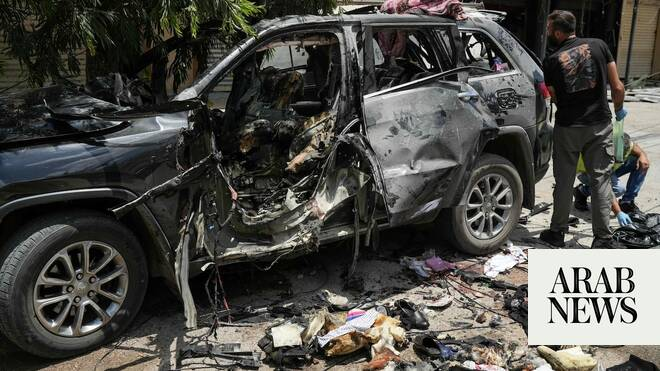

# Lebanon says Israeli strike on south kills 4, including 3 women

Source: https://www.arabnews.com/node/2649837/middle-east
Captured source: https://www.arabnews.com/node/2649837/middle-east
Published: 2026-07-06T14:08:07+03:00
Modified: 2026-07-06T17:02:48+03:00
Author: AFP

## Summary

BEIRUT: Lebanese state media said an Israeli strike on a car in the country’s south on Monday killed four people, including three women, despite a ceasefire between Israel and Hezbollah. Lebanon’s official National News Agency (NNA) said a school principal, her mother, a foreign female domestic worker and a male Syrian worker were killed when an Israeli drone targeted their

## Image

## Video Or Embed URLs

- blob:https://www.arabnews.com/4b702db0-c5a3-4171-9e35-0b8e19a563d4
- https://imasdk.googleapis.com/js/core/bridge3.774.0_en.html
- https://a8127430fd449eff21237f394eccd73d.safeframe.googlesyndication.com/safeframe/1-0-45/html/container.html
- https://static.addtoany.com/menu/sm.25.html
- about:blank
- https://sync.teads.tv/wigo-no-slot
- https://ep2.adtrafficquality.google/sodar/sodar2/255/runner.html
- https://www.google.com/recaptcha/api2/aframe
- https://cm.g.doubleclick.net/partnerpixels?gdpr=0&us_privacy=1---&gpp_sid=-1&url=https%3A%2F%2Fwww.arabnews.com%2Fnode%2F2649837%2Fmiddle-east

## Text

https://arab.news/g8kw9

NNA said a school principal, her mother, a foreign female domestic worker and a male Syrian worker were killed when an Israeli drone targeted their car

BEIRUT: Lebanese state media said an Israeli strike on a car in the country’s south on Monday killed four people, including three women, despite a ceasefire between Israel and Hezbollah. Lebanon’s official National News Agency (NNA) said a school principal, her mother, a foreign female domestic worker and a male Syrian worker were killed when an Israeli drone targeted their car as they returned from inspecting their family home in Nabatieh Al-Fawqa. Israel has kept up intermittent strikes on south Lebanon, particularly in the Nabatieh area, despite the two-week-old truce, usually saying it is targeting Hezbollah sites and operatives. Both sides accuse the other of violating the ceasefire. An agreement signed last month by the United States and Iran aimed at ending the wider regional war also established a ceasefire in Lebanon, in effect since June 21. Days later, after talks in Washington, Lebanon and Israel agreed to a US-backed framework agreement aiming to pave the way for a permanent end to hostilities. Hezbollah, which drew Lebanon into the Middle East war on March 2 with rocket fire at Israel, has rejected the framework. The deal calls for the disarmament of the Iran-backed group, a gradual Israeli withdrawal from south Lebanon and the deployment of the Lebanese army there, starting with two “pilot” areas, but without specifying a timeline for the pull-out. Lebanon’s President Joseph Aoun said Monday that Israel’s occupation was preventing the Lebanese army’s deployment to the south. A statement from his office said he emphasized the need to pressure Israel to withdraw because “the occupation undermines the legitimacy of the (Lebanese) state and prevents the army from deploying, and the laying of foundations for achieving a just and lasting peace.” On Sunday, Israeli Prime Minister Benjamin Netanyahu had reiterated that Israel’s military would maintain its presence “as long as necessary in order to protect the residents of the north and all the citizens of Israel.” Lebanese authorities say Israeli attacks since March 2 have killed about 4,300 people. The conflict also displaced more than one million, but according to the United Nations more than 640,000 have returned home since June 22.
