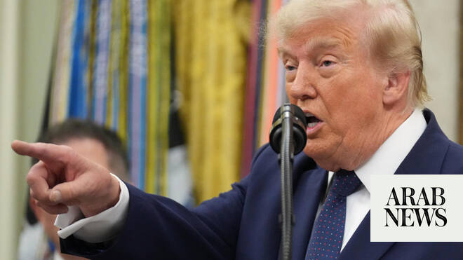

# Trump says there will either be a deal with Iran or US will ‘finish the job’

Source: https://www.arabnews.com/node/2649865/middle-east
Captured source: https://www.arabnews.com/node/2649865/middle-east
Published: 2026-07-06T18:58:59+03:00
Modified: 2026-07-06T19:54:45+03:00
Author: Reuters

## Summary

WASHINGTON: President Donald Trump said on Monday the United States would either reach ​a deal with Iran or “finish the job,” renewing his threat of military action as Tehran projects defiance following the funeral of Supreme Leader Ayatollah Ali Khamenei. Indirect US-Iran talks ended last week without any public sign of ‌headway toward ‌a lasting peace, ​despite ‌a ⁠60-day

## Image

## Video Or Embed URLs

- blob:https://www.arabnews.com/0dc79959-3f11-400b-8d79-93a3918cd603
- https://imasdk.googleapis.com/js/core/bridge3.774.0_en.html
- https://static.addtoany.com/menu/sm.25.html
- about:blank
- https://www.google.com/recaptcha/api2/aframe
- https://cm.g.doubleclick.net/partnerpixels?gdpr=0&us_privacy=1---&gpp_sid=-1&url=https%3A%2F%2Fwww.arabnews.com%2Fnode%2F2649865%2Fmiddle-east

## Text

https://arab.news/vxe63

“We’re either going to make a deal or we’re going to finish the job. OK. And it won’t be tough to finish ‌the job,” Trump said

WASHINGTON: President Donald Trump said on Monday the United States would either reach ​a deal with Iran or “finish the job,” renewing his threat of military action as Tehran projects defiance following the funeral of Supreme Leader Ayatollah Ali Khamenei.

Indirect US-Iran talks ended last week without any public sign of ‌headway toward ‌a lasting peace, ​despite ‌a ⁠60-day ceasefire intended ​to create ⁠space for diplomacy following the US and Israeli strikes that triggered the conflict.

“We’re either going to make a deal or we’re going to finish the job. OK. And it ⁠won’t be tough to finish ‌the job. I’d ‌rather make a deal, because ​I don’t ‌want to affect 91 million people,” Trump ‌told reporters in the Oval Office.

“We can knock down their bridges in one hour, we can knock out their energy ‌supply.... They don’t have any money now. We haven’t given them ⁠any ⁠money.”

Trump spoke after Khamenei’s weekend funeral where, rather than looking weakened by the war that began with US and Israeli strikes on February 28, Iranians appeared to be defiant, united and determined to shape what comes next.

The 60-day ceasefire was intended by Washington to revive diplomacy on stopping ​Iran developing ​a nuclear arsenal.
