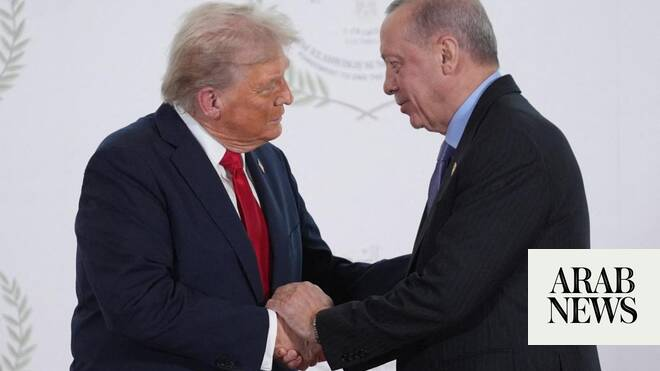

# Trump expected to tell Turkiye he is ready to restore access to F-35 jets, NYT reports

Source: https://www.arabnews.com/node/2649937/middle-east
Captured source: https://www.arabnews.com/node/2649937/middle-east
Published: 2026-07-07T08:53:55+03:00
Modified: 2026-07-07T12:05:46+03:00
Author: ReutersAP

## Summary

US President Donald ‌Trump is expected to tell Turkish President Recep Tayyip Erdogan that he is prepared to allow the country to ​rejoin the F-35 stealth fighter program, the New York Times reported on Monday, citing four senior administration officials. The report comes as Trump heads to Ankara for a NATO summit, where he is expected to meet Erdogan. The summit is set to

## Image

## Video Or Embed URLs

- blob:https://www.arabnews.com/fd96cd66-bcda-4592-9119-642f1281a66b
- https://imasdk.googleapis.com/js/core/bridge3.775.0_en.html
- https://b0682f698ebe076e5b4756262a24aa76.safeframe.googlesyndication.com/safeframe/1-0-45/html/container.html
- about:blank
- https://static.addtoany.com/menu/sm.25.html
- https://sync.teads.tv/wigo-no-slot
- https://ep2.adtrafficquality.google/sodar/sodar2/255/runner.html
- https://www.google.com/recaptcha/api2/aframe
- https://cm.g.doubleclick.net/partnerpixels?gdpr=0&us_privacy=1---&gpp_sid=-1&url=https%3A%2F%2Fwww.arabnews.com%2Fnode%2F2649937%2Fmiddle-east

## Text

https://arab.news/g724r

The report comes as US president heads to Ankara for a NATO summit

US President Donald ‌Trump is expected to tell Turkish President Recep Tayyip Erdogan that he is prepared to allow the country to ​rejoin the F-35 stealth fighter program, the New York Times reported on Monday, citing four senior administration officials. The report comes as Trump heads to Ankara for a NATO summit, where he is expected to meet Erdogan. The summit is set to begin on Tuesday ‌evening. According to ‌the New York Times ​report, ‌the ⁠officials differed on ​the ⁠details of how Trump would seek to work around congressional and legal restrictions, but suggested there could be an exchange of letters on the subject between the two leaders. The White House did not immediately respond to Reuters’ request for ⁠comment on the report. Turkiye’s 2019 acquisition ‌of the Russian ‌S-400 air defense system has soured ​ties with the United ‌States and hampered congressional support for Ankara. ‌In response, Washington imposed sanctions and removed Turkiye from the F-35 fighter jet program. Congress also passed a law prohibiting any sales of F-35s to Turkiye as long ‌as Ankara remained in possession of the S-400s, saying the Russian systemposes ⁠a security ⁠risk to US-made combat aircraft. The issue has remained a major point of contention between the two countries even though Turkiye enjoys warmer ties with Washington under Trump. The reported development is a sign of improving ties between the two countries, especially after Trump’s administration formally notified Congress of its intention to sell dozens of jet engines worth more than $700 million to ​Turkiye last month, according ​to a copy of the formal notification seen by Reuters.

Netanyahu opposes jet sales to Turkiye But speaking Monday on the morning show “Fox & Friends,” Israeli Prime Minister Benjamin Netanyahu urged the US not to sell F-35 fighter jets to Turkiye, saying that Erdogan “calls openly for the annihilation of Israel.”

Turkiye and Israel have acrimonious relations. Erdogan frequently accuses Israel of committing genocide in its war in Gaza, triggered by the deadly Oct. 7, 2023 Hamas-led attack on southern Israel. Netanyahu said selling Turkey F-35s would “upset the power balance in the Middle East, which is ultimately guaranteed by Israeli air superiority and also, I think, by America’s posture in the Middle East.”
