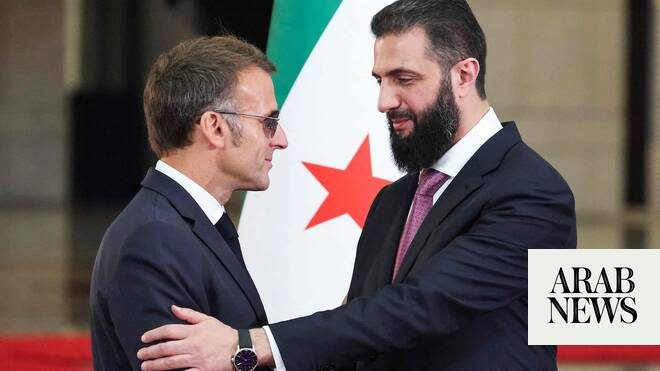

# Syria president says relying on French help to stop Israeli escalations

Source: https://www.arabnews.com/node/2649961/middle-east
Captured source: https://www.arabnews.com/node/2649961/middle-east
Published: 2026-07-07T14:38:10+03:00
Modified: 2026-07-07T18:27:42+03:00
Author: AFP

## Summary

DAMASCUS: Syria’s President Ahmed Al-Sharaa said Tuesday that he is counting on an “active French role” to halt Israeli escalations against his country. During a joint press conference with his French counterpart Emmanuel Macron in Damascus, Al-Sharaa condemned “systematic Israeli attacks,” saying “we are counting on an active French role to stop this escalation and ensure

## Image

## Video Or Embed URLs

- blob:https://www.arabnews.com/ff26a23e-6f9d-4566-82bf-626ff528904b
- https://imasdk.googleapis.com/js/core/bridge3.774.0_en.html
- https://a34a5a9c73c355190ddba7d8e4a8cc99.safeframe.googlesyndication.com/safeframe/1-0-45/html/container.html
- https://static.addtoany.com/menu/sm.25.html
- about:blank
- https://ep2.adtrafficquality.google/sodar/sodar2/255/runner.html
- https://www.google.com/recaptcha/api2/aframe
- https://sync.teads.tv/wigo-no-slot
- https://cm.g.doubleclick.net/partnerpixels?gdpr=0&us_privacy=1---&gpp_sid=-1&url=https%3A%2F%2Fwww.arabnews.com%2Fnode%2F2649961%2Fmiddle-east

## Text

https://arab.news/6wu72

Al-Sharaa announced an agreement with Macron to install ambassadors

President saluted Macron’s “courage” for continuing his visit after Damascus bombings

DAMASCUS: Syria’s President Ahmed Al-Sharaa said Tuesday that he is counting on an “active French role” to halt Israeli escalations against his country. During a joint press conference with his French counterpart Emmanuel Macron in Damascus, Al-Sharaa condemned “systematic Israeli attacks,” saying “we are counting on an active French role to stop this escalation and ensure respect for international agreements.”

Al-Sharaa also announced an agreement with Macron to reappoint ambassadors, with the French embassy in Damascus closed since 2012 during the country’s bloody civil war. “I am pleased to announce today our agreement to begin the process of exchanging resident ambassadors between Damascus and Paris as soon as possible, signaling the return of diplomatic relations to their normal state,” Al-Sharaa said.

Macron, meanwhile, said that France is ready to ​help rebuild Syria’s economy and banking sector. “We ‌want ​to ‌continue working on ‌the restructuring of the banking sector,” Macron said ‌at the news conference alongside Al-Sharaa. France was working on helping the Syrian central bank, Macron added.

The French president added that Syria should not let the blasts that wounded 18 people during his landmark visit to Damascus on Tuesday affect the country’s stability. Macron called to “not let ourselves be destabilized” after the attacks, while Al-Sharaa saluted Macron’s “courage” for continuing his visit after the bombings.
