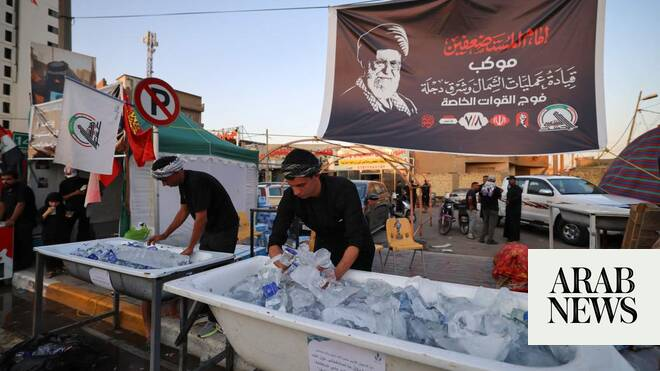

# Coffin of slain Iranian supreme leader arrives in Iraq’s Najaf, Iraqi state TV says

Source: https://www.arabnews.com/node/2650031/middle-east
Captured source: https://www.arabnews.com/node/2650031/middle-east
Published: 2026-07-07T23:12:05+03:00
Modified: 2026-07-07T23:14:28+03:00
Author: Reuters

## Summary

NAJAF: The coffin of Iran’s slain Supreme Leader Ayatollah Ali Khamenei arrived in Iraq’s ​holy city of Najaf on Tuesday after funeral ceremonies in Iran, bringing a multi-day procession to one of Shiite Islam’s most sacred sites following the leader’s death in a February 28 US-Israeli strike. Iraqi Prime Minister Ali Al-Zaidi and senior Iraqi officials received the coffin at

## Image

## Video Or Embed URLs

- https://55e552256b6e8a628e9d95b744ed04f9.safeframe.googlesyndication.com/safeframe/1-0-45/html/container.html
- https://static.addtoany.com/menu/sm.25.html
- about:blank
- https://imasdk.googleapis.com/js/core/bridge3.774.0_en.html
- https://www.google.com/recaptcha/api2/aframe
- https://sync.teads.tv/wigo-no-slot
- https://cm.g.doubleclick.net/partnerpixels?gdpr=0&us_privacy=1---&gpp_sid=-1&url=https%3A%2F%2Fwww.arabnews.com%2Fnode%2F2650031%2Fmiddle-east

## Text

https://arab.news/cdntr

Senior Iraqi officials, including Prime Minister Ali Al-Zaidi, received Khamenei's coffin at ‌Najaf International Airport

NAJAF: The coffin of Iran’s slain Supreme Leader Ayatollah Ali Khamenei arrived in Iraq’s ​holy city of Najaf on Tuesday after funeral ceremonies in Iran, bringing a multi-day procession to one of Shiite Islam’s most sacred sites following the leader’s death in a February 28 US-Israeli strike. Iraqi Prime Minister Ali Al-Zaidi and senior Iraqi officials received the coffin at ‌Najaf International Airport ‌ahead of funeral ceremonies and ​a ‌mass ⁠public ​procession, state ⁠TV reported. Najaf holds special significance for Shiites worldwide as the burial place of Imam Ali, the cousin and son-in-law of the Prophet Muhammad. Iranian President Masoud Pezeshkian also arrived in Najaf to participate in the ceremonies. The official reception at ⁠the airport was attended by Iraqi political ‌leaders and Shi’ite ‌religious figures, before the coffin is ​carried through the ‌city in public mourning events expected to draw ‌large crowds on Wednesday. Iran’s state-organized funeral ceremonies, which began on Friday, have been designed as both a religious commemoration and a demonstration of continuity by ‌the Islamic Republic following the death of the leader who ruled Iran ⁠for nearly ⁠four decades. The procession moved from Tehran to the Shiite seminary city of Qom before arriving in Iraq. Iraqi authorities tightened security around Najaf ahead of the arrival as large numbers of mourners traveled from across Iraq and neighboring countries. The procession is due to continue to the Iraqi shrine city of Karbala before the coffin returns to Iran for burial ​in Mashhad later this ​week.
