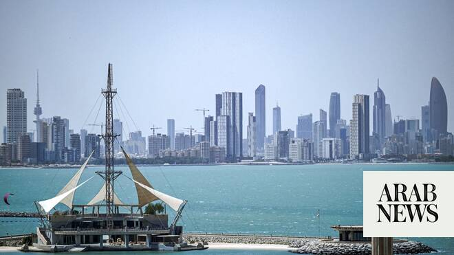

# Gulf, Arab states condemn latest Iranian attacks

Source: https://www.arabnews.com/node/2650065/middle-east
Captured source: https://www.arabnews.com/node/2650065/middle-east
Published: 2026-07-08T10:20:11+03:00
Modified: 2026-07-08T10:29:29+03:00
Author: Arab News

## Summary

DUBAI: Kuwati on Wednesday condemned the latest Iranian attack, describing Tehran’s military actions a continuation of “brazen aggressions at a time when regional and international efforts aimed at de-escalation are underway” which “undermined efforts to reduce tensions.” The security of the State of Kuwait, its sovereignty, and the safety of its citizens and residents on its

## Image

## Video Or Embed URLs

- https://39ebb387aa824dd72ec0c010d3e04332.safeframe.googlesyndication.com/safeframe/1-0-45/html/container.html
- https://static.addtoany.com/menu/sm.25.html
- about:blank
- https://imasdk.googleapis.com/js/core/bridge3.774.0_en.html
- https://www.google.com/recaptcha/api2/aframe
- https://cm.g.doubleclick.net/partnerpixels?gdpr=0&us_privacy=1---&gpp_sid=-1&url=https%3A%2F%2Fwww.arabnews.com%2Fnode%2F2650065%2Fmiddle-east

## Text

https://arab.news/bsnwe

Doha emphasizes necessity of “continuing on the path of dialogue and diplomacy, de-escalation’

DUBAI: Kuwati on Wednesday condemned the latest Iranian attack, describing Tehran’s military actions a continuation of “brazen aggressions at a time when regional and international efforts aimed at de-escalation are underway” which “undermined efforts to reduce tensions.”

The security of the State of Kuwait, its sovereignty, and the safety of its citizens and residents on its soil are a red line that cannot be crossed, statement from the country’s foreign ministry said.

Jordan issued a similar condemnation on “the brutal Iranian attacks” against Kuwait, describing them “a flagrant violation of Kuwait’s sovereignty, a threat to its security and stability and the safety of its territories, a dangerous escalation, and a blatant breach of international law and the United Nations Charter.”

Qatar also condemned the repeated Iranian attacks on Bahrain and Kuwait.

In a statement from its foreign affairs ministry, Doha emphasized the “necessity of sparing the region the consequences of these unjustified attacks, continuing on the path of dialogue and diplomacy, de-escalation, and building on the gains achieved within the framework of the memorandum of understanding, in a manner that contributes to consolidating security and stability at both the regional and international levels.”

Egypt has also condemned the repeated Iranian attacks on Kuwait, Bahrain and other Gulf states, and described Tehran’s actions “a blatant violation of their sovereignty, a serious threat to the security and stability of the Gulf region, and an unacceptable escalation that would increase tensions in the region.”

“Egypt emphasizes its full rejection of all actions that infringe upon the security and sovereignty of sisterly nations or threaten the security and stability of the region,” its foreign affairs ministry said in a statement, and renewed its call for restraint and de-escalation in order to preserve regional security and safeguard peace and stability.

The Islamic Revolutionary Guard ​Corps said it carried out a joint missile and drone operation against Ali Al Salem Air Base in Kuwait, and other key US military sites in Bahrain in retaliation for US military strikes in Iran.

US early on Wednesday launched a wave of airstrikes on Iran in response to attacks on tankers in the Strait of Hormuz.

Anwar Gargash, the diplomatic adviser to the UAE president, have commented that “Iran’s attacks on Qatari and Saudi commercial tankers in the Strait of Hormuz, and the repeated aggression against our sisterly Bahrain and Kuwait, are a clear indicator that Tehran remains incapable of committing to the requirements of de-escalation and turning the page on war.”

“The Gulf Arab states cannot remain a target for Iran’s wavering between the logic of escalation and the path of rationality, stability, and peace,” Gargash posted on social media.
