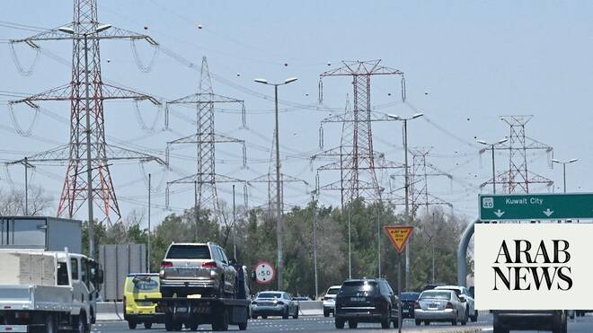

# Saudi Arabia joins other nations in condemning Iranian attacks on Kuwait and Bahrain

Source: https://www.arabnews.com/node/2650065/middle-east
Captured source: https://www.arabnews.com/node/2650065/middle-east
Published: 2026-07-08T10:20:11+03:00
Modified: 2026-07-08T17:49:27+03:00
Author: Arab News

## Summary

DUBAI: Iranian missile and drone attacks against Kuwait and Bahrain were condemned by Saudi Arabia on Wednesday, along with other nations both in the region and around the world. The two countries came under fire in a renewed flare-up of hostilities between Tehran and Washington that threatens to collapse negotiation efforts. Saudi Arabia's Ministry of Foreign Affairs

## Image

## Video Or Embed URLs

- https://ea9f625d014c97a9f93503e389313d1f.safeframe.googlesyndication.com/safeframe/1-0-45/html/container.html
- https://static.addtoany.com/menu/sm.25.html
- about:blank
- https://www.google.com/recaptcha/api2/aframe
- https://imasdk.googleapis.com/js/core/bridge3.774.0_en.html
- https://cm.g.doubleclick.net/partnerpixels?gdpr=0&us_privacy=1---&gpp_sid=-1&url=https%3A%2F%2Fwww.arabnews.com%2Fnode%2F2650065%2Fmiddle-east

## Text

https://arab.news/bsnwe

Kingdom's foreign ministry says it holds Iran responsible "for the consequences of its continued aggression"

Regional states denounce the Iranian strikes against the Gulf countries and call for de-escalation

DUBAI: Iranian missile and drone attacks against Kuwait and Bahrain were condemned by Saudi Arabia on Wednesday, along with other nations both in the region and around the world.

The two countries came under fire in a renewed flare-up of hostilities between Tehran and Washington that threatens to collapse negotiation efforts.

Saudi Arabia's Ministry of Foreign Affairs expressed the Kingdom's "strongest condemnation" of the repeated Iranian attacks on Kuwait and Bahrain.

"These attacks constitute a violation of state sovereignty and international law," the ministry said. "The Kingdom holds Iran responsible for the consequences of its continued aggression and demands an immediate cessation of these violations to preserve the security, stability, and safety of the region."

The Islamic Revolutionary Guard ​Corps said it carried out a joint missile and drone attack against Ali Al Salem Air Base in Kuwait, and other key US military sites in Bahrain in retaliation for US military strikes in Iran. The American airstrikes were in response to attacks on tankers in the Strait of Hormuz.

Kuwait condemned Iran's attack as a continuation of “brazen aggressions at a time when regional and international efforts aimed at de-escalation are underway.”

The security of Kuwait, its sovereignty, and the safety of its citizens and residents on its soil are a red line that cannot be crossed, the foreign ministry said.

The Bahrain Defence Force said the Iranian attacks targeted civilian areas and private property and were a violation of international humanitarian law.

Gulf neighbors, which have also faced waves of attacks since the conflict started at the end of February, stepped in to condemn the latest Iranian aggression.

Qatar's foreign ministry said it was necessary to spare the region "the consequences of these unjustified attacks." Doha said all sides should continue on the path of "dialogue and diplomacy, de-escalation" that build on the gains achieved through a memorandum of understanding signed by the US and Iran last month.

Anwar Gargash, the diplomatic adviser to the UAE president, said: “Iran’s attacks on Qatari and Saudi commercial tankers in the Strait of Hormuz, and the repeated aggression against our sisterly Bahrain and Kuwait, are a clear indicator that Tehran remains incapable of committing to the requirements of de-escalation and turning the page on war.”

He added: “The Gulf Arab states cannot remain a target for Iran’s wavering between the logic of escalation and the path of rationality, stability, and peace."

The UAE's foreign ministry also condemned "in the strongest terms" an Iranian attack targeting a Saudi tanker in the Strait of Hormuz on Tuesday. The Wedyan was among three tankers struck within hours of one another.

"The attack constitutes a grave threat to the safety and security of international navigation and represents a dangerous escalation which undermines the security and stability of one of the most critical waterways in the world," the ministry said.

Jordan described Iran's strikes against Kuwait as “a flagrant violation of Kuwait’s sovereignty, a threat to its security and stability and the safety of its territories, a dangerous escalation, and a blatant breach of international law and the United Nations Charter.”

Egypt said the repeated Iranian attacks on Kuwait, Bahrain and other Gulf states are “a blatant violation of their sovereignty, a serious threat to the security and stability of the Gulf region, and an unacceptable escalation that would increase tensions in the region.”

The Egyptian foreign ministry called for restraint and de-escalation to preserve regional security and safeguard peace and stability.

Oman, which borders the Strait of Hormuz, also condemned the attacks on Bahrain and Kuwait, as well as the Tuesday attacks on the tankers.

"Oman calls upon all parties to exercise restraint, de-escalate tensions, prioritize dialogue and diplomatic solutions, and commit to the full implementation of existing understandings, in support of ongoing efforts to consolidate peace and security in the region," the Sultanate's foreign ministry said.

Lebanese President Joseph Aoun renewed his call for restraint, de-escalation, and “prioritizing the language of dialogue and diplomacy, out of concern for the security of the region, its stability, and the safety of its peoples.”

China warns US, Iran against ‘reigniting’ war, urges dialogue

Meanwhile, China denounced the escalation in hostilities, with Beijing’s foreign ministry warning both sides against resuming the war in the Middle East. “Reigniting the war is not in the interests of either side, and military means cannot solve the fundamental problems,” foreign ministry spokesperson Mao Ning told a news conference.
