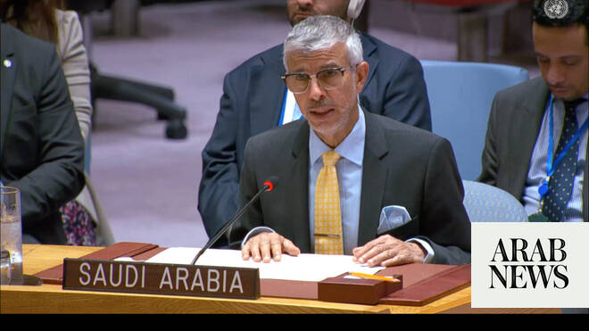

# Saudi UN envoy calls for accountability on sexual violence in war, condemns violations against Palestinians

Source: https://www.arabnews.com/node/2650191/middle-east
Captured source: https://www.arabnews.com/node/2650191/middle-east
Published: 2026-07-09T02:57:31+03:00
Modified: 2026-07-09T12:13:36+03:00
Author: Ephrem Kossaify

## Summary

NEW YORK: Saudi Arabia’s Permanent Representative to the UN Abdulaziz Alwasil told the Security Council on Wednesday that sexual violence continues to be used in armed conflicts as a weapon of oppression, intimidation and forced displacement, targeting civilians, particularly women and children. Addressing a high-level council meeting on conflict-related sexual violence and

## Image

## Video Or Embed URLs

- https://0dfd6a6406887397ff47622dfbb4f116.safeframe.googlesyndication.com/safeframe/1-0-45/html/container.html
- https://static.addtoany.com/menu/sm.25.html
- about:blank
- https://www.google.com/recaptcha/api2/aframe
- https://imasdk.googleapis.com/js/core/bridge3.774.0_en.html
- https://cm.g.doubleclick.net/partnerpixels?gdpr=0&us_privacy=1---&gpp_sid=-1&url=https%3A%2F%2Fwww.arabnews.com%2Fnode%2F2650191%2Fmiddle-east

## Text

https://arab.news/v32dc

Abdulaziz Alwasil speaking during top UN Security Council meeting

Urges action against perpetrators of offences targeting Palestinians

NEW YORK: Saudi Arabia’s Permanent Representative to the UN Abdulaziz Alwasil told the Security Council on Wednesday that sexual violence continues to be used in armed conflicts as a weapon of oppression, intimidation and forced displacement, targeting civilians, particularly women and children.

Addressing a high-level council meeting on conflict-related sexual violence and the “Women, Peace and Security” agenda, Alwasil said such acts constitute serious violations of international human rights laws.

He noted that the council, through Resolution 1820 adopted in 2008 and subsequent related resolutions, had reaffirmed that conflict-related sexual violence poses a serious threat to international peace and security, and perpetrators must be held accountable.

“Addressing this crime is a shared responsibility for the entire international community and all states concerned,” Alwasil said, calling for coordinated efforts to tackle its root causes and protect civilians and victims.

The Saudi envoy reaffirmed his country’s commitment to international human rights laws, describing them as rooted in “legal, humanitarian, and moral responsibilities.”

He said the Kingdom, guided by the values and principles of Islam, insisted on respect for the provisions of the Geneva Conventions and called for strengthening the means of implementing international humanitarian law.

Alwasil condemned all violations committed against civilians and stressed the importance of accountability, adding that assisting and protecting vulnerable groups was “not only a legal obligation imposed by international humanitarian law, but above all, a collective humanitarian and moral responsibility.”

He pointed to Saudi Arabia’s aid agency KSrelief as an example of the Kingdom’s international support programs, saying it continues to assist the most vulnerable, including survivors of sexual violence, in cooperation with international humanitarian organizations.

Turning to international humanitarian law more broadly, Alwasil said civilians under the authority of a party to a conflict must be treated humanely without discrimination, and protected from all forms of violence and degrading treatment, including torture and killing.

He said violations committed in the Palestinian territory, including acts of sexual violence, represent a flagrant violation of international law and shared humanitarian values. And called for urgent international action to halt these violations, protect civilians, and hold those responsible accountable.

“Providing protection in the face of sexual violence in areas of armed conflict is a legal obligation from which there can be no derogation,” Alwasil said, closing his remarks with a call to strengthen international cooperation in combating the phenomenon “wherever it may be.”
