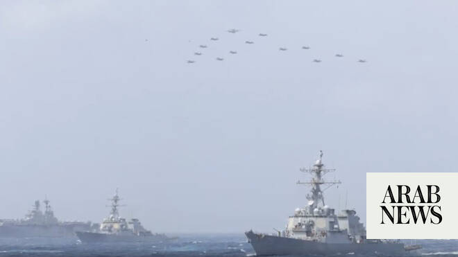

# Saudi Arabia, Arab states condemn Iran’s attacks on Bahrain, Kuwait and Jordan

Source: https://www.arabnews.com/node/2650194/middle-east
Captured source: https://www.arabnews.com/node/2650194/middle-east
Published: 2026-07-09T12:50:42+03:00
Modified: 2026-07-09T18:22:24+03:00
Author: Arab News

## Summary

DUBAI: Gulf states on Thursday condemned the latest Iranian missile and drone attacks targeting Kuwait, Bahrain and Jordan, while renewing calls for restraint and a return to diplomacy as regional tensions continued to escalate. Kuwait and Bahrain said their air defense systems intercepted multiple missiles and drones early Thursday, hours after Iran's Revolutionary Guards

## Image

## Video Or Embed URLs

- blob:https://www.arabnews.com/15dd737a-18c3-4f49-bc53-de692b6b9386
- https://imasdk.googleapis.com/js/core/bridge3.774.0_en.html
- https://f856211a6cc8f11b1beebe843156f7b0.safeframe.googlesyndication.com/safeframe/1-0-45/html/container.html
- https://static.addtoany.com/menu/sm.25.html
- about:blank
- https://www.google.com/recaptcha/api2/aframe
- https://cm.g.doubleclick.net/partnerpixels?gdpr=0&us_privacy=1---&gpp_sid=-1&url=https%3A%2F%2Fwww.arabnews.com%2Fnode%2F2650194%2Fmiddle-east

## Text

https://arab.news/65c6p

Qatar briefly issued a security alert before its Interior Ministry announced that the threat had ended

Fresh strikes raise fears of wider Gulf conflict after US attacks on Iran

DUBAI: Gulf states on Thursday condemned the latest Iranian missile and drone attacks targeting Kuwait, Bahrain and Jordan, while renewing calls for restraint and a return to diplomacy as regional tensions continued to escalate.

Kuwait and Bahrain said their air defense systems intercepted multiple missiles and drones early Thursday, hours after Iran's Revolutionary Guards vowed retaliation following another round of US strikes on Iranian territory.

Jordanian military said it intercepted eight missiles fired from Iran on Thursday, while the Islamic republic said it targeted a US base there amid a new exchange of strikes between Tehran and Washington.

“Jordanian air defense systems intercepted and shot down, today, Thursday, eight missiles that were launched from Iran toward Jordanian territory,” the military said in a statement.

Iran’s Revolutionary Guards said they struck the US’s “command-and-control center in West Asia and the enemy air base in Al-Azraq, Jordan, with 10 ballistic missiles.”

It added that “if the terrorist US military repeats its aggression, the other US bases in the region will not be safe from our heavy fire.”

Kuwait's military said air defense systems had intercepted and destroyed four missiles and 10 drones, adding that explosions heard across the country were the result of interception operations. The defense ministry said one person was injured and was in stable condition.

In Bahrain, air raid sirens sounded across the capital, Manama, before air defense systems intercepted incoming projectiles.

The Bahrain Defence Force said it remained prepared to respond to any further attacks, accusing Iran of continuing "its systematic aggressive approach" through missile and drone strikes targeting the kingdom.

Iranian state media later reported that the Revolutionary Guards had launched missiles and drones targeting two US military bases in Kuwait and two in Bahrain.

Saudi Arabia condemned the attacks during a phone call between Foreign Minister Prince Faisal bin Farhan and his Kuwaiti counterpart, reiterating the need to halt the escalation and return to dialogue.

The Kingdom’s foreign ministry later released a statement reiterating its “categorical rejection of Iran’s violation of the sovereignty of these brotherly nations and its continued threats to regional security and stability.”

The statement said Iranian violations undermine international efforts aimed at restoring security and stability in the region.

The United Arab Emirates likewise condemned what it described as a flagrant violation of the sovereignty of Jordan, Bahrain and Kuwait, reaffirming its support for all measures taken by all three countries to safeguard their security and stability.

It reaffirmed its full solidarity with them and its support for all measures to safeguard their security.

Qatar also issued a security alert before later announcing that the threat had ended.

During a telephone call with Iranian Foreign Minister Abbas Araghchi, Qatari Prime Minister and Foreign Minister Sheikh Mohammed bin Abdulrahman Al-Thani stressed the need for Iran and the US to commit to diplomacy and implement the memorandum of understanding aimed at ending the conflict.

Al-Thani also discussed the latest developments with Saudi Foreign Minister Prince Faisal, with both sides emphasizing the importance of resuming dialogue and ending hostilities.

The Qatari prime minister also condemned an attack on a Qatari tanker in the Strait of Hormuz earlier this week, according to Qatar's foreign ministry.

Egypt likewise strongly condemned the Iranian attacks on Jordan, Bahrain and Kuwait, describing them as a serious escalation that threatens regional security and civilian safety.

Cairo reaffirmed its rejection of any actions that undermine the sovereignty of Arab states, stressed the importance of respecting international law and good-neighborly relations, and reiterated its full support for Jordan and the measures it is taking to protect its security and territorial integrity.

* With AFP and Reuters
