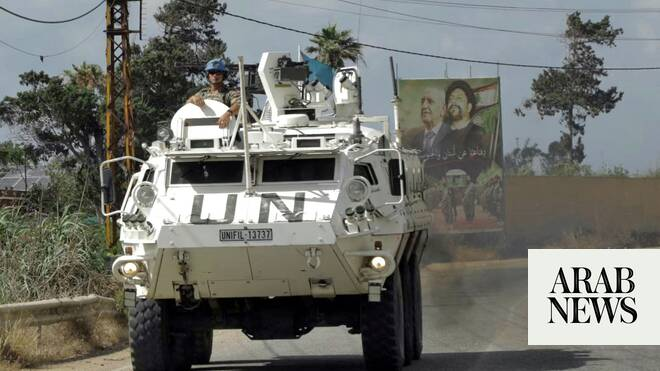

# US to guide Israeli withdrawal from Lebanon zones, lead new talks: officials

Source: https://www.arabnews.com/node/2650307/middle-east
Captured source: https://www.arabnews.com/node/2650307/middle-east
Published: 2026-07-09T21:59:30+03:00
Modified: 2026-07-09T21:59:30+03:00
Author: AFP

## Summary

BEIRUT: The United States will oversee the withdrawal of Israeli forces from “pilot zones” in the south, with the first to get underway within days, Lebanese and US officials said Thursday. A US official said that new talks between Israel and Lebanon would go ahead next week, after a diplomatic source earlier told AFP that Lebanon had demanded an Israeli pullout from the zones

## Image

## Video Or Embed URLs

- https://static.addtoany.com/menu/sm.25.html
- about:blank
- https://imasdk.googleapis.com/js/core/bridge3.774.0_en.html
- https://www.google.com/recaptcha/api2/aframe
- https://sync.teads.tv/wigo-no-slot
- https://cm.g.doubleclick.net/partnerpixels?gdpr=0&us_privacy=1---&gpp_sid=-1&url=https%3A%2F%2Fwww.arabnews.com%2Fnode%2F2650307%2Fmiddle-east

## Text

https://arab.news/j37f2

Israel to begin withdrawal from “pilot zone” in southern Lebanon within days, Lebanese and US officials say

BEIRUT: The United States will oversee the withdrawal of Israeli forces from “pilot zones” in the south, with the first to get underway within days, Lebanese and US officials said Thursday. A US official said that new talks between Israel and Lebanon would go ahead next week, after a diplomatic source earlier told AFP that Lebanon had demanded an Israeli pullout from the zones before taking part. Under a framework agreement reached on June 26, Israel will gradually withdraw from areas of southern Lebanon where it has sent troops as part of its military campaign against Hezbollah, the Iranian-backed Shia movement that has long battled Israel. As part of the agreement, the long-disempowered Lebanese military will take full control of two small areas dubbed pilot zones. The US ambassador to Lebanon, Michel Issa, told President Joseph Aoun that “an American military delegation will arrive in Beirut in the coming days to... determine the mechanism for implementation on the ground,” according to the Lebanese presidency. In Washington, a US official said that “we have moved to the implementation stage of the framework.” “The first pilot zone will launch in a matter of days, and further pilot zones are being mapped out and planned,” the official said on condition of anonymity. US Central Command will coordinate on the zones with both countries, he said. “We will soon begin outreach to international partners to help the Lebanese government effectively restore sovereignty in these zones and across their country more broadly,” the official said. The agreement says that Lebanon will exert full responsibility for the zones only upon “confirmation of successful disarmament of non-state armed groups,” a reference to Hezbollah, for years effectively outside the control of the Lebanese government. The agreement — rejected by Hezbollah — does not set a timetable for Israel’s withdrawal, and Israeli officials have also vowed that their forces will remain in a “security zone” 10 kilometers (six miles) deep as long as Hezbollah remains armed. “It is essential to avoid any vacuum when Israeli forces withdraw from the designated area,” Issa added, according to a statement from the Lebanese presidency. Aoun, for his part, once again called on the United States to “exert pressure on Israel to halt military operations and comply with the provisions of the framework.” Aoun is expected to visit Washington later this month at the invitation of his American counterpart Donald Trump. The latest Israel-Lebanon talks will take place in Rome next Wednesday and Thursday. The US official said the talks would take place at the level of technical teams and be closed to the press. Italy had earlier announced that the talks would take place between ambassadors, much like previous rounds in Washington.
