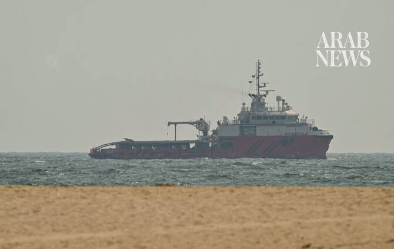

# US demands Iran publicly state that Strait of Hormuz is open and Tehran won’t attack ships anymore

Source: https://www.arabnews.com/node/2650470/middle-east
Captured source: https://www.arabnews.com/node/2650470/middle-east
Published: 2026-07-11T00:51:42+03:00
Modified: 2026-07-11T01:17:00+03:00
Author: AP

## Summary

WASHINGTON: The US is demanding that Iran make a public statement saying the Strait of Hormuz is open and that ships crossing the vital corridor won’t be attacked anymore, senior US officials said Friday, adding that internal Tehran power struggles have made it difficult to reach and keep a deal. The US officials, who spoke on condition of anonymity to describe to reporters

## Image

## Video Or Embed URLs

- https://38492cc74baf2597a5797c3ecf68ec19.safeframe.googlesyndication.com/safeframe/1-0-45/html/container.html
- https://static.addtoany.com/menu/sm.25.html
- about:blank
- https://imasdk.googleapis.com/js/core/bridge3.774.0_en.html
- https://www.google.com/recaptcha/api2/aframe
- https://sync.teads.tv/wigo-no-slot
- https://cm.g.doubleclick.net/partnerpixels?gdpr=0&us_privacy=1---&gpp_sid=-1&url=https%3A%2F%2Fwww.arabnews.com%2Fnode%2F2650470%2Fmiddle-east

## Text

https://arab.news/pg52a

US negotiators say Trump has given them a limited time to reach a deal with Iran

Tehran's UN diplomat insists any activity in the Strait of Hormuz “rests exclusively with Iran”

WASHINGTON: The US is demanding that Iran make a public statement saying the Strait of Hormuz is open and that ships crossing the vital corridor won’t be attacked anymore, senior US officials said Friday, adding that internal Tehran power struggles have made it difficult to reach and keep a deal. The US officials, who spoke on condition of anonymity to describe to reporters the state of play with Iran, said the resumption of strikes this week came after what they described as a rogue faction of Iranian hard-liners trying to sabotage the ceasefire between Tehran and Washington. It comes as US President Donald Trump reiterated on social media Friday that he views the interim ceasefire deal as “OVER!” But he said the US would continue talks aimed at putting a permanent end to the war. The officials said Friday that Trump is giving US negotiators limited time to reach a deal with Iran, but, in a sign of the challenges ahead, they underscored that the president had a wide range of options if talks fall apart. They also said a power struggle was playing out in real time in Iran after US and Israeli strikes at the start of the war killed its longtime leader, Ayatollah Ali Khamenei. Iran says it wants to control Strait of Hormuz ‘exclusively’ The US is working on pressing Iran to make a public statement that the Strait of Hormuz, a vital waterway for world energy markets, is open and free to ships to transit, the officials said. But moments before the US officials spoke, Tehran’s diplomat at the United Nations told reporters that any activity in the Strait of Hormuz, including its opening or demining operations, “rests exclusively with Iran.” “Any attempt, by external actors, to interfere with or establish a power arrangement would violate the (interim deal), and undermine its implementation, delay the restoration of normal commercial navigation, jeopardize maritime safety, and increase regional tensions,” Ambassador Amir Saeid Iravani said outside the UN Security Council. Iran has said the strait must now be under its sole control and that vessels should begin to pay fees to Tehran — even though the world for decades has considered it an international waterway. About a fifth of all traded oil and natural gas passed through the strait before the war began. Iran’s grip on the strait during the conflict led to a global energy crisis, though oil prices have sharply dropped since wartime highs of $120 a barrel. Any nuclear deal will require Iran to turn over enriched material The US officials said to reporters Friday that any deal on Iran’s nuclear program would require Tehran to turn over its stockpile of highly enriched uranium. If the US does not reach a deal with Iran to turn over its nuclear material, it has military options to ensure that it remains buried underground forever, the officials said. They did not detail those options. The highly enriched material that could potentially be used to make a nuclear weapon is believed to be buried after strikes the US launched on Iran last summer. Iran says its nuclear program is intended for peaceful purposes. The officials said they would never reach a nuclear deal with Iran if it would not first abide by terms of the ceasefire deal and stop renewed attacks on ships in the Strait of Hormuz. Unclaimed strikes came after US ended its attacks No one claimed responsibility Friday for airstrikes that hit Iran after the US said it finished its attacks, leaving questions about who else may be targeting the Islamic Republic. On Friday, Iranian state media quoted Esmail Kousari, a member of the Iranian parliament’s national security committee and a former commander in the paramilitary Revolutionary Guard, as warning the UAE would “pay the price for its cooperation with the United States.” He accused the Emirates of having a “behind-the-scenes” role in the recent US attacks. US Central Command spokesperson Capt. Tim Hawkins said there were “no operational updates” after Trump’s pronouncement about the ceasefire. Gulf Arab states, which Iran has targeted repeatedly since the war began Feb. 28, did not immediately respond to requests for comment Friday about the strikes. Israel, which took part in the Iran war, also has not claimed any recent attacks on Iran. The strikes Thursday, just as Iran prepared to bury the late Khamenei, hit areas across southern Iran. The country’s theocracy hasn’t directly blamed anyone, though one lawmaker warned the United Arab Emirates about allegedly providing support to the US campaign against Iran. Iran responded to the strikes Thursday by launching a wider volley of attacks across the Mideast, targeting Bahrain, Jordan, Kuwait and Qatar. One person was reportedly hurt in Kuwait as air defense systems targeted the incoming fire across the region. Mediators and allies regroup after strikes Iranian Foreign Minister Abbas Araghchi plans to discuss the strait with his Omani counterpart at a meeting Saturday in Oman, Iran’s state-run IRNA news agency said. Turkish Foreign Minister Hakan Fidan told his country’s state broadcaster TRT that he believed “a solution can be reached” this weekend between Iran and Oman, which lie on opposite sides of the narrow waterway. The US continues to urge mariners to travel on a southern route through Oman’s territorial waters to avoid Iran. The leader of the UAE, Sheikh Mohammed bin Zayed Al Nahyan, traveled to Kuwait immediately after the Iranian attack for a meeting with the small, oil-rich nation’s ruling emir. Gulf Arab countries also held calls with Qatar’s foreign minister. He has been deeply involved, along with Pakistan, in mediating Iran-US talks. Pakistani Prime Minister Shehbaz Sharif said he spoke separately Friday with Iranian President Masoud Pezeshkian and with Qatar’s ruling emir, Sheikh Tamim bin Hamad Al Thani, and stressed to both the need for restraint and diplomacy. Israel’s government said Prime Minister Benjamin Netanyahu spoke with Trump on Thursday night, with Trump updating Netanyahu “on American moves in the Gulf.” Israel Katz, Israel’s defense minister, also renewed threats that his nation stood ready to confront Iran if needed. “If we will have to return, we will return with even greater force,” Katz told a military ceremony.
