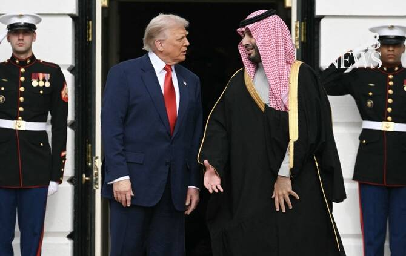

# Saudi crown prince, Trump discuss US-Iran talks, Gulf security

Source: https://www.arabnews.com/node/2650475/saudi-arabia
Captured source: https://www.arabnews.com/node/2650475/saudi-arabia
Published: 2026-07-11T01:50:23+03:00
Modified: 2026-07-11T05:09:05+03:00
Author: Arab News

## Summary

RIYADH: Saudi Crown Prince Mohammed bin Salman and US President Donald Trump discussed regional security, maritime navigation and ongoing US-Iran contacts during a telephone call on Friday, as Riyadh and Washington stepped up diplomatic coordination following a renewed flare-up in Gulf tensions. According to the Saudi Press Agency (SPA), the two leaders reviewed bilateral

## Image

## Video Or Embed URLs

- https://da46457af635e11eadd0375d401483a4.safeframe.googlesyndication.com/safeframe/1-0-45/html/container.html
- https://static.addtoany.com/menu/sm.25.html
- about:blank
- https://imasdk.googleapis.com/js/core/bridge3.774.0_en.html
- https://www.google.com/recaptcha/api2/aframe
- https://cm.g.doubleclick.net/partnerpixels?gdpr=0&us_privacy=1---&gpp_sid=-1&url=https%3A%2F%2Fwww.arabnews.com%2Fnode%2F2650475%2Fsaudi-arabia

## Text

https://arab.news/wuj5x

Leaders stress diplomacy, maritime security amid renewed Mideast tensions

Saudi FM, Rubio discuss coordination as US-Iran tensions simmer

RIYADH: Saudi Crown Prince Mohammed bin Salman and US President Donald Trump discussed regional security, maritime navigation and ongoing US-Iran contacts during a telephone call on Friday, as Riyadh and Washington stepped up diplomatic coordination following a renewed flare-up in Gulf tensions.

According to the Saudi Press Agency (SPA), the two leaders reviewed bilateral cooperation and ways to strengthen ties across various sectors. They also exchanged views on regional and international developments, including discussions between Washington and Tehran.

The crown prince and Trump stressed the importance of safeguarding maritime navigation, protecting international sea lanes and supporting efforts aimed at enhancing regional security and stability.

Separately, Saudi Foreign Minister Prince Faisal bin Farhan held a phone call with US Secretary of State Marco Rubio, during which the two reaffirmed the importance of continued coordination and consultations to promote security and stability across the region, SPA reported.

The calls came after a fresh escalation between the United States and Iran that threatened to undermine recent diplomatic efforts to end months of hostilities.

The latest crisis erupted after Iranian forces attacked commercial oil tankers transiting the Strait of Hormuz despite a ceasefire agreement, prompting US airstrikes on targets inside Iran. Tehran later retaliated with missile and drone attacks against US allies in the Gulf, raising fears of a wider regional conflict.

The renewed violence has intensified international calls for Washington and Tehran to return to negotiations.

Egypt and Qatar have urged both sides to resume dialogue and implement the memorandum of understanding reached earlier this year as the basis for a broader settlement, while Pakistan has appealed for restraint and offered to continue mediating between the two countries.

Trump said on Friday that the United States had agreed to continue talks with Iran, although he declared that the ceasefire was effectively over following the latest exchange of attacks.

Saudi Arabia has consistently called for restraint, dialogue and diplomatic solutions to preserve regional stability and ensure the security of international shipping routes, particularly through the Strait of Hormuz, one of the world's most critical energy transit corridors.
