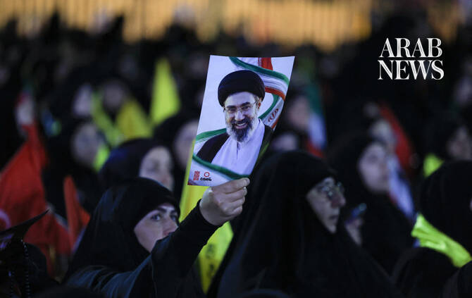

# Iran’s supreme leader pledges revenge for slain father and predecessor

Source: https://www.arabnews.com/node/2650505/middle-east
Captured source: https://www.arabnews.com/node/2650505/middle-east
Published: 2026-07-11T14:04:36+03:00
Modified: 2026-07-11T16:34:36+03:00
Author: Reuters

## Summary

TEHRAN: Iran’s Supreme Leader Ayatollah Mojtaba Khamenei threatened vengeance for the death of his predecessor and father on Saturday, but added that it ​would depend not only on Iran but also on “free people around the world.” In the supreme leader’s first public message since funeral ceremonies for his father, Ayatollah Ali Khamenei, began a week ago, the statement read on

## Image

## Video Or Embed URLs

- https://c20993a23f4e93114d940ed952c1aeeb.safeframe.googlesyndication.com/safeframe/1-0-45/html/container.html
- https://static.addtoany.com/menu/sm.25.html
- about:blank
- https://imasdk.googleapis.com/js/core/bridge3.774.0_en.html
- https://www.google.com/recaptcha/api2/aframe
- https://sync.teads.tv/wigo-no-slot
- https://cm.g.doubleclick.net/partnerpixels?gdpr=0&us_privacy=1---&gpp_sid=-1&url=https%3A%2F%2Fwww.arabnews.com%2Fnode%2F2650505%2Fmiddle-east

## Text

https://arab.news/wda2d

Mojtaba Khamenei says vengeance is “the demand of the nation” and “must certainly” take place

His statement was read on state television and no photo, video or audio recording of him has been published since he was injured in the attack that killed his father

TEHRAN: Iran’s Supreme Leader Ayatollah Mojtaba Khamenei threatened vengeance for the death of his predecessor and father on Saturday, but added that it ​would depend not only on Iran but also on “free people around the world.” In the supreme leader’s first public message since funeral ceremonies for his father, Ayatollah Ali Khamenei, began a week ago, the statement read on state television said that vengeance was “the demand of the nation” and “must certainly” take place. Ayatollah Ali Khamenei was killed in a ‌US-Israeli airstrike on Feb. ‌28, at the start of ​the ‌war. “We ⁠pledge to ​avenge ⁠the blood of the martyred leader and all the martyrs of these two wars from the criminal and disgraced killers,” the statement said. Mojtaba Khamenei, who senior sources have said suffered facial disfigurement and other injuries in the strike, has not been seen by Iranians since he was appointed supreme leader ⁠on March 8. “Whether we are there or not, ‌this will be accomplished, and soon ‌every free person around the world ​will fulfill a part ‌of this divine mission,” the statement said. An exchange of attacks ‌between US and Iranian forces this week has raised doubts over a truce agreed between Washington and Tehran aimed at ending the four-month war. Iran says the deal will ultimately deliver major economic ‌benefits. Despite the recent flare-up, US President Donald Trump, while declaring that the ceasefire was over, ⁠said on ⁠Friday that the two countries had agreed to continue talks. Mojtaba Khamenei’s continued absence from the public eye — there has been no photo, video or audio recording of him published since the air attack — has added to the uncertainties facing Iran, with some Iranians saying the new leader must be seen even if he is injured. He became supreme leader with the backing of the powerful Revolutionary Guards. Ayatollah Ali Khamenei, who ruled for 37 years, was buried in the country’s ​holiest shrine, state media ​said on Friday, after huge crowds gathered for his funeral.
