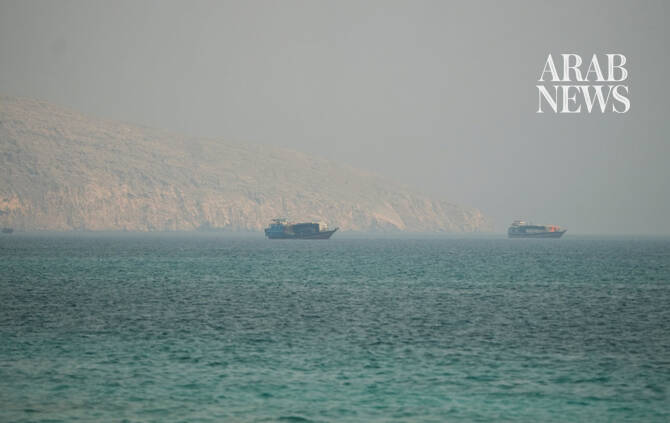

# Iran declares Strait of Hormuz closed as ‘unauthorized’ vessel hit

Source: https://www.arabnews.com/node/2650579/middle-east
Captured source: https://www.arabnews.com/node/2650579/middle-east
Published: 2026-07-12T02:39:26+03:00
Modified: 2026-07-12T02:39:44+03:00
Author: Reuters

## Summary

DUBAI/WASHINGTON: Iran on Sunday said it closed the Strait of Hormuz after a vessel traveled on an unapproved route and was struck, warning that any retaliation over ​the incident would be met with a “severe response.” “A vessel that had jeopardized maritime security by switching off its systems was struck and brought to a halt,” the Navy of Iran’s Islamic Revolutionary Guard

## Image

## Video Or Embed URLs

- https://207f3f4294102b17bbae316f8fb75092.safeframe.googlesyndication.com/safeframe/1-0-45/html/container.html
- https://static.addtoany.com/menu/sm.25.html
- about:blank
- https://imasdk.googleapis.com/js/core/bridge3.774.0_en.html
- https://www.google.com/recaptcha/api2/aframe
- https://sync.teads.tv/wigo-no-slot
- https://cm.g.doubleclick.net/partnerpixels?gdpr=0&us_privacy=1---&gpp_sid=-1&url=https%3A%2F%2Fwww.arabnews.com%2Fnode%2F2650579%2Fmiddle-east

## Text

https://arab.news/jxnjt

Iran says the strait would stay closed until ‘end of US interference’

Says its forces struck a ‌vessel after it switched off systems and used an unauthorized route

DUBAI/WASHINGTON: Iran on Sunday said it closed the Strait of Hormuz after a vessel traveled on an unapproved route and was struck, warning that any retaliation over ​the incident would be met with a “severe response.” “A vessel that had jeopardized maritime security by switching off its systems was struck and brought to a halt,” the Navy of Iran’s Islamic Revolutionary Guard Corps said in a statement, without giving any details about the ship. The statement said several ships attempted to move through the waterway on an “unauthorized route” and disregarded warnings to correct their course. The strait, the IRGC said, was closed “until further notice” and until “the end of US interference in this region.” Acts of aggression against Iran “will be met with a severe response, and new enemy bases in the region will be targeted,” the Navy said. The United States is demanding that Iran publicly state it will stop attacks on ships in the strait — and that all lanes will be open with no tolls through the waterway, senior US officials told reporters on Friday. US President Donald ‌Trump said on ‌Friday the US and Iran had agreed to continue talks despite an escalation of hostilities this ​week, ‌while also ⁠declaring an ​end ⁠to the ceasefire. A senior Iranian source told Reuters that Iran, the US, Qatar and Pakistan had agreed to negotiate in a call that mediators were trying to arrange for Saturday while Iran’s Foreign Minister Abbas Araqchi was in Oman. It was not immediately clear whether the efforts were successful. Araqchi and Omani Foreign Minister Sayyid Badr Albusaidi met in Oman to exchange “views on appropriate mechanisms for the safe passage of ships through the Strait of Hormuz,” according to a statement from the Iranian foreign minister. Oman’s state news agency later said that Omani and Iranian negotiators would continue talks “at the technical and political levels.” Oman is helping to mediate an end to a war that has destabilized the Gulf and raised prices around the world since the US and Israel launched airstrikes ⁠on Iran on February 28. About a fifth of the world’s oil supply transited through the Strait of ‌Hormuz before the war, and Iran’s effective blockade of the waterway has caused energy ‌prices to surge, fueling global inflation. CNN reported on Saturday that Oman made a draft proposal ​for the strait, including free navigation through its southern corridor in Omani ‌territorial waters. The plan called for vessels transiting the northern corridor through Iranian territorial waters to obtain prior approval from Iran, although no tolls ‌would be imposed, CNN said. The White House and State Department did not immediately respond to requests for comment on the CNN report.

Qatari mediators held talks in Tehran on Friday

Three Qatari and Saudi commercial tankers came under fire earlier in the week, prompting the US to hit Iranian sites, and Iran to respond with strikes on US military sites in Gulf states. Araqchi accused the United States of violating the ceasefire agreement; the US revoked the license authorizing the sale of Iranian ‌crude on Tuesday after the vessels were hit. “There can only be mutual compliance,” Araqchi wrote on X on Friday. While Iran has not claimed responsibility for the ship attacks, analysts say Tehran uses such ⁠actions to gain leverage in negotiations. The ⁠flare-up cast further doubt over the future of an interim agreement aimed at ending the conflict and pushed oil prices higher, a politically sensitive issue for Trump ahead of November congressional elections. “The Islamic Republic of Iran has asked us to continue ‘talks.’ We have agreed to do so, but the United States has stated to them, in no uncertain terms, that the Cease Fire is OVER!” Trump posted on his Truth Social platform on Friday.

Iran threatens to avenge supreme leader’s killing

A written statement from Iran’s new supreme leader, Ayatollah Mojtaba Khamenei, on Saturday threatened vengeance for the death of his predecessor and father, who was killed on February 28. Released to mark funeral ceremonies for former leader Ayatollah Ali Khamenei on Thursday, which the new leader did not attend, it said the vengeance would take place whatever happened to Iran. “We pledge to avenge the blood of the martyred leader and all the martyrs,” the message said. Trump had posted on Friday that he had ordered the US military to be prepared to launch thousands of missiles against Iran if Tehran attempted to assassinate him. The Wall Street Journal and other US media reported this week that ​Israel had shared intelligence with Washington that Iran had recently devised ​a plan to assassinate Trump. At the funeral ceremonies on Thursday, a huge crowd of mourners packed a courtyard, some bearing banners reading, “We Will Kill Trump.”
