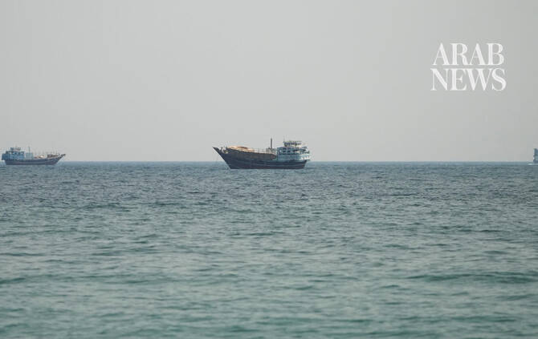

# Oman says 23 rescued, one missing after vessel attacked off coast

Source: https://www.arabnews.com/node/2650630/middle-east
Captured source: https://www.arabnews.com/node/2650630/middle-east
Published: 2026-07-12T16:14:27+03:00
Modified: 2026-07-12T16:15:48+03:00
Author: AFP

## Summary

MUSCAT: Oman said Sunday it had rescued 23 crew members from a commercial ship while one was missing after the vessel was struck off the Gulf sultanate's eastern coast. "Twenty-three crew members were rescued and provided with necessary medical care. Search operations are continuing for one crew member who remains missing," Oman's Maritime Security Center said in a statement.

## Image

## Video Or Embed URLs

- https://8f8f55eed49ebfda32c78376556b9ba2.safeframe.googlesyndication.com/safeframe/1-0-45/html/container.html
- https://static.addtoany.com/menu/sm.25.html
- about:blank
- https://www.google.com/recaptcha/api2/aframe
- https://imasdk.googleapis.com/js/core/bridge3.774.0_en.html
- https://sync.teads.tv/wigo-no-slot
- https://cm.g.doubleclick.net/partnerpixels?gdpr=0&us_privacy=1---&gpp_sid=-1&url=https%3A%2F%2Fwww.arabnews.com%2Fnode%2F2650630%2Fmiddle-east

## Text

https://arab.news/cuve2

Crew members were on commercial ship when struck off Oman’s eastern coast

Search is underway for one missing, says sultanate’s Maritime Security Center

MUSCAT: Oman said Sunday it had rescued 23 crew members from a commercial ship while one was missing after the vessel was struck off the Gulf sultanate's eastern coast. "Twenty-three crew members were rescued and provided with necessary medical care. Search operations are continuing for one crew member who remains missing," Oman's Maritime Security Center said in a statement. The agency said it had received a distress call from the Cypriot-flagged GFS Galaxy 4.4 nautical miles off the coast of Musandam Governorate. The signal came after the vessel was struck during the latest exchanges of fire between Iran and the United States. US Central Command said the ship had been disabled by fire and damage to its engine room, accusing Tehran of attacking it. Earlier, India's foreign ministry said of 11 Indian nationals on board, 10 had been rescued, adding that one was missing. British maritime agency UKMTO said the crew had abandoned ship and were on a lifeboat, around 17 kilometres (10 miles) east of Oman. The attack came as Tehran announced it was closing the Strait of Hormuz and launched missiles and drones at its Gulf neighbours in retaliation for new US strikes. The Indian foreign ministry said the attacks on commercial shipping in the region were "deeply worrisome". "The targeting of commercial shipping and civilian infrastructure in the region must end," it said. "Free and unimpeded navigation... through the international waterways in the region, in keeping with international law, must be restored at the earliest." The exchange of fire threatens an interim agreement aimed at ending the Middle East war, which began on February 28 with US-Israeli strikes on Iran, including one that killed former supreme leader Ali Khamenei.
