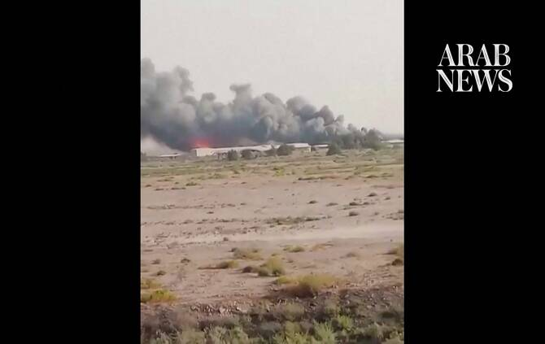

# Kuwait says three border posts, offshore oil platform attacked

Source: https://www.arabnews.com/node/2650645/middle-east
Captured source: https://www.arabnews.com/node/2650645/middle-east
Published: 2026-07-12T20:04:47+03:00
Modified: 2026-07-12T22:41:39+03:00
Author: AFP

## Summary

KUWAIT CITY: Kuwait’s defense ministry said on Sunday that three border posts and an offshore oil platform were attacked during a fresh exchange of strikes between the United States and Iran. “Three land border posts in the north of the country were subjected to a cowardly attack, resulting in material damage,” the statement said, without specifying the origin of the assault.

## Image

## Video Or Embed URLs

- https://880565ce66cd1237c0f2153afeb4e780.safeframe.googlesyndication.com/safeframe/1-0-45/html/container.html
- https://static.addtoany.com/menu/sm.25.html
- about:blank
- https://imasdk.googleapis.com/js/core/bridge3.774.0_en.html
- https://www.google.com/recaptcha/api2/aframe
- https://sync.teads.tv/wigo-no-slot
- https://cm.g.doubleclick.net/partnerpixels?gdpr=0&us_privacy=1---&gpp_sid=-1&url=https%3A%2F%2Fwww.arabnews.com%2Fnode%2F2650645%2Fmiddle-east

## Text

https://arab.news/vq6bq

KUWAIT CITY: Kuwait’s defense ministry said on Sunday that three border posts and an offshore oil platform were attacked during a fresh exchange of strikes between the United States and Iran. “Three land border posts in the north of the country were subjected to a cowardly attack, resulting in material damage,” the statement said, without specifying the origin of the assault.

It added that an “offshore drilling platform belonging to the Kuwait Oil Company... was targeted by a hostile drone, resulting in material damage and the injury of one worker.”
