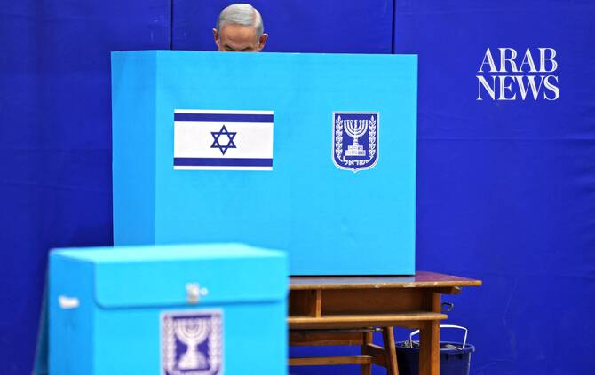

# Israel’s election will be held on October 27, coalition head says

Source: https://www.arabnews.com/node/2650661/middle-east
Captured source: https://www.arabnews.com/node/2650661/middle-east
Published: 2026-07-12T22:20:45+03:00
Modified: 2026-07-13T08:02:00+03:00
Author: Reuters

## Summary

JERUSALEM: Israel ‌is set to hold a national election on October 27, according to Prime ​Minister Benjamin Netanyahu’s coalition, its first since Hamas’ 2023 attack and the wars that ensued in Gaza, Lebanon and Iran. The precise ballot date had been unclear since the Israeli parliament voted in ‌May to ‌disband, raising the ​possibility ‌the election ⁠could ​be held ⁠early.

## Image

## Video Or Embed URLs

- https://8fabda66acf040d50ed569168b39837e.safeframe.googlesyndication.com/safeframe/1-0-45/html/container.html
- https://static.addtoany.com/menu/sm.25.html
- about:blank
- https://imasdk.googleapis.com/js/core/bridge3.774.0_en.html
- https://www.google.com/recaptcha/api2/aframe
- https://cm.g.doubleclick.net/partnerpixels?gdpr=0&us_privacy=1---&gpp_sid=-1&url=https%3A%2F%2Fwww.arabnews.com%2Fnode%2F2650661%2Fmiddle-east

## Text

https://arab.news/4nkbb

The precise ballot date had been unclear since the Israeli parliament voted in ‌May to ‌disband

JERUSALEM: Israel ‌is set to hold a national election on October 27, according to Prime ​Minister Benjamin Netanyahu’s coalition, its first since Hamas’ 2023 attack and the wars that ensued in Gaza, Lebanon and Iran.

The precise ballot date had been unclear since the Israeli parliament voted in ‌May to ‌disband, raising the ​possibility ‌the election ⁠could ​be held ⁠early.

However, coalition head Ofir Katz told a parliamentary committee on Sunday that the original October 27 date set by law would be kept.

Successive surveys have suggested Netanyahu’s ⁠coalition of nationalist and religious ‌parties would ‌lose the ballot, though his ​political rivals still ‌have no clear path to ‌power and the political landscape may still shift.

Less than a year after a 2022 political comeback at the head ‌of Israel’s most right-wing government to date, Netanyahu’s security credentials ⁠were ⁠left in tatters by Hamas’ surprise attack on October 7, 2023. Polls show many are unhappy with Netanyahu over the outcome of the Iran war.

It is rare for governments in Israel to complete a full four-year term. Netanyahu is Israel’s longest-serving leader ​and has proven himself ​an unmatched political survivor.
