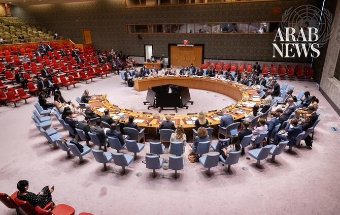

# Security Council members rally behind Saudi Arabia, denounce Iran’s role in Houthi escalations

Source: https://www.arabnews.com/node/2650787/middle-east
Captured source: https://www.arabnews.com/node/2650787/middle-east
Published: 2026-07-14T01:50:40+03:00
Modified: 2026-07-14T01:50:40+03:00
Author: Ephrem Kossaify

## Summary

NEW YORK CITY: The UN Security Council held an emergency meeting on Monday to address escalations in and around Yemen, with member states lining up to condemn Iran’s alleged support for the Houthis, and to express solidarity with Saudi Arabia after the militia launched ballistic missiles at the Kingdom. The session was requested by the Yemeni prime minister, Shaya Mohsen

## Image

## Video Or Embed URLs

- https://8d5b039451da652b4211c14c762ed475.safeframe.googlesyndication.com/safeframe/1-0-45/html/container.html
- https://static.addtoany.com/menu/sm.25.html
- about:blank
- https://imasdk.googleapis.com/js/core/bridge3.776.0_en.html
- https://www.google.com/recaptcha/api2/aframe
- https://cm.g.doubleclick.net/partnerpixels?gdpr=0&us_privacy=1---&gpp_sid=-1&url=https%3A%2F%2Fwww.arabnews.com%2Fnode%2F2650787%2Fmiddle-east

## Text

https://arab.news/26u4u

Emergency council session comes amid unauthorized flights from Tehran to Yemen in breach of UN resolutions, and as Houthis launch missiles at the Kingdom

Yemen’s government says flights violate sovereignty and airspace; US accuses Tehran of flying in Revolutionary Guard personnel ‘in support of Houthi terrorism’

NEW YORK CITY: The UN Security Council held an emergency meeting on Monday to address escalations in and around Yemen, with member states lining up to condemn Iran’s alleged support for the Houthis, and to express solidarity with Saudi Arabia after the militia launched ballistic missiles at the Kingdom.

The session was requested by the Yemeni prime minister, Shaya Mohsen Al-Zindani, in a letter on July 7, with the support of Bahrain and the UK, the “penholder” that takes the lead on Yemen at the Security Council.

It came after an Iranian aircraft flew from Tehran to Sanaa International Airport on July 3 and then returned home, reportedly transporting Houthi officials to attend the funeral of Iran’s formersupreme leader, Ali Khamenei. Yemen’s government protested against the flight as a violation of its sovereignty and airspace.

On Monday, another Iranian flight carrying a Houthi delegation landed at Hodeidah Airport, hours after airstrikes reportedly hit the runway at Sanaa International Airport. According to Yemen’s government, the strikes were intended to prevent the Iranian aircraft from landing.

The Houthis declared an end to their “deescalation phase” with Riyadh and launched ballistic missiles at the Kingdom, which were intercepted.

Briefing the council, the assistant secretary-general for the Middle East, Khaled Khiari, said these developments underscored the fact that “there is no alternative to an inclusive, Yemeni-owned political process” in the country. Unilateral measures, he warned, “will not bring Yemen closer to peace” but risk entrenching divisions and fragmentation.

US ambassador Tammy Bruce delivered the sharpest condemnation of Iran during the session, accusing Tehran of using the flight on July 3 to ferry “IRGC personnel, including drone and missile experts, in support of Houthi terrorism” under cover of a funeral delegation, in violation of Security Council Resolution 2216.

She said the subsequent flight on Monday had proceeded “despite explicit public instructions” from Yemen’s government not to allow it, describing this as “simply unacceptable.”

Bruce also linked the incidents to a broader pattern of Iranian aggression. She cited missile and drone attacks against commercial vessels in the Strait of Hormuz — including a Qatari liquefied natural gas tanker that was left burning, and a container ship bound for the UAE — as well as strikes against Bahrain, Jordan, Kuwait, Oman, Qatar and the UAE over the past week.

She warned that Washington would respond with force if Iran continued to target shipping, and reaffirmed the US commitment to sanctions and support for the Yemeni government against “the Iranian-supported Houthi terrorist threat.”

The UK’s ambassador, Kate Foster, condemned “in the strongest terms” the Houthi attacks on Saudi Arabia as “reckless and unacceptable,” as she affirmed London’s “full solidarity” with Riyadh.

She said the unauthorized Iranian flights constituted a clear breach of Yemeni sovereignty, and that verified reports of military personnel or equipment on the aircraft would indicate violations of UN Security Council resolutions 2216 and 2140. She urged the UN to investigate.

Foster also expressed solidarity with Gulf nations and other states in the region after further Iranian attacks over the past 48 hours on Qatar, Kuwait, Bahrain and Jordan, as well as strikesagainst shipping in the Strait of Hormuz.

Bahrain’s ambassador, Jamal Alrowaiei, condemned what he described as “terrorist Houthi attacks” against Saudi Arabia and reiterated Manama’s solidarity with “the sisterly Kingdom.”

Iranian-backed Houthi escalations, including threats to close the Bab-el-Mandeb Strait, violated resolutions 2216, 2722, 2817 and 2813, he said, and he warned that any support for the Houthis “constitutes a threat to peace and security” in Yemen and the wider region.

The French ambassador, Jerome Bonnafont, said Iran had “undermined” Yemen’s legitimate authorities and violated international law by landing aircraft in Sanaa and Hodeidah without government consent.

He described this as part of a wider pattern of “destabilizing behavior” by Tehran, including clashes in the Gulf since July 7 and ongoing threats to close the Strait of Hormuz. He reiterated France’s solidarity with Saudi Arabia, and demanded that Iran halt all military transfers to the Houthis.

The Russian ambassador, Anna Evstigneeva, described the flight on July 3 as “strictly humanitarian” in nature and noted it had caused no casualties or material damage, while acknowledging it had fueled escalation.

Moscow called for the full lifting of the air, sea and land blockade of Yemen, as well as renewed UN-led mediation efforts involving neighboring countries, including Saudi Arabia and Iran.

Briefing the council on humanitarian conditions in Yemen, the acting assistant secretary-general, Indrika Ratwatte, said more than 18 million Yemenis were hungry and 450 health facilities hadclosed in the past year alone amid a catastrophic shortfall in aid funding, a crisis he warned could escalate sharply if regional tensions spilled further into the country.
