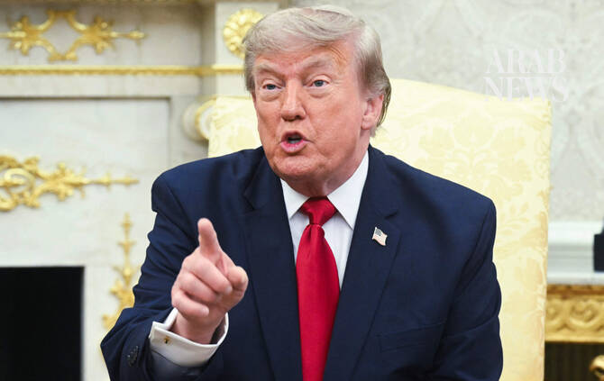

# US representatives held talks with Iran on Tuesday, Trump says

Source: https://www.arabnews.com/node/2650929/world
Captured source: https://www.arabnews.com/node/2650929/world
Published: 2026-07-15T01:41:00+03:00
Modified: 2026-07-15T01:41:00+03:00
Author: Reuters

## Summary

WASHINGHTON: President ​Donald Trump said ‌US representatives ‌held ​talks ‌with ⁠Iran ​on Tuesday. Trump ⁠made ⁠the ‌comments ‌in ​an ‌interview aired ‌on ‌Fox News’ “Special Report” ⁠show.

## Image

## Video Or Embed URLs

- https://07f0dbe2418410e93c850ac600f02b04.safeframe.googlesyndication.com/safeframe/1-0-45/html/container.html
- https://static.addtoany.com/menu/sm.25.html
- about:blank
- https://imasdk.googleapis.com/js/core/bridge3.776.0_en.html
- https://www.google.com/recaptcha/api2/aframe
- https://sync.teads.tv/wigo-no-slot
- https://cm.g.doubleclick.net/partnerpixels?gdpr=0&us_privacy=1---&gpp_sid=-1&url=https%3A%2F%2Fwww.arabnews.com%2Fnode%2F2650929%2Fworld

## Text

https://arab.news/bcwqk

WASHINGHTON: President ​Donald Trump said ‌US representatives ‌held ​talks ‌with ⁠Iran ​on Tuesday. Trump ⁠made ⁠the ‌comments ‌in ​an ‌interview aired ‌on ‌Fox News’ “Special Report” ⁠show.
