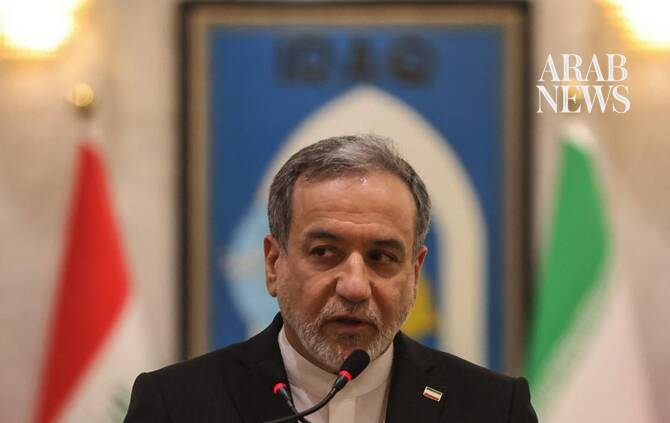

# Iranian minister visits Doha to offer condolences days after Iran attacked Qatar

Source: https://www.arabnews.com/node/2650997/middle-east
Captured source: https://www.arabnews.com/node/2650997/middle-east
Published: 2026-07-15T15:21:30+03:00
Modified: 2026-07-15T17:56:17+03:00
Author: Reuters

## Summary

DUBAI: Iran’s foreign minister, Abbas Araghchi, traveled to Doha on Wednesday to offer his condolences after the death of former Qatari emir Sheikh Hamad ‌bin Khalifa ‌Al-Thani, Iran’s ISNA ‌reported, ⁠days after Iran ⁠attacked Qatar. Araghchi is scheduled to “meet with Qatari authorities and offer his condolences,” the foreign ministry said in a statement. Iran has attacked

## Image

## Video Or Embed URLs

- https://8fb878200e823386ce580e61f59908f2.safeframe.googlesyndication.com/safeframe/1-0-45/html/container.html
- https://static.addtoany.com/menu/sm.25.html
- about:blank
- https://imasdk.googleapis.com/js/core/bridge3.777.0_en.html
- https://ep2.adtrafficquality.google/sodar/sodar2/255/runner.html
- https://www.google.com/recaptcha/api2/aframe
- https://sync.teads.tv/wigo-no-slot
- https://cm.g.doubleclick.net/partnerpixels?gdpr=0&us_privacy=1---&gpp_sid=-1&url=https%3A%2F%2Fwww.arabnews.com%2Fnode%2F2650997%2Fmiddle-east

## Text

https://arab.news/rttga

Iran has attacked what it says are US targets in ⁠Qatar

Sheikh Hamad led Qatar from 1995 to 2013 and was 74 when he passed away

DUBAI: Iran’s foreign minister, Abbas Araghchi, traveled to Doha on Wednesday to offer his condolences after the death of former Qatari emir Sheikh Hamad ‌bin Khalifa ‌Al-Thani, Iran’s ISNA ‌reported, ⁠days after Iran ⁠attacked Qatar.

Araghchi is scheduled to “meet with Qatari authorities and offer his condolences,” the foreign ministry said in a statement. Iran has attacked what it says are US targets in ⁠Qatar — a mediator between ‌Washington ‌and Tehran ‌in the Iran ‌war — most recently on Sunday when the death of the ‌former emir was announced. Iran’s Islamic Revolutionary ⁠Guard ⁠Corps said on Sunday it was targeting Qatar’s Al Udied, the biggest US base in the Middle East, with ballistic missiles.

Sheikh Hamad led the country from 1995 to 2013 and was 74 when he passed away. He was seen as one of the architects of modern Qatar and led the country during a period of rapid economic growth.

His funeral was held on Sunday.
